# Gopher! 
## go

### make new

make和new都是用于给变量分配内存,make和new对于内存分配策略是一致的,
编译器会进行逃逸检查,逃逸的变量(编译器无法确定生命周期)会分配到堆

new一般用于分配内存,并返回一个指向该内存的指针,将内存置为零值,
常用于值类型,如果new(map),需要初始化才能用

make用于创建chan slice map,不仅会分配内存,还会进行一些额外的初始化

---

### slice

go slice由底层数组指针,长度,容量组成

```go
s1 := []int{1, 2, 3} // Len=3, Cap=3 类似数组,无需指定长度
s2 := make([]int, 2, 5) // cap可以省略,默认与len相等
s3 := arr[1:3] // 截取数组获得slice
```

slice的扩容是动态的,当len超过cap会触发自动扩容
在Go1.18之前
如果申请的新容量旧容量两倍,直接扩容
`cap<1024 newcap=oldcap*2` `cap>1024 newcap=1.25*oldcap`

在Go1.18之后
如果申请的新容量旧容量两倍,直接扩容
`oldcap<256 newcap=oldcap*2` `oldcap>256 newcap=1.25oldcap + 3/4*256`实现更平滑的过度
扩容后实际的容量还需要经过内存对齐,cap调整为内存块的整数倍

切片传递是引用传递
传递的是切片结构体的副本,但副本中的数组指针仍然指向原数组
函数内修改切片会影响原数组,导致外部切片改变
函数内触发扩容导致指针指向新数组,外部切片不受影响

```go
 origin := []int{1, 2, 3} // cap=3 len=3
 copyed := origin[:2]     // cap=3 len=2

 copyed = append(copyed, 4) // [1,2,4]
 origin = append(origin, 5) // [1,2,4,5]超出oldcap(3) 扩容指向新的数组

 copyed = append(copyed, 6) // [1,2,4,6]
 origin = append(origin, 7) // [1,2,4,5,7]

 fmt.Println(origin) // [1,2,4,5,7]
 fmt.Println(copyed) // [1,2,4,6]
```

---

### map

hmap是map的核心结构,存储着map的元信息

```go
type hmap struct{
    count     int         // 键值对的数量   
    flags     uint8       //  标识是否被写,扩容等标识,因为map线程并发不安全
    B         uint8       //  桶的个数是2^B次
    noverflow uint16      //  溢出桶bmap大致数量
    hash0     uint32      // 随机hash因子 

    buckets    unsafe.Pointer   // 指向一个数组(bmap)
    oldbuckets unsafe.Pointer   // 扩容前的桶 
    nevacuate  uintptr          //  成倍扩容分流操作计数的字段

    extra *mapextra  // 额外信息,存储溢出桶的引用
}

type mapextra struct {
    // 如果哈希表的 key/val 大小较大，buckets 中的指针会指向 keys/values 数组
    // 这些字段存储 keys/values 数组
    overflow         []*bmap       // 溢出桶数组
    oldoverflow   []*bmap       // 旧桶数组的溢出桶
    nextOverflow  *bmap         // 下一个可用的溢出桶
}
```

指向溢出桶的指针在bmap中是uintptr类型,仅表示内存地址,不会被gc看作有效的引用
所以当map的key和value不包含指针的时候,会被gc处理
`mapextra`结构包含了当前所有桶和孔容时旧桶的关联溢出桶地址两个slice
gc会扫描slice,避免被错误回收

```go
// bmap 实际存储信息的结构
type bmap struct {
    tophash [8]uint8  // 存储每个键的哈希值的高 8 位
    keys    [8]keytype // 存储最多 8 个键
    values  [8]valuetype // 存储最多 8 个值
    overflow uintptr   // 指向溢出桶的指针
}
```

1. 计算hash获得64位哈希值

2. 确定桶索引

   使用低B位快速定位`bucketIndex = hash & (2^B - 1)`(等同hash%2^B获得)桶索引
   该等价关系 **仅当除数是 2 的整数次幂时成立**，非 2 的幂的情况下不适用
   `eg. 2³=8,hash=10(1010) 1010&0111=0010 10%8=2`

3. 定位key在bucket位置

   取hash高8位,遍历tophash数组,存在一样的,就比较key是否一样,相等则返回value

   当前桶没有通过overflow遍历溢出桶

扩容

1. 负载因子过高会扩容

   负载因子=map元素数量/2^B

   当负载因子>6.5 会翻倍扩容,bucket个数翻倍

2. 溢出桶过多

     当某个桶中的元素过多（链表长度超过 8），且总桶数量 < 2^15 时，触发**等量扩容**（桶数量不变，仅重新组织数据，减少哈希冲突）常见于hash因子的设置导致同一个hash值里的元素过多,map蜕变成链表,或者经过大量删除溢出桶冗余

采用渐进式扩容

1. **创建新桶**：扩容时，先申请新桶数组（`newbuckets`），将 `hmap.oldbuckets` 指向旧桶，`hmap.buckets` 指向新桶，`hmap.nevacuate` 标记已迁移的旧桶数量（初始为 0）。
2. **增量迁移**：每次对 `map` 进行读写操作（如 `get`、`set`、`delete`）时，顺带迁移 **1~2 个旧桶** 的元素到新桶，并更新 `hmap.nevacuate`。
3. **完成迁移**：当所有旧桶的元素都迁移到新桶后，`hmap.oldbuckets` 置为 `nil`，释放旧桶内存，扩容完成。

---

### map+锁 和 sync.Map

加锁map采用原始的map结合互斥锁或者读写锁,每次对map读写都要lock&unlock

sync.Map **针对“一次写入，多次读取”或“读远多于写”的场景进行了高度优化**
写性能相对较低,需要维护read和dirty两个map,而且存在内存泄露的风险,syncMap并不会立即清除删除的key
而且不支持直接range遍历,需要实现Range接口,实现后遍历是快照的

```go
type Map struct {
    mu Mutex          // 互斥锁，用于保护dirty字段和misses字段。
    read atomic.Value // readOnly, 一个atomic.Value类型的字段，存储了一个readOnly结构体，用于                            存储只读数据。
    dirty map[interface{}]*entry // 一个map，存储了所有可写的键值对。
    misses int    // 一个计数器，记录了从read读取失败的次数，用于触发将数据从dirty迁移到read的决策。
}


type readOnly struct {
    m       map[interface{}]*entry    // 实际存储键值对的map。
    amended bool // 标记位，如果dirty中有read中没有的键，那么为true
}
```

sync.Map分为读层和写层
read是一个原子值,让读取操作可以无锁进行
dirty用来存储那些被修改过的键值对

**write**

1. 写入时会查read是否尝试更新read层,检有key并且没有被标记为已删除

   如果没有被删除说明是更新操作,read原地更新entry的指针

2. 如果read层更新失败会加锁进入dirty层,检查key是否存在,存在就更新

   1. key不存在就会检查read层的key是否标记为删除,
      如果被标记为已删除就会创建一个新的entry放入read和dirty层,
      去除已删除的标记
   2. 如果是不存在的key且不是被删除,说明是添加,如果dirty层为nil
      (map刚创建或者dirty被提升为read),
      会复制read层所有未标记删除的k-v     复制$(效率o(n))$
      然后放入将entry放入dirty

**read:**

1. 读取时先从read层寻找,如果找到了entry.p指向的值就会直接返回,misses不变
   如果找到entry.p指向expunged(删除),返回未找到
2. read层没有加锁去找dirty,misses+1,找到就返回值
   在返回前会再检查read层,如果read层不存在啊key,会创建一个entry加入read
3. 如果 `dirty` 层中的所有键值对都被 `Load` 操作访问过，并且没有新的写入操作发生，
   `sync.Map` 会在某个 `Load` 操作中，将当前的 `dirty` 层**原子地提升**为新的 `read` 层
   在这个提升操作完成后，`sync.Map` 会将 `m.dirty` **设置回 `nil`**,misses置为0

---

### select

- 编译器遍历select所有的case,收集case的信息(chan对象,操作类型x<-ch 或ch<-x,关联的值))
  会过滤无效的case(nil),然后编译器调用selectgo,将case打包成scase结构体数组
- 检查就绪(非阻塞)的case,随机选取一个就绪(防止饥饿),直接执行
- 阻塞等待的时候,有default直接执行default,
  没有default会为当前goroutine注册sudog,封装上下文加入到case对应的等待队列,让出goroutine资源
  被唤醒后从等待队列移除进入就绪

---

### go interface

接口是一种抽象的类型,定义了一组方法签名,用于实现多态和解耦
go的接口实现是隐式的,不需要明确指明实现哪个接口
只要这个类型实现了接口规定的方法,我们就认为它实现了这个接口
接口变量可以存储实现了该接口的值,我们可以使用统一的方法处理不同的对象,体现多态
对于go来说,没有定义任何方法的接口是空接口interface{}可以存储任何类型的值,用于接受任何类型的参数
当我们需要从接口变量获取原始的值的时候,需要对接口进行断言,一般结合switch

**eface是空interface{}的实现**，只包含两个指针：`_type`指向类型信息，`data`指向实际数据。这就是为什么空接口能存储任意类型值的原因，通过类型指针来标识具体类型，通过数据指针来访问实际值。

**iface是带方法的interface实现**，包含`itab`和`data`两部分。`itab`是核心，它封装了`_type`,存储了接口类型、具体类型，以及方法表。方法表是个函数指针数组，保存了该类型实现的所有接口方法的地址

---

### sync 同步互斥

*sync.Mutex互斥锁*
作用：保证同一时间只有一个 goroutine 能进入临界区，完全互斥。
适用场景：所有需要独占访问共享资源的场景（如修改共享变量、操作共享数据结构）

*sync.RWMutex读写锁*
作用：区分 “读操作” 和 “写操作”，支持多 goroutine 同时读（共享），但写操作时必须独占（互斥）。
适用场景：读多写少的场景（如缓存、配置读取），提升读操作的并发效率。

*sync.WaitGroup：等待一组 goroutine 完成*
作用：主线程等待多个子 goroutine 全部执行完毕后再继续，避免主线程提前退出。
适用场景：批量启动 goroutine 执行任务，需要等待所有任务完成后汇总结果。

*sync/atomic：原子操作*
作用：通过 CPU 指令级别的原子操作，实现简单变量的无锁CAS同步（比锁更高效）。
适用场景：简单的计数器、标志位更新（如统计请求数、判断状态），不适合复杂逻辑。

*Channel：通信与同步*
作用：通过 “通信” 实现同步（“不要通过共享内存通信，而要通过通信共享内存”），可用于传递数据或控制执行顺序。
适用场景：goroutine 间传递数据、控制并发数、实现生产者 - 消费者模型等

*sync.Cond：条件变量*
作用：让一组 goroutine 等待某个 “条件” 成立后再执行（如 “队列非空”“数据准备好”），支持广播唤醒或单播唤醒。
适用场景：生产者 - 消费者模型（消费者等待数据，生产者生产后唤醒）、多 goroutine 等待某个事件。

`sync.Cond` 本质上是 **基于共享内存的同步机制**

| 维度         | `sync.Cond`（条件变量）                                     | `Channel`（通道）                                      |
| ------------ | ----------------------------------------------------------- | ------------------------------------------------------ |
| **核心目标** | 让一组 goroutine 等待某个 “条件成立” 后再执行               | 通过 “传递数据” 实现 goroutine 间的同步与通信          |
| **同步方式** | 基于 “共享内存 + 条件判断”：依赖共享变量的状态变化          | 基于 “通信”：通过发送 / 接收数据传递信号或数据         |
| **依赖关系** | 必须与互斥锁（`Mutex`/`RWMutex`）配合使用                   | 无需依赖锁，自身可通过缓冲 / 无缓冲实现阻塞            |
| **唤醒机制** | 支持 “单播唤醒”（`Signal()`）和 “广播唤醒”（`Broadcast()`） | 唤醒是被动的：发送方唤醒接收方，或接收方唤醒发送方     |
| **适用场景** | 多 goroutine 等待同一个动态条件（如 “队列非空”“资源可用”）  | 传递数据、控制并发数、简单的顺序同步（如 “先 A 后 B”） |

*sync.Once：确保操作只执行一次*

```go
type Once struct {
    done uint32 // 标识位
    m Mutex
}
```

当Once.Do(f)首次被调用时：
它首先会通过原子操作（atomic.LoadUint32）快速检查done标志位。
如果done为1，说明初始化已完成，直接返回,无锁，开销极小。
如果done为0，说明可能是第一次调用，这时它会进入一个慢路径（doSlow）。
在慢路径里，它会先加锁，然后再次检查done标志位。防止了在多个goroutine同时进入慢路径时，函数f被重复执行。
如果此时done仍然为0，那么当前goroutine就会执行传入的函数f。

执行完毕后，它会通过原子操作（atomic.StoreUint32）将done标志位置为1，最后解锁。
之后任何再调用Do的goroutine，都会在第一步的原子Load操作时发现done 为1而直接返回。整个过程结合了原子操作的速度和互斥锁的安全性，高效且线程安全地实现了"仅执行一次"的保证

### sync.Mutex

Go的Mutex主要有两种模式：

正常模式（Normal Mode）和饥饿模式（Starvation Mode）。

**正常模式**：这是默认模式，讲究的是性能。
新请求锁的goroutine会和等待队列头部的goroutine竞争，
新来的goroutine有几次"自旋"的机会，如果在此期间锁被释放，
它就可以直接抢到锁。这种方式吞吐量高，但可能会导致队列头部的goroutine等待很久，即"不公平"。

**饥饿模式**：当一个goroutine在等待队列中等待超过1ms后，Mutex就会切换到此模式，讲究的是公平。
在此模式下，锁的所有权会直接从解锁的goroutine移交给等待队列的头部，新来的goroutine不会自旋，必须排到队尾。
这样可以确保队列中的等待者不会被"饿死"。当等待队列为空，或者一个goroutine拿到锁时发现它的等待时间小于1ms，饥饿模式就会结束，切换回正常模式。这两种模式的动态切换，是Go在性能和公平性之间做的精妙平衡。

### sync.WaiGroup 是怎样实现协程等待

WaitGroup实现等待，本质上是一个原子计数器和一个信号量的协作。
调用Add会增加计数值，Done会减计数值。
而Wait方法会检查这个计数器，如果不为零，就利用信号量将当前goroutine高效地挂起。
直到最后一个Done调用将计数器清零，它就会通过这个信号量，一次性唤醒所有在Wait处等待的goroutine，从而实现等待目的。

1. `Add(delta int)`：将计数器的值增加 `delta`。通常在启动协程前(go func(){})调用，`delta` 一般为要启动的协程数量（或任务数量）。
2. `Done()`：将计数器的值减1。这个方法通常在每个协程执行完毕时调用,通常用defer执行调用。
3. `Wait()`：阻塞当前协程，直到计数器的值变为0。当所有协程都调用了 `Done()`，计数器归零，`Wait()` 会返回，表示所有协程都已结束

---

### sync.Pool

`sync.Pool` 是 Go 语言标准库 `sync` 包提供的**并发安全的对象池**，用于**缓存临时创建的对象**，供后续复用。它的核心设计目标是**减少内存分配次数**，降低垃圾回收（GC）的压力，从而提升程序在高并发场景下的性能

在高频创建和销毁临时对象的场景,如高并发服务器处理请求时频繁的内存分配会导致
大量临时对象被创建，触发频繁的 GC，增加系统开销
内存碎片增多，降低内存利用率

**对象重置**：Put 前必须重置对象状态（如清空缓冲区、重置字段），否则下次获取时可能拿到残留数据。
**不保证数据持久性**：GC 会清理 Pool 中的对象，因此不能将 Pool 作为长期存储（如缓存用户会话,数据库连接池）。
**并发安全**：Get/Put 方法本身是并发安全的，无需额外加锁。

`sync.Pool` 的实现与 Go 调度器的 `P`（Processor，处理器，用于绑定 goroutine 与 OS 线程）紧密相关，核心是**减少锁竞争**，提高并发性能。其核心结构和逻辑如下：

```go
type Pool struct {
    noCopy noCopy  // 保证 Pool 不能被复制

    local     unsafe.Pointer // 指向 []*poolLocal，每个 P 对应一个 poolLocal
    localSize uintptr        // 数组长度（等于 P 的数量）

    victim     unsafe.Pointer // 上一轮的 local，用于 GC 时的对象过渡
    victimSize uintptr        // victim 数组的长度

    New func() interface{} // 当 Pool 中无对象时，创建新对象的函数
}

// 每个 P 对应的本地对象池
type poolLocal struct {
    private interface{} // 仅当前 P 可访问的对象（无锁）
    shared  poolChain   // 其他 P 可访问的共享对象链表（需要锁）
    pad     [128]byte   // 避免 false sharing（伪共享）
}
```

`sync.Pool` 的核心是**按 P 划分本地对象池**，减少跨 P 操作的锁竞争：

- **Put(elem interface{}**：将对象放入 Pool
  1. 先获取当前 goroutine 绑定的 P；
  2. 将对象存入该 P 对应的 `poolLocal.private`（若 private 为空）；
  3. 若 private 已存在对象，则存入 `poolLocal.shared`（共享链表，需要加锁）。
- **Get() interface{}**：从 Pool 中获取对象
  1. 先获取当前 goroutine 绑定的 P；
  2. 优先从该 P 的 `poolLocal.private` 取对象（无锁，最快）；
  3. 若 private 为空，从该 P 的 `poolLocal.shared` 取（加锁）；
  4. 若仍为空，则尝试从其他 P 的 `shared` 链表 “偷” 对象（加锁，跨 P 操作）；
  5. 若所有途径都无对象，调用 `New` 函数创建新对象。

`sync.Pool` 中的对象会在**每次 GC 时被清理**，但清理逻辑并非直接删除，而是通过 “受害者机制”（victim）实现：

- GC 开始时，将当前 `local` 中的对象迁移到 `victim` 中；
- 下次 Get 时，若 `local` 中无对象，会尝试从 `victim` 中获取；
- 下一次 GC 时，`victim` 中的对象会被彻底清理。

这一机制保证了 Pool 不会长期持有对象，避免内存泄漏，同时给了对象一次 “被复用” 的机会

### chan

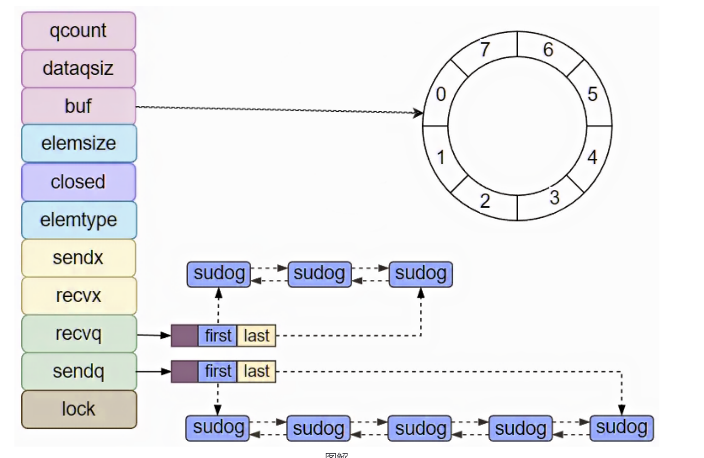

```go
type hchan struct {
     qcount   uint             // chan存储的元素个数
     dataqsiz uint             //  chan缓冲区的 容量
     buf      unsafe.Pointer   // 指向底层的数组
     elemsize uint16           //  元素类型大小,byte 缓冲区总内存=elementsize*dataqsize
     synctest bool             //  true表面实在synctest测试中的chan
     closed   uint32           // 是否关闭
     timer    *timer           //
     elemtype *_type           // 元素类型
     sendx    uint  // 发送者索引
     recvx    uint  // 接收索引
     recvq    waitq // 等待接收被阻塞的goroutine队列
     sendq    waitq //  等待发送被阻塞的goroutine队列
       //  sudog是结构体,存储G的上下文
        // 锁保护hchan的所有字段以及阻塞通道的sudog
     // 同步原语满足运行条件(缓冲通道没满或者被其他G唤醒),会从阻塞 队列中取出sudog
     lock     mutex
}
```

```go
// waitq 等待队列
type waitq struct {
    first *sudog
    last  *sudog
}
```

---

### chan读写

| **chan状态**                   | **读操作（`<-ch`）**                                         | **写操作（`ch <- val`）**                                    | **关闭操作（`close(ch)`）**                              |
| ------------------------------ | ------------------------------------------------------------ | ------------------------------------------------------------ | -------------------------------------------------------- |
| **nil 通道**                   | 永久阻塞（无底层结构，无法接收数据）                         | 永久阻塞（无底层结构，无法发送数据）                         | 触发 panic（`close of nil channel`）                     |
| **空通道（已初始化，无数据）** | 阻塞（等待数据写入或通道关闭）                               | 无缓冲：阻塞至有接收者 <br />有缓冲：直接写入（缓冲区未满），不阻塞 | 关闭成功（后续写操作 panic，读返回零值 +`ok=false`）     |
| **有值通道（含未读数据）**     | 立即返回数据（`ok=true`），无缓冲通道同步完成，有缓冲通道从缓冲区取数 | 无缓冲：阻塞至有接收者 <br /> 有缓冲：若未满则直接写入，否则阻塞 | 关闭成功（剩余数据可读取，读完后读返回零值 +`ok=false`） |
| **满通道（有缓冲且写满）**     | 立即返回数据（`ok=true`），缓冲区数据量 - 1（解除 “满” 状态） | 阻塞（等待数据被读取以腾出缓冲区空间）                       | 关闭成功（同 “有值通道”，剩余数据可读取）                |
| **关闭的通道**                 | 若有剩余数据：返回数据（`ok=true`） <br />无剩余数据：立即返回零值（`ok=false`），不阻塞 | 触发 panic（`send on closed channel`）                       | 触发 panic（`close of closed channel`）                  |

#### 写入chan

1. 先获取chan的lock
2. 检查chan==nil ,永久阻塞
3. 检查chan 若close触发panic
4. 若recvq不为空,优先处理等待的接收者
   1. 从recvq取出第一个sudog,将发送的数据复制到接收者的内存地址sudog.elem
   2. 唤醒接收者G,标记为就绪状态
5. 若recvq缓冲区有空位
   1. 将数据复制到sendx的位置(buf[sendx]),更新sendx((sendx + 1) % dataqsiz)索引和qcount
6. 若阻塞发送
   1. 创建sudog对象,关联当前G,待发送的数据以及channel
   2. sudog放入sendq并释放chan的lock,挂起当前G阻塞

#### 读取chan

先获取lock

1. 检查chan==nil ,永久阻塞

2. 优先处理有缓冲chan

   1. 从buf[recvx]复制数据到接收者内存地址,更新recvx和qcount

3. sendq中有发送者等待

   1. 从sendq取出sudog

   2. 无缓冲chan直接将sudog.elem复制到接收者内存地址(直接交付数据)

      有缓冲chan先将发送者数据复制到buf[sendx],更新sendx和qcount
      再把recvx的数据赋值给接收者然后更新recvx和qcount
      (将数据先交付到缓冲区)

4. chan关闭只返回零值

5. 阻塞接收 senq为空

   1. 创建sudog对象,关联当前G,接受数据的地址和chan,放入recvq,挂起

   ---

### channel使用场景

1. 协程间数据的通信,生产者消费者模型

   不同goroutine通过chan之间安全的传输数据,避免共享内存导致的竞态问题
   比如一个goroutine生产数据,另一个进行消费

2. 协程同步

   通过chan实现主chan等待子chan完成任务,代替传统的锁或者等待组

   ```go
   func main(){
         done:=make(chan struct{})
         go func(){
            fmt.Println("子进程开始")
            time.Sleep(2*time.second)
            fmt.Println("子进程开始")
            done<-struct{}{}
        }()
       <-done
   }
   ```

3. 限制并发的数量
   建立一个缓冲区为3的chan`sem := make(chan struct{}, 3)`
   子goroutine运行时先获取信号,在开始运行,结束后释放信号

4. 优雅关闭协程

   若暴力关闭可能导致资源泄露,数据丢失,通过chan发送信号控制goroutine关闭

   等待goroutine处理完手头的数据后释放资源

---

### goroutine 数量控制

基于带缓冲 Channel 的令牌桶机制

创建一个固定容量的缓冲 Channel 作为 "令牌桶"，每个 goroutine 启动前需从 Channel 获取令牌（写入数据），结束后释放令牌（读取数据）。当 Channel 满时，新的 goroutine 会阻塞等待令牌，从而限制并发数量。

```go
func limitGoroutines(n int, tasks []func()) {
    token := make(chan struct{}, n) // 容量n的令牌桶
    var wg sync.WaitGroup
    for _, task := range tasks {
        wg.Add(1)
        token <- struct{}{} // 获取令牌，满则阻塞
        go func(t func()) {
            defer wg.Done()
            defer func() { <-token }() // 释放令牌
            t()
        }(task)
    }
    wg.Wait()
}
```

Worker Pool（工作池）模式

预先创建固定数量的 worker goroutine，通过一个任务 Channel 接收任务，worker 循环从 Channel 中获取任务并执行。由于 worker 数量固定，自然限制了并发的 goroutine 数量。

```go
func workerPool(n int, tasks []func()) {
    taskCh := make(chan func(), len(tasks))
    // 预先创建n个worker
    for i := 0; i < n; i++ {
        go func() {
            for task := range taskCh {
                task()
            }
        }()
    }
    // 发送任务
    for _, t := range tasks {
        taskCh <- t
    }
    close(taskCh) // 所有任务发送完成，关闭Channel
}
```

### goroutine泄漏

goroutine泄漏是指程序启动的goroutine无法正常退出,占用cpu和内存资源

泄漏核心是goroutine的生命周期没有被正确的管理

1. 管道阻塞

   goroutine长时间等待无缓冲chan读写操作而阻塞且没有退出机制,
   从 channel 接收数据时，channel 始终没有数据且未关闭，导致接收方永久阻塞

2. 无限循环

   goroutine存在死循环没有退出条件,阻塞goroutine,资源无法释放

3. 加锁忘记释放

   goroutine中加锁后,可能由于panic导致锁没有释放,需要使用defer确保释放

   再比如sync.WaitGroup等待组 添加与done的数量不一致

4. context信号

   在goroutine,本应该监听context done的释放信号,忘记监听会导致无法正常退出
   或者监听了ctx.Done()但逻辑出错
   或者使用了context.Backgroud或TODO这种无取消机制的ctx但没有设计其他退出机制

5. 计时器/定时器未正确处理

   time.Ticker没有调用stop,ticker会持续向chan发送数据,若goroutine已退出但ticker未停止,底层的goroutine会泄露

   time.After滥用会不断创建新的定时器chan,未触发不释放

6. select所有case不匹配且没有退出机制,goroutine会永久阻塞到select上

如何检测内存泄漏:

使用内置的pprof工具进行分析goroutine的堆栈信息
在疑似泄露的代码中调用debug.Stack()获取栈信息定位问题

---

### GMP

#### GMP介绍

GMP是Go runtime调度器的核心组件

G(gouroutine)
是Go提供的轻量级的用户态的并发单元,类似于协程,
操作系统并不知道它的存在,销毁创建由go runtime调度器管理,开销极小,切换成本低
每个goroutine初始栈的大小为2KB,栈空间可以动态的伸缩
G的数量理论上无上限

M(Machine)
表示操作系统的线程,是真正在CPU执行指令的实体,每一个都与一个os线程绑定 
一个M同一时候只能执行一个G,一个G可以在不同的M上执行,
每个M都有一个特殊的G0,用于系统调用和调度
M的数量由Go runtime管理,一个M绑定一个P后才能运行,M阻塞时会休眠,所以M的数量一般大于P
`M` 的数量是动态的，由调度器决定，根据当前的负载情况动态调整, GO默认设置为 10000，实际上内核很难达到该限制，可以认为是没有限制。

P(Processor)
包含了运行goroutine的上下文资源,每个P维护着一个本地队列,还会和全局队列进行交互,
负责将队列中的G绑定到M上执行
P需要和M绑定才能发挥作用,一个P绑定一个M才会工作
M执行完当前G后,会从P的本地队列或全局或偷取其他队列的G继续工作
默认是CPU的核心数,可以通过`GOMAXPROCS`修改,但设置过多会导致开销增加

GMP调度流程:
使用go func创建一个G,优先加入P的本地队列,或者全局队列
M和P进行绑定,绑定成功后从P的队列中获取G,如果本地队列为空,会从全局队列偷取一半到本地队列
全局队列为空,会从其他的P偷取一半G,保持负载均衡

G发生系统调用阻塞的时候(文件读写,网络io)需要切换到os内核态完成:
如果是**阻塞系统调用**(当前线程会一直等待操作完成,比如文件读写):M会被阻塞,P与M解绑,绑定新的M继续执行其他G
如果是非阻塞调用(调用后立刻返回):M不会被阻塞,G会被挂起,M继续执行其他G

#### *协作式和抢占式调度*

协作式调度依赖 **Goroutine 主动释放控制权**

- 显式调用 `runtime.Gosched()`,将当前 G 放回全局队列，触发调度器切换到其他 G
- 隐式调度点（编译器插入）,编译器在函数调用、循环、channel 操作等位置插入 **抢占检查指令**。当 G 执行到这些位置时，检查是否被标记为需要抢占

抢占式调度:为解决协作式调度的盲区（如无函数调用的死循环）
go经过系统现场监控触发**抢占式调度**,将其放回P,防止其他G饥饿

- **时间片耗尽**：sysmon 线程定期检查（默认 10ms），若某个 G 运行超过阈值，标记为可抢占。
- **GC 需求**：垃圾回收时需暂停所有 G，触发抢占
- 当 G 执行系统调用时，M 与 P 解绑，P 可被其他 M 抢占。

#### G0 M0

>**M0** 是 “启动器”：负责初始化整个调度模型(P队列,全局G队列)，
>启动 GoScheduler,初始化完成后和普通M一样
>
>**G0** 是 “调度执行者”：每个 M 的专属工具，用于保存普通G的上下文,实现 G 的轻量级切换
>
>**GoScheduler** 是 “大脑”：通过管理 P、分发 G、唤醒 M，驱动整个调度模型高效运转，最终实现 goroutine 的并发执行。

流程

1. 启动 M0（程序的第一个 OS 线程）

   - 当执行 `go run` 时，操作系统创建一个 Go 进程，进程内自动生成第一个 OS 线程，即 **M0**（进程的主线程）
   - M0 是后续所有初始化工作的 “载体”

2. 创建 G0（M0 的专属调度栈）

   M0 启动后，Go 运行时立即为它创建 **G0**（每个 M 必须有一个 G0）
   G0 不是用户代码（如 `main` 函数），而是运行时的 “调度工具”，专门负责 M 上的 goroutine 切换

3. 初始化并绑定 P

    M0 会根据 `GOMAXPROCS`（默认等于 CPU 核心数）创建一组 P（逻辑处理器），并从中取一个 P 绑定到自己身上（M 必须绑定 P 才能执行 G）。
    同时，`main` 函数被包装成第一个用户 goroutine（记为 **G-main**），放入该 P 的本地队列。

4. G0 调度 G-main 执行（首次上下文切换）
     M0 先运行 G0（此时 CPU 执行的是 G0 的调度逻辑）。
     G0 从 P 的队列中取出 G-main，执行

5. 上下文切换
   保存 G0 自身的临时状态（仅调度器需要）。
   加载 G-main 的上下文（如 `main` 函数的入口地址、栈信息等）。
   切换到 G-main 的用户栈，让 M0 开始执行 `main` 函数代码。

---

### GC

根对象是GC开始扫描时的起始对象,比如全局变量,栈上的变量(goroutine使用的局部变量,函数参数,返回值),寄存器中的变量

1. 标记清除法

   STW,从根对象递归遍历所有可达对象,标记
   由于堆内存变量的生命周期不明确,需要遍历整个堆内存,未标记的对象清除,
   stack对象会随函数的结束而自动释放,不涉及GC管理,不会被STW影响
   每次标记清除都要STW 严重影响性能

2. 三色标记法

   所有对象初始标记为白色
   从根对象开始遍历,标记为灰色
   遍历灰色对象标记为黑色,并将其可达对象标记为灰色
   重复直到标记完成

   三色标记仍然需要stw,而且存在标记过程中对象缺失和漏标
   比如黑色对象指向一个白色后,原本指向白色的断开,导致白色没有办法被扫描到,后续错误回收

   所以规定
   **强三色不变:黑色不允许指向白色**
   **弱三色不变:黑色指向的白色对象其上游必须存在灰色对象**

3. 写屏障

   go的gc依旧是只对heap生效,stack仍然需要stw

   go针对两种三色不变提出插入写屏障和删除写屏障

   **插入写屏障:**
   满足强三色
   当A引用B,将B标记为灰色
   在一次正常的三色标记流程结束后，需要对栈上重新进行一次stw

   **删除写屏障:**

   满足弱三色
   在删除引用时，如果被删除引用的对象自身为灰色或者白色，那么被标记为灰色
   但当一个对象的引用被删除后,会变为灰色,即使后续没有被使用也不会被清除,会留到下一轮GC

4. 混合写屏障

   GC开始会将stack可达对象标记为黑色,GC期间stack新建的对象都是黑色,确保后续避免stw

   堆上被删除/添加的对象标记为灰色

---

### go锁如何保证解决缓存穿透

缓存穿透是指数据既不在缓存也不在数据库中

避免缓存击穿我们可以进行限流防止大量恶意key攻击数据库

go可以使用加锁+双重检查

1. 检查缓存:先从缓存中尝试获取,若命中直接返回

2. 加锁
   加锁后再次查询缓存，避免多个请求等待锁时，前一个请求已更新缓存，后续请求无需再查数据库
   缓存没有的话,我们使用sync.Mutex加锁确保只有一个goroutine访问
   并且可以使用redis或者布隆过滤器标记key,防止后续再次穿透

---

### go 内存分配

go的内存分配算法来源于`TCMalloc`,为每一个线程预分配一块缓存,
线程申请小内存的时候,可以从缓存分配内存
预分配只需要进行一次系统调用,而且由于线程请求的是自己的缓存,不需要加锁

#### TCMalloc

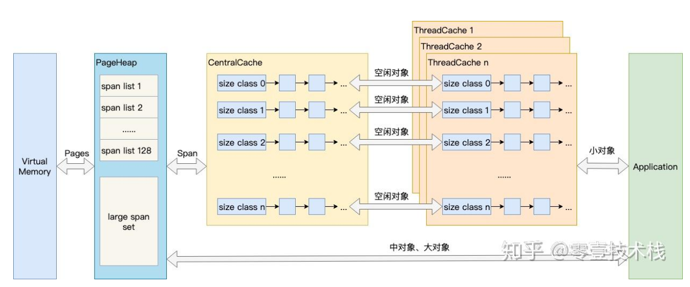

对内存管理以页为单位,一组连续的page称为Span
pageHeap是堆内存的抽象,存放若干链表,链表保存Span,
CentralCach内存不足时,会从pageheap获取span,将span拆分成若干个内存块,内存过多会放回
每个span链表根据内存块的大小划分:小对象0~256KB ,中对象257~1MB 大对象>1MB

CentralCach是所有线程共享的缓存,保存空闲内存块链表,链表数量和ThreadCache链表一样

ThreadCache是每个线程各自的Cache,每个cache包括多个空闲内存块链表,访问无锁
当ThreadCache内存块过多时，可以放回CentralCache。由于CentralCache是共享的，所以它的访问是要加锁的

**内存分配:**

- 小内存(ThreadCache-> CentralCache -> HeapPage):通常情况threadcache是足够的,无需去访问centralCache也pageheap
- 中等内存:直接在PageHeap中选择适当的大小即可
- 大对象分配流程：直接从large span set选择合适数量的页面组成span

#### go内存

>- Go语言源代码中「栈内存」和「堆内存」的分配都是虚拟内存，最终CPU在执行指令过程中通过内部的MMU把虚拟内存转化为物理内存。
>- Go语言编译期间会进行逃逸分析，判断并标记变量是否需要分配到堆上

stack是程序运行时**线程私有的连续内存区域**，用于存储函数调用栈帧（Stack Frame）。每个栈帧包含函数的局部变量、参数、返回地址等临时数据,初始大小仅为2KB,自动回收无需GC

heap是程序运行时全局共享的非连续内存区域,用于存储生命周期超出当前函数作用域的对象或被指针引用的对象,动态申请,依赖GC,非连续

go通过逃逸分析决定变量分配的位置,如果变量生命仅在当前函数内,就会分配到stack

1. 局部变量返回给外部,或者被其他函数的指针参数修改,逃逸到heap
2. 变量大小编译期无法确定`s := make([]int, n)`   n 是运行时参数，s 的大小不确定，逃逸到堆
3. 变量被闭包引用,闭包生命周期长于当前函数
4. 大对象(32KB)会直接分配到heap

##### heap

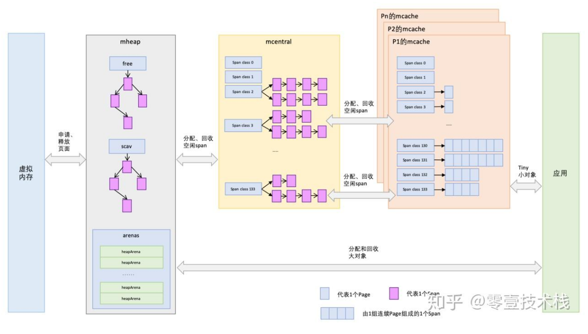

**mache**和TCMalloc中threadCache类似,保存各种大小的Span,按Span分类,
小对象预先从mcache分配内存,
但在Go中是每个P拥有一个mcahe,Go中最多有GOMAXPROCS个线程在运行
不同 P 的 `mcache` 不会被并发访问,每个 `mcache` 仅由绑定到对应 P 的线程操作，无需加锁。

**mcentral**和centralCache类似,所有线程的共享缓存,需要加锁访问,
按span级别分类,链表串联,每个级别的span有两个链表,通过这种机制可以避免频繁向os申请内存
nonempty:这个链表里的span,每个span至少有1个空闲的对象空间(堆上分配内存但未使用,可以重新非分配给新的对象),mcache释放span时加入到该链表的
empty:所有的span都不确定里面是否有空闲的对象空间,需要进一步检查,当一个span交到这里会加入这个链表

**mheap**和pageheap类似,mheap内存不够用会向os申请,
mheap将span组织成两颗tree,
free:空闲并且非gc的span,这些span是程序最近释放的,物理内存仍被进程持有,可以直接分配给新的对象
scav:空闲并且已经gc的span,若要重新使用这些span，需要先向操作系统申请物理内存
mheap中还有arenas，由一组heapArena组成,主要是为mheap管理span和垃圾回收服务

- 32KB 的大对象，直接从mheap上分配；
- <=16B 的对象使用mcache的tiny分配器分配；
- (16B,32KB] 的对象，首先计算对象的规格大小，然后使用mcache中相应规格大小的mspan分配；
- 如果mcache没有相应规格大小的mspan，则向mcentral申请
- 如果mcentral没有相应规格大小的mspan，则向mheap申请
- 如果mheap中也没有合适大小的mspan，则向操作系统申请

##### stack

stack内存分配会在创建goroutine时分配,或者栈扩容时分配

go的stack内存按照大小分为小内存(小于32KB)和大内存(大于32KB)

小内存分配:

1. 先去M线程缓存mache的栈内存缓存stackcache获取
2. 不足从全局栈缓存池stackpool获取
3. 不足从逻辑处理器结构p.pagecache分配
4. 最后从堆mheap获取

大内存:

1. 直接从全局栈内存缓存池`stackLarge`分配
2. 从逻辑处理器结构`p`中的`p.pagecache`
3. 从mheap获取

---

### 调用函数传入结构体时，应该传值还是指针

Go 的函数参数传递都是值传递。

所谓值传递：指在调用函数时将实际参数复制一份传递到函数中，这样在函数中如果对参数进行修改，将不会影响到实际参数。参数传递还有引用传递，所谓引用传递是指在调用函数时将实际参数的地址传递到函数中，那么在函数中对参数所进行的修改，将影响到实际参数

Go 里面的 map，slice，chan 是引用类型。变量区分值类型和引用类型。所谓值类型：变量和变量的值存在同一个位置。所谓引用类型：变量和变量的值是不同的位置，变量的值存储的是对值的引用。

| 数据类型    | 底层结构       | 修改操作是否影响外部     | 原因                                     |
| ----------- | -------------- | ------------------------ | ---------------------------------------- |
| **Slice**   | 指向数组的指针 | 元素修改 → 是；扩容 → 否 | 扩容会分配新数组，函数内外的指针指向不同 |
| **Map**     | `hmap` 结构    | 是                       | 所有操作共享同一个 `hmap` 结构           |
| **Channel** | `hchan` 结构   | 是                       | 所有操作共享同一个 `hchan` 结构          |

 如何确保修改生效

- **Slice**：若需在函数内修改 `slice` 本身（如扩容），需通过**指针传递**：

  ```go
  func modifySlicePtr(s *[]int) {
      *s = append(*s, 42) // 直接修改指针指向
  }
  ```

  `append` 操作**不需要扩容**时,函数内的切片副本和原切片共享同一个底层数组
  此时 `append` 会修改底层数组，原切片的 `len` 虽然没变化，但通过原切片仍能访问到新增的元素

   `append` 操作**需要扩容**时,切片副本和原切片完全分离（`ptr` 不同），原切片不会受到任何影响

- **Map/Channel**：无需指针传递，直接操作即可生效

---

### chan code

#### 限制10个goroutine执行，每执行完一个goroutine就放一个新的goroutine进来

```go
func main() {
    var wg sync.WaitGroup
    ch:=make(chan struct{},10)
    for i:=range 100{
       wg.Add(1)
       ch <- struct{}{}
       go func(id int) {
          defer wg.Done()
          fmt.Println("id:", id)
          <-ch
       }(i)
    }
    wg.Wait()
}
```

#### 开启10个协程，顺序打印1-1000，且保证协程号1的，打印尾数为1的数字

```go
func main() {
    // 同步
    // var wg sync.WaitGroup
    s := make(chan struct{})
    m := make(map[int]chan int, 101)
    for i := 1; i <= 100; i++ {
       m[i] = make(chan int)
    }
    for i := 1; i <= 10; i++ {
       go func() {
          for {
             fmt.Println(i, <-m[i])
             s <- struct{}{}
          }
       }()
    }
    for i := 1; i <= 1000; i++ {
       id := i % 10
       if id == 0 {
          id = 10
       }
       m[id] <- i
       <-s
    }
    time.Sleep(10*time.Second)
}
```

#### 限制10个goroutine执行，每执行完一个goroutine就放一个新的goroutine进来

```go
func main() {
    var wg sync.WaitGroup
    ch:=make(chan struct{},10)
    for i:=range 100{
       wg.Add(1)
       ch <- struct{}{}
       go func(id int) {
          defer wg.Done()
          fmt.Println("id:", id)
          <-ch
       }(i)
    }
    wg.Wait()
}
```

#### 2个goroutine交替10次打印1,2

```go
func main() {
    ch := make(chan struct{})
    go func() {
       for range 10{
          <-ch
          fmt.Println("1:", 0)
          ch <- struct{}{}
       }
    }()
    go func() {
       for range 10{
          <-ch
          fmt.Println("2:", 1)
          ch <- struct{}{}
       }
    }()
    ch<-struct{}{}
    time.Sleep(time.Second*5)
}
```

#### 2个groutinue 打印1a2b3c

```go
func printMethod1() {
    numChan := make(chan struct{})
    letterChan := make(chan struct{})
    var wg sync.WaitGroup
    wg.Add(2)
    go func() {
       defer wg.Done()
       for i := 'a'; i <= 'z'; i++ {
          <-letterChan
          fmt.Println(string(i))
          numChan <- struct{}{}
       }
    }()
    go func() {
       defer wg.Done()
       for i := 1; i <= 26; i++ {
          <-numChan
          fmt.Println(i)
          if i != 26 {
             letterChan <- struct{}{}
          }
       }
    }()
    letterChan <- struct{}{}
    wg.Wait()
    close(numChan)
    close(letterChan)
}

func main() {
    // printMethod1()
    var wg sync.WaitGroup
    wg.Add(2)
    printMethod2()
    wg.Done()
    fmt.Println("============================")
    printMethod1()
    wg.Done()
    wg.Wait()
    
}
```

```go
func printMethod2() {
    numChan := make(chan struct{})
    letterChan := make(chan struct{})
    var wg sync.WaitGroup
    wg.Add(2)
    go func() {
       defer wg.Done()
       for i := 'a'; i <= 'z'; i++ {
          fmt.Println(string(i))
          numChan <- struct{}{}
          <-letterChan
       }
    }()
    go func() {
       defer wg.Done()
       for i := 1; i <= 26; i++ {
          <-numChan
          fmt.Println(i)
          letterChan <- struct{}{}

       }
    }()

    wg.Wait()
    close(numChan)
    close(letterChan)
}
```

#### 3个goroutine交替打印abc 10次

```go
func main() {
    achan := make(chan struct{})
    bchan := make(chan struct{})
    cchan := make(chan struct{})
    defer close(achan)
    defer close(bchan)
    defer close(cchan)
    var wg sync.WaitGroup
    wg.Add(3)
    go func() {
       defer wg.Done()
       for i := range 10 {
          <-achan
          fmt.Println(i, " a")
          bchan <- struct{}{}
       }
    }()
    go func() {
       defer wg.Done()
       for i := range 10 {
          <-bchan
          fmt.Println(i, " b")
          cchan <- struct{}{}
       }
    }()
    go func() {
       defer wg.Done()
       for i := range 10 {
          <-cchan
          fmt.Println(i, " c")
          if i != 9 {
             achan <- struct{}{}
          }
       }
    }()
    achan <- struct{}{}
    wg.Wait()
    fmt.Println("end")
}
```

#### 两个goroutine交替打印奇偶数

```go
func main() {
    ch1 := make(chan struct{})
    ch2 := make(chan struct{})
    var wg sync.WaitGroup
    wg.Add(2)
    go func() {
       defer wg.Done()
       for i := range 100 {
          <-ch1
          if i%2 == 0 {
             fmt.Println("偶数线程", i)
          }
          ch2 <- struct{}{}

       }
    }()
    go func() {
       defer wg.Done()
       for i := range 100 {
          <-ch2
          if i%2 != 0 {
             fmt.Println("奇数线程", i)
          }
          if i != 99 {
             ch1 <- struct{}{}
          }
       }
    }()
    ch1 <- struct{}{}
    wg.Wait()
} 
```

```go
// implBy1Chan 一个chan实现
func implBy1Chan() {
    ch := make(chan struct{})
    var wg sync.WaitGroup
    wg.Add(2)
    go func() {
       defer wg.Done()
       for i := range 100 {
          ch <- struct{}{}
          if i%2 == 0 {
             fmt.Println("偶数线程", i)
          }
       }
    }()
    go func() {
       defer wg.Done()
       for i := range 100 {
          <-ch
          if i%2 != 0 {
             fmt.Println("奇数线程", i)
          }
       }
    }()
    wg.Wait()
}   
```

#### 不超过10个goroutine不重复的打印slice中的100个元素

```go
func main() {
    s := make([]int, 100)
    for i := range 100 {
       s[i] = i
    }
    var wg sync.WaitGroup
    ch := make(chan struct{}, 10)
    for i := range 100 {
       wg.Add(1)
       ch <- struct{}{}
       go func(idx int) {
          defer wg.Done()
          fmt.Printf("idx: %d i:%d\n", s[idx], s[i])
          <-ch
       }(i)
    }
    wg.Wait()
}

```


## mysql

### engine

InnoDB：InnoDB是MySQL的默认存储引擎，具有ACID事务支持、行级锁、外键约束等特性。
它适用于高并发的读写操作，支持较好的数据完整性和并发控制。

MyISAM：MyISAM是MySQL的另一种常见的存储引擎，具有较低的存储空间和内存消耗，适用于大量读操作的场景。
然而，MyISAM不支持事务、行级锁和外键约束，因此在并发写入和数据完整性方面有一定的限制。

Memory：Memory引擎将数据存储在内存中，适用于对性能要求较高的读操作，但是在服务器重启或崩溃时数据会丢失。
它不支持事务、行级锁和外键约束

---

### innodb 2000w

default page;16KB data:1KB 1page存放16条数据
一个指针大约6B bigint8B sum=14B
16000/14=实际大于1000
根节点也能指1000条
所以1000\*1000\*16=2000w左右


### 页分裂

innodb的B+树实际的叶子节点是以页的格式存储,每个页内有序存储着每条具体的记录,页与页之间通过 “双向链表” 连接

当向一个 “已满或剩余空间不足” 的页插入新记录时，若新记录的主键值不在页的末尾,则触发页分裂
若定义了主键但非有序自增,写入的数据不一定会比最后一条id大,就会导致页分裂,进行调整

---

### 数据库迁移到新库设计

迁移数据库往往是收到性能等限制,在迁移之间需要先对表结构进行优化,
去除冗余字段,优化字段类型,拆分大表,优化主键外键和索引,提高检索的效率

迁移过程中我们可以停机全量去迁移,
这样适合数据量小的情况,比如mysqldump导出后,在新库执行,
往往需要与用户约定好时间,尽量在低峰期迁移,比如半夜

也可以增量迁移,使用canal监听mysql的binlog,变更事件写入kafka,由消费者同步到新库
往往是先全量迁移历史记录,增量添加新的记录,快照后不停机,新数据来了后双写

最后我们需要验证数据的一致性,可以对比两库的表行数,关键字段MD5

迁移后不要立刻修改业务到新库,可以先让非核心业务使用,出现错误通过binlog补回迁移期间数据,及时回滚并修改新库

---

### sql语句

```sql
from
join
on 在连接表时使用，首先执行，用于在生成临时表之前根据条件筛选记录，因此效率最高。
where 在生成临时表后筛选数据，适用于不涉及聚合函数的条件
group by
聚合函数count() sum()  cancat_group()
having 分组聚合函数执行完毕才能进行过滤，那这个条件肯定就是放在having
select
distinct
order by
limit  offset
```

### 数据库存储金额（DECIMAL） 为什么不能用FLoat和Double（精度问题）

存储金额时选择 **DECIMAL 类型**是绝对正确的，
核心原因就是 Float 和 Double 会因 “二进制浮点存储的固有缺陷” 导致精度丢失，而金额计算对精度的要求是 分毫不差

为什么不能用 Float/Double？核心是 “二进制无法精确表示十进制小数”
Float（单精度）和 Double（双精度）都属于 **浮点型**，底层用 二进制科学计数法 存储数据。但十进制的小数（比如 0.1、0.2）在二进制中是 “无限循环小数”，无法用有限的二进制位精确表示，这就导致存储和计算时必然产生精度误差，具体体现在两个方面：

存储时的 “近似值” 问题：看起来是 0.1，实际是 接近 0.1 的近似值
以 0.1 为例，它在二进制中的表示是 **0.0001100110011...（0011 无限循环）**，而 Float 只有 32 位、Double 只有 64 位存储位，无法容纳无限循环的二进制数，只能 “截断” 保留有限位，最终存储的是一个 “接近 0.1 但不等于 0.1 的近似值”。
比如在 MySQL 中执行 `SELECT 0.1 + 0.2`，用 Float 存储会得到 `0.30000000000000004`，而不是精确的 `0.3`

计算时的 “误差累积”：多次运算后误差会放大
即使单次误差很小，一旦涉及多次计算（比如订单折扣、税费叠加、分期还款），误差会不断累积。比如：用 Double 存储 1.01 元，经过 1000 次 “加 1.01” 的循环后，最终结果可能不是 1011.01 元，而是偏差几分钱 —— 这对财务对账、金额校验来说是致命的，可能导致系统账实不符，甚至引发业务纠纷。


为什么 DECIMAL 适合存储金额？精确的 “十进制定点存储”
DECIMAL 是数据库专门为 “精确存储十进制小数” 设计的 **定点型**，底层不依赖二进制浮点，而是用 “字符串” 或 “十进制整数 + 缩放因子” 的方式存储，完全避免了二进制转十进制的精度丢失问题，核心优势有 3 点：

**无精度丢失**：精确表示所有十进制小数
DECIMAL 直接以十进制格式存储数字，比如 0.1 就是 0.1，0.2 就是 0.2，计算时不会出现 “0.1+0.2≠0.3” 的情况。例如在 MySQL 中，用 `DECIMAL(10,2)` 存储 0.1 和 0.2，执行 `SELECT 0.1 + 0.2` 会精确返回 `0.30`，完全符合金额计算的精度要求。

精度可控：自定义整数位和小数位长度
DECIMAL 支持显式指定精度参数 `DECIMAL(p, s)`，其中：

`p`（precision）：总位数（整数位 + 小数位），最大支持 65 位；`s`（scale）：小数位位数，最大支持 30 位，且 `s ≤ p`。
`DECIMAL(10,2)`表示最大支持 8 位整数（比如 99999999.99 元，即亿级金额）和 2 位小数（分），完全覆盖大部分业务场景

**无误差累积**：多次计算后精度依然可靠
由于 DECIMAL 是精确存储，无论进行多少次加减乘除运算（比如订单金额 × 折扣率、分期还款金额 = 总金额 / 期数），结果都能精确到设置的小数位，不会出现误差累积。


### Buffer Pool 的作用

内存缓存，规避磁盘慢 IO

InnoDB 的磁盘数据是按 **数据页（默认 16KB）** 存储的，而非按 “行” 存储。因此，“获取 id=1 的记录” 本质是 “获取 id=1 所在的数据页”：

- **情况 1：数据页已在 Buffer Pool**
  Buffer Pool 是 InnoDB 的核心内存缓存区，专门缓存磁盘数据页（包括数据页、索引页、undo 页等）。如果目标数据页已在 Buffer Pool 中，InnoDB 直接从内存中提取 id=1 的行记录，返回给执行器 —— 这一步是纯内存操作，耗时微秒级。
- **情况 2：数据页不在 Buffer Pool**
  InnoDB 会发起 **磁盘随机 IO**（因为数据页在磁盘上是离散存储的），将目标数据页读入 Buffer Pool（同时会触发 “LRU 淘汰策略”，移除不常用的旧页，保证缓存命中率）。
  之后再从内存页中提取记录返回给执行器 —— 这一步受磁盘 IO 影响，耗时毫秒级（是内存操作的 1000 倍以上）。

InnoDB 直接在 Buffer Pool 的 “目标数据页” 中修改记录的新值 —— 此时，内存中的数据页与磁盘上的数据页内容不一致，这个内存页被称为 **脏页（Dirty Page）**。

- 这一步是纯内存操作，速度极快；
- 脏页不会立即刷盘（磁盘随机写效率低），而是由后台线程（Page Cleaner）在 “空闲时段” 或 “内存不足时” 异步刷盘，避免影响前台更新的性能。

### undo log 的存储与持久化

- undo log 并非直接写入磁盘，而是先写入 Buffer Pool 中的 “Undo 页面”（InnoDB 为 undo log 分配的专用缓存页）；
- 但 InnoDB 修改 Undo 页面后，会立即生成对应的 **redo log**（因为 undo log 本身也是 “数据”，需要保证持久性 —— 若崩溃时 Undo 页面未刷盘，可通过 redo log 恢复）；
- 后续 Undo 页面会被后台线程（如 Page Cleaner）异步刷入磁盘的 “undo 表空间”。

### 一条sql语句执行过程

**连接阶段**:客户端先使用TCP与mysql服务器连接,连接后由连接池对线程进行管理避免频繁连接销毁
~~mysql缓存 :**mysql8已经废弃**,只有完全一致的select才会命中缓存,缓存的表发生写入缓存会立刻清空~~
**解析阶段**:进行词法分析和语法分析
词法分析将mysql语句分成多个单词,识别关键词,比如select from 表名 字段名等
语法分析根据sql的语法规则,生成语法树,检查语法错误比如拼写错误,返回错误给客户端
**优化阶段**
优化阶段先进性预处理,检查表,库,字段名是否存在,然后将*扩展为对应的字段
然后进行优化,选取合适的索引,多表连接顺序和算法

**执行阶段**
执行阶段根据索引进行不同的策略扫描,
主键索引从B+tree根节点向下搜索并返回,
二级索引会回表,这里可以使用索引下推,对满足条件的数据进行回表
若是全表扫描性能损耗极高,从最左叶子节点读一行回一次表,需要建立正确的索引

Insert 会检查主键的唯一性,外键关联,非空约束,然后在主键索引指定位置写入B+tree
Update会根据where进行二级索引或者全表扫描,找到修改的记录并加行锁,修改非索引字段直接更新,修改二级索引同步更新二级索引,修改聚簇索引先删除后添加
Delete 定位到目标行加行锁,将记录标记为删除放入垃圾链,后续异步清理,同时更新索引

执行完毕后返回给客户端,并且记录在日志中比如redo log, binlog

### update语句的具体执行过程

具体更新一条记录 `UPDATE t_user SET name = 'xiaolin' WHERE id = 1;`的流程如下:

1. 执行器负责具体执行，会调用存储引擎的接口，通过主键索引树搜索获取 id = 1 这一行记录：
   如果 id=1 这一行所在的数据页本来就在 buffer pool 中，就直接返回给执行器更新；
   如果记录不在 buffer pool，将数据页从磁盘读入到 buffer pool，返回记录给执行器。
2. 执行器得到聚簇索引记录后，会看一下更新前的记录和更新后的记录是否一样：
   如果一样的话就不进行后续更新流程；
   如果不一样的话就把更新前的记录和更新后的记录都当作参数传给 InnoDB 层，让 InnoDB 真正的执行更新记录的操作；
3. 开启事务， InnoDB 层更新记录前，首先要记录相应的 undo log，
   因为这是更新操作，需要把被更新的列的旧值记下来，也就是要生成一条 undo log，
   undo log 会写入 Buffer Pool 中的 Undo 页面，不过在内存修改该 Undo 页面后，需要记录对应的 redo log。
4. InnoDB 层开始更新记录，会先更新内存（同时标记为脏页），然后将记录写到 redo log 里面，这个时候更新就算完成了。
   为了减少磁盘I/O，不会立即将脏页写入磁盘，后续由后台线程选择一个合适的时机将脏页写入到磁盘。
   这就是 WAL 技术，MySQL 的写操作并不是立刻写到磁盘上，而是先写 redo 日志，然后在合适的时间再将修改的行数据写到磁盘上。
5. 在一条更新语句执行完成后，然后开始记录该语句对应的 binlog，此时记录的 binlog 会被保存到 binlog cache，
   并没有刷新到硬盘上的 binlog 文件，在事务提交时才会统一将该事务运行过程中的所有 binlog 刷新到硬盘。
6. XA事务提交：
   prepare 阶段：将 redo log 对应的事务状态设置为 prepare，然后将 redo log 刷新到硬盘；
   commit 阶段：将 binlog 刷新到磁盘，接着调用引擎的提交事务接口，将 redo log 状态设置为 commit（将事务设置为 commit 状态后，刷入到磁盘 redo log 文件）；

---

### join和in的区别

JOIN用于关联两个或者多表,通过关联条件比如on子句将表中符合条件的结果形成新的结果集
IN用来筛选单表内符合条件的行

---

### union 和 union all区别

union和union all都是sql之中用于合并多个select查询集的操作符,
需要select返回相同数量的列(可用null或者0补齐)和兼容的数据结构
区别在于union会去重,union all全保留不去重

---

### 聚簇索引、联合索引，结合场景描述

**聚簇索引**
是一种特殊的索引,不仅决定数据的逻辑顺序,也决定了数据在磁盘上的物理顺序
聚簇索引通常是主键索引,没有主键时会选取unique建立,两者都不存在innodb会生成一个隐藏的列建立
聚簇索引的节点包含了数据本身,直接存储**完整的行数据**,不是数据指针,查询时不需要回表,效率更高,但插入更新删除会导致数据移动

一般在需要按范围频繁查询的表使用:比如频繁检索order_id七天内的订单,一般有序可以连续在叶子节点定位数据,检索很快
通过主键查询的表也方便聚簇索引,直接获取数据,不需要回表
但不适合频繁修改的健,频繁的修改需要频繁的移动物理位置,引发大量io,比如用户表主键不应该设置为可修改

**二级索引**（非主键索引，如普通列索引、联合索引）

- 以非主键列（或联合列）为索引键，B + 树的叶子节点存储**索引键 + 主键值**（而非完整行数据）。
- 查询时：先通过二级索引的 B + 树定位到目标索引键对应的主键值（“索引查找”），再用主键值到聚簇索引中查询完整行数据（“回表”）。例如`select * from t where name='张三'`（name 是二级索引），会先在 name 索引树中找到 name=' 张三 ' 对应的主键 id=10，再到聚簇索引中查 id=10 的行数据。

**联合索引**
联合索引是二级索引的一种,二级索引的节点包含着指向数据行的指针,如果索引中没有需要的字段需要回表
联合索引按字段顺序排序,应该将选择性高的字段放在前面,如果某个数据经常需要,但不是索引,可以加入联合索引,减少回表
联合索引一般用作多条件的频繁查询满足最左前缀：`WHERE category_id=10` 或 `WHERE category_id=10 AND price<100` 均可命中索引
需要排序的订单也可以使用联合索引`(user_id, create_time)`,uid过滤用户,create_time已经排序

联合索引遵循最左匹配原则,只有包含最左边开始的连续列才能命中索引
比如(A,B,C)查询`WHERE A=? AND B=?` 可以命中,查询`WHERE B=? AND C=?`无法命中

---

### 慢查询优化

慢查询优化思路是:定位慢查询->分析瓶颈问题->优化

打开慢查询日志`slow_query_log = 1`,查找时间较长  `slow_query_time=1` 比如1s查询记录
使用explain查看sql执行计划,
关注`type`查找数据记录的大概范围,**system** > **const** > **eq_ref** > **ref** > **range** > **index** > **all;**
关注`key`实际使用的索引,
`rows`扫描行数

- 当**type=all key=null**表明没有使用索引进行了全表扫描,需要建立索引

  对于高频查询的where/join/order by字段建立合适的索引,

- 避免条件中对索引使用函数,会使索引失效
  避免查询条件进行隐式的转化,要保持查询的参数和条件的参数类型一致,否则不走索引

  ```SQL
  SELECT * FROM orders WHERE order_no = 10086;  -- order_no是VARCHAR类型  
  修改为
  SELECT * FROM orders WHERE order_no = '10086'; 
  ```

- 主键索引分页查询offset过大时,`select * from page order by id limit 6000000, 10;`

  会读取并返回很多无用的offset数据,然后抛弃除了limit的数据,这时候可以使用子查询

  `select * from page where id >=(select id from page order by id limit 6000000, 1) order by id limit 10;`只返回60000条id,而不是全量数据,这样也可以优化

  或者采用游标分页,使用上一页最后一条id来获取下一页分页的参数

  `SELECT * FROM page WHERE id > 6000000ORDER BY id LIMIT 10;`

- 非主键的limit进行索引时,还会比主键多个回表``select * from page order by user_name limit 0, 10;``,我们可以改为`select * from page t1, (select id from page order by user_name limit 6000000, 100) t2 WHERE t1.id = t2.id;`避免子查询回表,将匹配到的10个id返回

- 优化数据库字段的类型

  1. 避免盲目使用`int`(4B),可以使用`tinyint`(1B)存性别,`smallint`(2B)存评分
  2. 小数类型需要精确计算使用 `DECIMAL(M,D)`float适合非精确数据
  3. 固定长度使用`char`适合存放hash,可变长度使用`varchar`,超长的字符串使用`text`
  4. 避免设置null,使用空字符串代替或0代替,null会影响索引

- 数据库的记录过多时,可以分表,比如将表按年拆分,减少单表数据量;或者将表垂直拆分,用户访问比较频繁的uid放在主表,访问不频繁的address放在从表

- 还可以使用es进行检索,es倒排索引对于范围检索快于sql

### 为什么范围查询会导致索引失效

这里的 “失效” 不是指 “范围查询本身不使用索引”，而是指 “范围查询后的条件无法使用索引”（针对联合索引场景）。

例如，联合索引`(a, b)`，查询`where a > 10 and b = 20`：

- `a > 10`是范围查询，会**使用索引**定位到 a>10 的起始位置（利用 B + 树的有序性）；
- 但由于 a>10 的范围内，b 的值是无序的（B + 树只保证`(a, b)`整体有序，当 a 变化时，b 的顺序被打破），所以`b=20`无法继续利用联合索引，需要在 a>10 的范围内逐行过滤 b 的值 —— 即 “范围后的 b 索引失效”。

- **B + 树适合范围查询**：指的是 “单一索引列的范围查询”（如`a between 10 and 20`）。因为 B + 树的叶子节点按索引键有序排列且通过双向链表连接，找到范围起点后，可直接遍历链表获取所有范围内的数据，效率极高（这是 B + 树的核心优势）。
- **范围查询导致索引失效**：特指 “联合索引中，范围条件后的其他列无法使用索引”（如上述`a>10 and b=20`）。这不是 B + 树的缺陷，而是联合索引的 “有序性范围” 决定的 —— 联合索引只保证`(a, b)`整体有序，当 a 的条件是范围时，b 在该范围内无序，自然无法利用索引。

### 通常根据查询设置索引，有例外吗？

有例外，最典型的是**为保证数据完整性而创建的索引**，这类索引的核心目的不是优化查询，而是强制业务规则，即使没有直接查询依赖也必须存在：

- **唯一性约束（UNIQUE 索引）**：比如用户表的`username`字段，需要通过`UNIQUE`索引保证 “用户名不重复”，即使很少用`username`查询，也必须创建 —— 这是业务规则要求，而非查询优化。
- **外键索引（FOREIGN KEY）**：比如订单表的`user_id`关联用户表的`id`，外键字段会自动创建索引（或要求显式创建），目的是确保 “订单只能关联存在的用户”（防止脏数据），而非加速查询。

---

### mysql事务中的不可重复读和幻读的区别

不可重复读和幻读都属于"读一致性"的问题,区别在于数据修改的类型和范围

不可重复读:在同一事务内,多次读取的结果不一致,由于其他的事务修改了并提交了数据
可以通过**可重复读**的事务级别处理

幻读:同一事务内,多次执行相同范围内的查询工作时,结果集的数量不一致,其他事务增加删除记录
需要串行化,或则next-key lock(行锁+间隙锁)解决

---

### 数据库隔离级别

读未提交
事务A可以读取到事务B未修改的结果,几乎没有任何隔离性

读已提交
事务A可以读取到事务B修改提交后的结果,可以避免脏读
通过mvcc以及read_view在每条select创建实现
无法解决不可重复读

可重复读
事务A期间多次读取结果一致
read_view在第一次select期间创建,后续复用该read_view,通过对比trx_id和min max值
判断是否在ids中来决定是否可以读取到修改的值,解决不可重复度
结合next-key lock在可以重复读取的基础上解决幻读

串行化读
串行化执行,最安全,放弃并发,性能影响最大,在数据要求绝对的一致性使用

---

### MVCC怎么实现的

MVCC多版本并发控制,是innodb引擎实现事务隔离级别的核心技术,核心目标是解决读写冲突,保证事务隔离性
mvcc依赖隐藏列,undo日志,read view协作,让事务可以读取数据历史版本,而非当前最新版本

**隐藏列记录版本数据的元信息**
包含了DB_TRX_ID,最后一次修改该行的事务id
DB_ROLL_PTR 回滚指针,只想该行了历史版本
DB_ROW_ID 当表没有主键或者唯一健时维护的临时id

**undo 日志存储数据的历史版本**
insert undo:记录插入操作的旧版本,插入新行仅对当前事务可见,事务提交后会删除insert undo
update undo:记录更新或者删除的旧版本,长期保存

版本链形成
比如（`id=1`，`name="张三"`）由事务 1（`trx_id=10`）插入,此时版本链只有一个版本
事务2将name改成李四,旧版本(name="张三")被写入update undo,trx_id=10,roll_ptr=null
新版本trx_id=20 ptr指向旧版本
事务 3（`trx_id=30`）将`name`改为 "王五"
旧版本(name="李四")写入版本链 trx_id=20 ptr=张三
新版本(name="王五") trx_id=30 ptr=李四
当前版本（trx_id=30） → 版本2（trx_id=20） → 版本1（trx_id=10）

**read_view维护参数判断可见性**
read_view维护了m_ids(当前活跃事务id列表),min_trx_id(活跃最小id),max_trx_id(下一个要分配的事务id),creator_trx_id(创建这个read_view事务的id)

trx_id==creator_trx_id 表明是自己创建的事务,可读取
trx_id<min 表明版本非活跃,在readview前提交了数据,对当前事务可见
trx_id>max 表面该版本由未来事务生成,对当前事务不可见
min<=trx_id<max如果trx_id在m_ids中,表明活跃,未提交,不可见,不
在m_ids中表明trx_id的事务已提交,如果在read_view后创建的不可见

**隔离级别**
innodb通过read_view创建的不同时机实现了不同的隔离级别
读已提交时每次执行查询都会重新创建read_view,同一事务内多次查询可能读到不同的版本
可重复读仅在事务第一次查询时创建read_view,后续查询复用,避免读取不同的信息

**举例说明**

- 事务 A（`trx_id=100`，隔离级别`Repeatable Read`）：查询`id=1`的行。
- 事务 B（`trx_id=200`）：更新`id=1`的行并提交。

事务A开始,查询id=1,
创建read_view `m_ids={100} ,min_trx_id=100,max_trx_id=201,creator_trx_id=100`
版本链中当前版本`trx_id=50`（假设之前由已提交事务修改），`50 < min(100)` → 可见，读取到旧值

事务B更新id=1的行,旧版本trx_id=50存入undo,新版本trx_id=200,ptr指向50的版本
事务B提交,m_ids中移除200

事务A再次查询
read_view复用`m_ids={100},min_trx_id=100,max_trx_id=201,creator_trx_id=100`
新版本trx_id=200 在[min,max)之间,且不在m_ids之中,但是id在read_view之后创建的,属于未来版本修改
当前事务A读取是读取不到修改后的数据的

---

### 什么情况下加什么行锁

innodb支持行锁
select可以显式添加行锁,是读锁,不会阻塞其他线程读取,默认是快照读
通过索引进行更新删除时会锁定匹配的行,默认添加独占行锁,避免其他线程影响
范围查找时候会添加next-key lock,是一种记录锁和间隙锁结合,记录锁锁住自己的id,防止修改导致不可重复读
锁住范围内的间隙防止其他线程插入数据导致幻读

---

### 乐观锁的使用场景

乐观锁适合读多写少并发冲突低的情况
乐观锁一般维护一个vision或者时间戳,读取的时候不加锁,更新时检查有没有背其他的线程更新,版本号变化就回退

适用于电商库存的管理:用户会高并发的去读取库存,但写入是低并发的,只有下单才会写入
修改用户相关信息时:查看用户信息(比如姓名)的读取时高并发的,修改冲突较少
金融转账:用户可能多次频繁查看余额,但几乎不涉及对同一账号同时操作
多人协作工具或者博客文章:多人协作或者阅读时,会进行高并发的读取,但不会进行高并发的写入

---

### mysql三种日志

#### **undolog回滚日志,支持事务回滚和多版本读**

在mvcc版本控制中会生成版本链,数据修改时,旧版本会记录在undolog,新版本指针指向旧版本,
其他事务读取时可以读取旧版本,不需要加锁
事务回滚根据指针回滚到事务开始前的状态
事务提交后被知道没有事务需要后异步删除

undo log 是 **逻辑日志**，记录的是 **操作的逆过程**，格式为二进制，根据操作类型不同分为：
**INSERT undo**：记录插入操作的逆过程（删除刚插入的行）。
事务提交后，该 undo log 可立即被回收（因为插入的行仅当前事务可见，提交后其他事务无需访问）
**UPDATE undo**：记录更新 / 删除操作的逆过程（如更新前的旧值、删除前的行数据）。需要保留到 “所有依赖该版本的事务结束”（供 MVCC 读取历史版本），由 purge 线程延迟回收

#### **redolog重做日志,保证已提交事务不丢失**

记录数据页的物理修改,事务执行时写入,格式为二进制，大致包含：
数据页的表空间 ID、页号；页内的偏移量（修改的位置）；修改前的值和修改后的值。

用于确保事务的持久性,事务执行时,会将数据修改记录到redolog缓冲区中,再异步刷新到磁盘
若数据库崩溃或者错误关闭通过redolog恢复数据
redolog是固定大小,循环写入,满了后覆盖

如果没有redolog,是无法保证事务的持久性,
若没有redolog事务在提交时直接将数据写入磁盘,成本大于顺序写入日志,性能下架
若数据库崩溃,未写入磁盘的数据会丢失,无法通过日志恢复

#### **binlog二进制日志,用于主从同步和基于时间点恢复**

binlog事务提交时写入
binlog记录的是逻辑操作,比如sql语句,而不是物理层面的数据变化
记录所有的数据库增删改操作,用于主从复制,审计,数据恢复
主从复制时主库binlog被从库读取,数据恢复时通过binlog回溯到故障前
binlog是追加写入,不会覆盖

如果没有binlog,只靠redolog备份,但 redolog 仅能恢复到崩溃前的最后一致状态，
无法实现精细的时间点恢复

binlog 文件是记录了所有数据库表结构变更和表数据修改的日志，不会记录查询类的操作，比如 SELECT 和 SHOW 操作。

binlog 有 3 种格式类型，分别是 STATEMENT（默认格式）、ROW、 MIXED，区别如下：

**STATEMENT**：记录sql语句
每一条修改数据的 SQL 都会被记录到 binlog 中（相当于记录了逻辑操作，所以针对这种格式， binlog 可以称为逻辑日志），主从复制中 slave 端再根据 SQL 语句重现。但 STATEMENT 有动态函数的问题，比如你用了 uuid 或者 now 这些函数，你在主库上执行的结果并不是你在从库执行的结果，这种随时在变的函数会导致复制的数据不一致；

**ROW**：记录行数据最终被修改成什么样了（这种格式的日志，就不能称为逻辑日志了），
不记录 SQL 语句，而是记录 **每行数据的修改前后状态**（如 “id=1 的行，name 从 'b' 改为 'a'”）。

MIXED：包含了 STATEMENT 和 ROW 模式，它会根据不同的情况自动使用 ROW 模式和 STATEMENT 模式；

### 事务提交

MySQL 事务提交时，redo log写入分为两个阶段，
目的是避免 “redo log 与 binlog 数据不一致”（比如 redo 写了但 binlog 没写，主从复制会丢数据）：

1. **prepare 阶段**：
   - 事务执行完成后，InnoDB 将事务的修改记录写入 redo log（物理日志，记录 “某数据页修改了什么”），并将 redo log 标记为 **prepare 状态**。
   - 此时事务尚未最终提交。
2. **commit 阶段**：
   - MySQL 服务器（非 InnoDB 存储引擎层）将事务的逻辑操作记录写入 binlog（逻辑日志，记录 “做了什么操作”）。
   - 若 binlog 写入成功，InnoDB 将 redo log 的状态从 **prepare 改为 commit**，事务正式提交。

宕机场景：redo log 成功、binlog 未写

当 redo log 已写（处于 prepare 状态），但 binlog 未写完就宕机时，MySQL 重启后会触发 **崩溃恢复流程**，核心逻辑是 “保证 redo log 与 binlog 一致”：

- InnoDB 读取 redo log，发现存在 “prepare 状态但无对应 binlog” 的事务。
- 由于 binlog 未写入，若此时提交事务，会导致 **主库有该事务（redo log 记录），但从库无该事务（binlog 没记录）**，主从数据不一致。
- 因此，MySQL 会**回滚该事务**，丢弃 redo log 中 prepare 状态的修改，确保主从数据一致。

### 两阶段提交如何保证一致性？

若 MySQL 在两阶段提交的任何环节崩溃，重启后 InnoDB 会通过以下逻辑恢复：

1. 读取 redo log，检查事务的状态：
   - 若状态为 “commit”：直接确认事务有效，无需处理；
   - 若状态为 “prepare”：进入下一步 “binlog 校验”；
2. 校验 binlog：查看是否存在该事务的 binlog（通过事务 ID 匹配）：
   - 若存在 binlog：说明 binlog 已刷盘，将 redo log 状态改为 “commit”，事务生效；
   - 若不存在 binlog：说明 binlog 未刷盘，通过 undo log 回滚事务，确保与 binlog 一致。

---

### 主从复制

①当Master节点进行insert、update、delete操作时，会按顺序写入到binlog中。

②salve从库连接master主库，Master有多少个slave就会创建多少个binlog dump线程。

③当Master节点的binlog发生变化时，binlog dump 线程会通知所有的salve节点，并将相应的binlog内容推送给slave节点。

④I/O线程接收到 binlog 内容后，将内容写入到本地的relay-log。

⑤SQL线程读取I/O线程写入的relay-log，并且根据 relay-log 的内容对从数据库做对应的操作。

---

### 主从延迟

mysql只追求最终一致性,
默认是异步复制,主库写入binlog无需从库确认直接给客户端返回成功,
从库拉去并解析binlog若此时主库宕机,binlog会丢失,存在数据一致性风险
可以配置使用半同步复制,主库写入binlog后,必须有一个从库保存binlog才能返回成功

原因:

- 主库写入压力过大,导致binlog生成过快,从库无法及时读取和应用主库
  比如电商平台压力大的时候,主库写入压力激增,从库来不及同步
- 从库性能不足,比如cpu,内存,磁盘配置低,写入慢,
  从库sql线程处理relaylog(暂存主库拉下来的binlog)慢
- 网络延迟或者带宽不足
- 大事务或者长事务:大事务导致数据行多,长事务时间长,
  从库需要更多的时间去解析

## redis

### redis 指令

string

```redis
set name xxx    	     get name 
 mset k1 v1 k2 v2     		mget k1 k2
 set k v EX 60
set k v NX
exists name
strlen name
del name
incr name 
incrby name 10
decr name
decrby name 10
expire name 10  #10s
ttl name
```

list

```shell
LPUSH/RPUSH K1 V1  [V2 V3]
LPOP/RPOP K1
LRANGE K1 start end

BLPOP key [key ...] timeout #从key列表表头弹出一个元素，没有就阻塞timeout秒，如果timeout=0则一直阻塞
BRPOP key [key ...] timeout

LLEN K1 #长度
```

hash

```shell
HSET K1 name "JOB" 
HMSET K1 age 20 name "JOB" 
HGET K1 name
HMGET K1 name age
HLEN key  
HGETALL key  # 返回所有的key键值
HKEYS website
HVALS key
HINCRBY key field n  # field+n
```

set

```shell
SADD key member [member ...] 
SREM key member [member ...] 
SMEMBERS key # 所有元素
SCARD key #元素数量
SISMEMBER key member #是否存在
SRANDMEMBER key [count] #随机取出不删除
SPOP key [count] #随机取出并删除
SMOVE k1 k2 "lalala" # 转移

SINTER K1 K2 # &&
SINTERSTORE destination key [key ...]
SUNION key [key ...]
SDIFF key [key ...]
```

zset

```shell
ZADD key score member [[score member]...] 

ZREM key member [member...]  
ZREMRANGEBYRANK key start stop 按照排名删除
ZREMRANGEBYSCORE key min max  按照分数删除


ZSCORE key member #返回有序集合key中元素member的分值
ZCARD key  #返回有序集合key中元素个数
ZCOUNT key min max #score 值在 min 和 max 之间(默认包括 score 值等于 min 或 max )的成员的数量

ZINCRBY key increment member  ( ZINCRBY salary 2000 tom )

ZRANGE key start stop [WITHSCORES] 正序获取有序集合key从start下标到stop下标的元素
ZRANK salary 0 -1 [WITHSCORES] 返回有序集 key 中成员 member 的排名
ZRANGEBYSCORE k1 (5 (10 #5 < score < 10 #按照分数范围返回
redis> ZRANGEBYSCORE salary -inf +inf WITHSCORES    # 显示整个有序集及成员的 score 值
1) "jack"
2) "2500"
3) "tom"
4) "5000"
5) "peter"
6) "12000"


ZREVRANGE key start stop [WITHSCORES] 倒序字典
ZRANGEBYSCORE key min max [WITHSCORES] [LIMIT offset count]#返回有序集合中指定分数区间内的成员，分数由低到高排序。
ZREVRANK key member #倒叙排名


```

bitmap 本质上是string

```shell
SETBIT key offset value
GETBIT key offset
BITCOUNT key start end #返回区间为内v=1的数量

# operations
# AND 与运算 &
#  OR 或运算 |
#  XOR 异或 ^
#  NOT 取反 ~
BITOP operation destkey key [key ...] # 对一个或多个保存二进制位的字符串 key 进行位元操作，并将结果保存到 destkey 上
BITOP AND and-result bits-1 bits-2
BITPOS [key] [value] #  第一次出现0/1的位置
```

### redis 事务

Redis 事务确实不是传统意义上的 ACID 事务（缺少严格的隔离性和回滚机制），
其核心价值在于 **“将多个命令打包，保证它们被连续、原子地执行**（排除运行时错误)

Redis 通过 `MULTI`、`EXEC`、`DISCARD`、`WATCH` 等命令实现事务

```bash
MULTI #标记一个事务块的开始
WATCH key [key ...] #监视一个(或多个) key 如果在事务执行之前这个(或这些)key被其他命令所改动，那么事务将被打断,乐观锁思想
UNWATCH K #取消 WATCH 命令对所有 key 的监视。
#如果在执行 WATCH 命令之后， EXEC 命令或 DISCARD 命令先被执行了的话，那么就不需要再执行 UNWATCH 了
EXEC # 执行所有事务块内的命令。
DISCARD #取消事务，放弃执行事务块内的所有命令
```

redis事务没有隔离级别,失败后但已经执行的并不会回滚
`EXEC` 执行时，事务内的命令会被连续执行，中间不会插入其他客户端的命令

### redis 是什么

redis是基于内存的高性能键值存储系统,单线程模型非阻塞io多路复用避免频繁上下文切换,性能极强,可以达到10w的QPS,
redis 支持的类型很多,比如字符串 List Set Zset Hash,以及hyperloglog基数统计,Geo地理信息等
redis具有高可用的特性,通过主从复制实现数据备份读写分离,通过哨兵机制实现监控和故障转移
redis是支持分布式的,redis cluster数据分片集群部署,将数据存储在不同的服务器
redis支持持久化,可以使用RDB或者AOF进行数据存储恢复
redis可以应用作为消息队列,缓存,分布式锁,广泛应用于高并发的场景

redis数据在内存存储,受限于物理容量,大规模数据交互内存成本高,否则超过内存会与磁盘交互,io性能急剧下降
redis RDB快照期间会阻塞主线程
redis不适合复杂场景的查询,没有数据库那样的多表关联能力
redis不支持事务,不适合强事务需求比如转账

---

### redis 为什么快

1. 基于纯内存的操作
2. redis利用自身特性,单线程的设计避免频繁切换上下文造成开销
3. 高效的IO模型,使用单线程循环配合IO多路复用epoll,让单个线程可以同时处理多个网络连接上的 I/O 事件（如读写），
   避免了多线程模型中的上下文切换和锁竞争问题
4. redis提供了多种高效的数据护结构,会根据数据大小和类型动态选择不同的底层结构
5. Redis 使用的是自己设计的 RESP 协议,二进制安全,序列化反序列化快
6. 可以采用主从复制+哨兵机制,实现读写分离以及高可用性
7. 可以批量打包pipline操作数据,合理设置过期时间降低占用

---

### Redis集群是怎样存储数据的 集群通讯过程

#### Redis 集群通过 数据分片(Sharding)实现分布式存储

**槽的数量**：Redis 集群固定划分了 **16384 个哈希槽**（编号 0~16383 2^14），所有数据都会 “映射” 到某个槽中，再由槽分配给具体节点。

当客户端写入 / 读取一个 Key 时，Redis 会通过以下步骤确定 Key 所属的槽：

1. 对 Key 执行 **CRC16 算法**（循环冗余校验，生成 16 位整数）；
2. 将 CRC16 结果对 **16384 取模**（`CRC16(key) % 16384`），得到的结果就是 Key 对应的哈希槽编号（0~16383）。

集群中的每个 **主节点（Master）** 会负责一部分哈希槽（从 0~16383 中划分），所有主节点的槽不重叠、全覆盖（即 16384 个槽必须全部分配给主节点，不能有遗漏）

#### 集群使用主从分离结合哨兵机制去存储数据

主服务器进行读写操作,写操作时同步复制给从服务器,从服务器一般是只读,
数据修改只在主服务器上进行，然后将最新的数据同步给从服务器，这样就使得主从服务器的数据是一致的

主从服务器命令复制是异步的:
首次全量复制,后续增量复制
从库是被动的,不会进行过期扫描,客户端访问过期健可以获取数据,主库在key过期后,AOF文件新增一条del指令同步到从库
主库接收到命令后发送给从服务器,但并不会等待从服务器执行完再返回给客户端,而是主服务器在本地执行完就返回
所以无法实现强一致性

主节点挂了后集群会自动触发故障切换，将其从节点升级为新主节点

1. **故障检测**：集群中所有节点会定期（默认 1 秒）向其他节点发送`PING`命令，若某节点连续`cluster-node-timeout`（默认 15 秒）内未响应，会被标记为 “疑似下线（PFAIL）”；
2. **投票确认**：若超过半数的主节点认为该节点 “疑似下线”，则将其标记为 “确定下线（FAIL）”；
3. **选举新主**：该主节点的所有从节点会发起投票，优先级最高（`slave-priority`配置，默认 100）、数据同步最完整（复制偏移量最大）的从节点会被选举为新主节点；
4. **槽迁移**：新主节点会接管原主节点的所有哈希槽，集群更新槽与节点的映射关系，客户端后续访问原槽的数据时，会自动路由到新主节点。

#### 客户端找到目标节点

 Redis 客户端会内置 “哈希槽映射表”，并定期从集群节点同步最新的槽映射关系（如 JedisCluster 会每隔 10 秒更新一次），写入流程如下

1. 客户端本地计算 Key 的哈希槽（`CRC16(key) % 16384`）；
2. 客户端查询本地 “槽 - 节点” 映射表，找到该槽对应的主节点 IP 和端口；
3. 客户端直接向目标主节点发送写入请求（如 SET key value）；
4. 主节点执行写入操作，同步给从节点，返回成功响应。

没有维护映射:会进行节点重定向
client随机访问一个集群节点,该节点检查 Key 的哈希槽是否归自己负责
由自己负责就直接返回,不由自己负责就会返回目标node
client再根据收到的响应进行重定向

#### 集群通信协议:Gossip

- **优点** ：元数据的更新比较分散，不是集中在同一个地方，更新请求会陆陆续续到达所有节点上去更新，有一定的延时，降低了压力
- **缺点** ：元数据更新有延时，可能会导致集群的一些操作会有一些滞后

类反熵优化方案Redis 的 Gossip 协议采用的是 反熵式机制，但其实现结合了谣言传播的特点，形成了独特的类反熵优化方案

每个节点每隔 1 秒随机选择 1-3 个其他节点发送 **PING 消息**，携带自身状态（如槽位分配、主从关系）和部分其他节点的信息（如疑似下线节点列表）。接收方通过回复 **PONG 消息** 反馈自身状态，实现双向状态同步。

- **数据粒度**：PING/PONG 消息仅包含 **部分状态数据**（如随机选择的 1/10 节点信息），而非全量数据，这与传统反熵的全量交换不同，但机制上仍属于反熵的 “推 - 拉” 模式
- **消除差异**：节点收到消息后，会更新本地状态并与自身数据对比。例如，若发现某个节点的槽位分配信息不一致，会主动请求完整数据以修复差异

**故障检测与恢复**
当节点 A 多次未收到节点 B 的 PONG 响应时，会将其标记为 **疑似下线（PFAIL）**，并通过 PING 消息将该状态传播给其他节点。若半数以上主节点确认 B 下线，会触发故障转移并广播 **FAIL 消息**，强制所有节点同步状态。

---

### 缓存不一致怎么解决

**旁路缓存**:
*读取时先查缓存,没有命中查数据库写入缓存后返回*
*写入时先更新数据库,再删除缓存*
若先删除缓存,第二个线程读取不到会立刻同步旧数据,缓存中持有旧数据
先更新数据库,由于缓存写入比数据库快很多,当更新数据库后可能短暂持有旧数据,但会删除掉

**延迟双删**:
更新前删除缓存,更新数据库,更新后延迟删除缓存
先删除缓存,确保后续查询直接命中数据库,更新数据库后,再次删除缓存
确保A在更新数据库时,B进行查询查到缓存缺失,重新同步旧数据到redis
实现简单适合中小并发场景,但延迟时间很难把控,时间太短会在旧数据写入前删除,旧数据依旧存有
时间过长会影响性能,二次删除可能失败需要重试或者定时任务兜底

**多源删除更新**:
确保所有修改数据库的操作都能触发缓存的更新和删除
业务代码直接去触发:修改数据库的接口中,显式调用缓存删除和更新逻辑
消息队列通知:分布式系统使用消息队列广播变更,所有依赖该数据的服务监听并更新缓存
数据库日志触发:通过捕获binlog,使用canal解析并更新

**数据更新加锁,走数据库查询**:
更新期间使用分布式锁阻塞其他线程,加锁期间所有请求读到锁的存在,不读取缓存,直接读取数据库
更新完成后释放锁,删除缓存重添加

**兜底**:
设置过期时间兜底,保证数据最终一致性
版本号控制:更新缓存时需要校验版本号或时间戳,mysql字段每次更新vision++或更新update_at
只有读取到的数据version比缓存里的新才能写入

---

### redis持久化

redis持久化由RDB,AOF,混合策略

**RDB**是进行快照持久化,在指定时间内将内存里数据快照全量写入磁盘,生成二进制文件
可以通过配置文件触发,一般有bgsave和save,bgsave会fork父进程,由子进程处理,不阻塞主线程读写
RDB由子线进程操作时,性能优秀
存储二进制文件方便写入内存,而且体积小
但是数据安全性低,快照是间隔生成的,两次快照期间发生故障会丢失数据
*适用于对数据丢失容忍度比较高的,追求高性能写入,快速恢复备份的场景,比如缓存、非核心统计*

**AOF**是追加文件持久化,记录写的命令以文本格式写到AOF文件中
AOF支持`always`每个写指令立即同步,安全性高性能差
`everysec`每秒追加写一次,默认方式,较平衡
`no`由操作系统觉得何时同步,性能好安全性低
AOF文件会进行重写,当前AOF文件数据过多时,会生成新的AOF文件,对于覆盖添加的语句,删除的语句会进行修订
AOF优点是可以秒级同步,安全性高,命令格式记录,对程序员易读,修复较简单
但文件体积大,恢复速度慢
*适用于数据安全性高,不接受快照间隔内数据丢失,增量持久化,比如金融数据、用户核心数据*

**混合**是结合RDB和AOF的机制
AOF文件头部存储RDB的全量二进制数据,尾部存储增量的命令
在恢复时先恢复RDB的全量数据,再执行尾部的追加命令
数据安全性高,恢复较快,文件大小中等

---

### 分布式锁

分布式系统中,多个进程可能会同时操作共享资源,分布式锁让这些并发互斥,防止数据出现不一致

**分布式锁一定要互斥 需要设置过期时间防止死锁 唯一id防止误删 原子性redis命令原子,lua脚本也原子性,要有高可用性**

分布式系统中可以用redis做分布式锁,利用redis单线程原子命令保证锁的lock与unlock唯一
可以使用`set lockkey unique_value EX 10 NX`建立锁,unique_value是唯一id,表示锁持有者
EX设置过期时间,防止锁一直被占有如死循环,系统崩溃导致的死锁,NX没有就创建

释放锁可以使用lua脚本,lua脚本在redis执行是原子的
如果锁的value=client_id,就删除锁

```lua  
-- 若锁的value等于client_id，则删除锁，否则不操作
if redis.call('get', KEYS[1]) == ARGV[1] then
  return redis.call('del', KEYS[1])
else
  return 0
end
```

redis分布式锁可以设置成看门狗机制
使用守护进程,每隔一段时间检查,仍然尺有锁会推后过期时间
释放锁会停止续约

redis集群中使用redlock进行分布式锁
当一个事务要求持有锁时,需要向独立的redis节点获取,在设定的ttl内超过半数同意认为持有分布式锁
释放锁需要向所有的节点请求释放

---

### 大key删除

如果一个 key 对应的 value 所占用的内存比较大，那这个 key 就可以看作是 bigkey
String类型value大于1MB
复合类型（List、Hash、Set、Sorted Set 等）的 value 包含的元素超过 5000 个

客户端超时阻塞：由于 Redis 执行命令是单线程处理，然后在操作大 key 时会比较耗时，那么就会阻塞 Redis，从客户端这一视角看，就是很久很久都没有响应。

网络阻塞：每次获取大 key 产生的网络流量较大，如果一个 key 的大小是 1 MB，每秒访问量为 1000，那么每秒会产生 1000MB 的流量，这对于普通千兆网卡的服务器来说是灾难性的。

工作线程阻塞：如果使用 del 删除大 key 时，会阻塞工作线程，这样就没办法处理后续的命令

查找大key

```bash
1.使用 Redis 自带的 --bigkeys 参数来查找
redis-cli -p 6379 --bigkeys
这个命令会扫描（Scan）Redis 中的所有 key，会对 Redis 的性能有一点影响

2.使用 Redis 自带的 SCAN 命令
SCAN 命令可以按照一定的模式和数量返回匹配的 key。
获取了 key 之后，可以利用 STRLEN、HLEN、LLEN 等命令返回其长度或成员数量
```

处理大key

**分割 bigkey**：将一个 bigkey 分割为多个小 key。例如，将一个含有上万字段数量的 Hash 按照一定策略（比如二次哈希）拆分为多个 Hash。

**采用合适的数据结构**：例如，文件二进制数据不使用 String 保存、使用 HyperLogLog 统计页面 UV、Bitmap 保存状态信息（0/1）。

**开启 lazy-free（惰性删除/延迟释放）**：lazy-free 特性是 Redis 4.0 开始引入的，指的是让 Redis 采用异步方式延迟释放 key 使用的内存，将该操作交给单独的子线程处理，避免阻塞主线程

---

### 存储对象String还是Hash

- String存储序列化后对象数据 Hash是单独存储每个字段的单独类型,适合修改
- Hash相比String节省内存
- String更适合复杂对象存储,不需要处理嵌套结构
- String通常是O(1)的操作,因为它存储的是整个对象，操作简单直接，整体读写的性能较好

---

### 过期删除策略

>redis对key设置过期时间,需要有相应的机制删除过期key,就是过期删除策略
>
>对key设置过期时间后,redis会将key带上过期时间存储在一个**过期字典**中
>
>查询key,会先查询是否过期

删除策略「惰性删除+定期删除」

- 惰性删除:不主动删除,每次从数据库访问key,若是过期则删除
  - 只有每次访问才会检查key是否过期,所以占用资源很少,对cpu友好
  - 但是若一个key已经过期,却仍留存在数据库中,没有被访问就不会被删除,造成空间的浪费

- 定期删除:每隔一段时间从数据库中随机抽取一定数量的key,删除其中过期key

  - 从过期字典中随机抽取20个key
  - 检测并删除过期key
  - 过期key占比大于25继续抽取直到小于25
  - 为了防止循环过度对cpu不友好,会加入定期删除循坏的时间上限

持久化中过期key:
RDB生成文件时不会存储过期key,主服务器载入RDB会进行检测,过期键不会加载,从服务器会加载后写一条del进行补偿
AOF写入阶段,数据库某个过期键没删除,AOF文件会保留此健,当过期健删除后,redis向AOF追加一条DEL命令,重写时也不会保存

### 内存淘汰

redis内存满了后会触发内存淘汰机制,阈值是我们设置的最大运行内存

- **不进行数据淘汰**
  - noeviction 内存满后返回错误

- **进行数据淘汰**
  - 在过期key中淘汰
  - 随机淘汰过期时间任意健值
  - 优先淘汰更早过期的
  - lru:设置过期的key中,淘汰最久未使用的key
  - lfu:设置过期的key中,淘汰最少使用的key

- **随机淘汰**
  - 任意淘汰key
  - lru:所有key中最久没有用的淘汰
  - lfu:所有key中使用最少的淘汰

---

### 慢查询

非O(1)时间复杂度的命令，例如：

- `KEYS *`：会返回所有符合规则的 key。

- `HGETALL`：会返回一个 Hash 中所有的键值对。

- `LRANGE`：会返回 List 中指定范围内的元素。

- `SMEMBERS`：返回 Set 中的所有元素。

- `SINTER`/`SUNION`/`SDIFF`：计算多个 Set 的交集/并集/差集。

- `ZRANGE`/`ZREVRANGE`：返回指定 Sorted Set 中指定排名范围内的所有元素。时间复杂度为 O(log(n)+m)，n 为所有元素的数量，m 为返回的元素数量，当 m 和 n 相当大时，O(n) 的时间复杂度更小。

  `ZREMRANGEBYRANK`/`ZREMRANGEBYSCORE`：移除 Sorted Set 中指定排名范围/指定 score 范围内的所有元素。时间复杂度为 O(log(n)+m)，n 为所有元素的数量，m 被删除元素的数量，当 m 和 n 相当大时，O(n) 的时间复杂度更小。

redis提供了slowlog可以查找慢查询

### 击穿 穿透 雪崩

#### 缓存击穿

key 对应的是 **热点数据**，该数据 **存在于数据库中，但不存在于缓存中**,可能会导致大量的请求无法命中缓存,对数据库压力大

解决:

**永不过期**（不推荐）：设置热点数据永不过期或者过期时间比较长。
**提前预热**（推荐）：针对热点数据提前预热，将其存入缓存中并设置合理的过期时间比如秒杀场景下的数据在秒杀结束之前不过期。
**加锁**（看情况）：在缓存失效后，通过设置互斥锁确保只有一个请求去查询数据库并更新缓存。

#### 缓存雪崩

**缓存在同一时间大面积的失效，导致大量的请求都直接落到了数据库上，对数据库造成了巨大的压力**
可以看走更严重的缓存击穿

**随机过期**:避免大量key同时过期,在原过期时间基础上增加随机时长
**Redis 集群**：采用 Redis 集群，避免单机出现问题整个缓存服务都没办法使用。使用Redis Cluster 和 Redis Sentinel 保证缓存的分布式和高可用
**多级缓存**：设置多级缓存，例如本地缓存+Redis 缓存的二级缓存组合，当 Redis 缓存出现问题时，还可以从本地缓存中获取到部分数据

#### 缓存穿透

key既不在缓存也不再数据库
**缓存无效 key**: `表名:列名:主键名:主键值` `SET key value EX 10086`
布隆过滤器
接口限流

#### redis结合布隆过滤器过滤请求

从请求中提取一个唯一标识符作为布隆过滤器的输入
HTTP请求使用uid+接口路径+参数作为标识符
订单创建使用uid+goodsid+timestamp作为标识
文章查看使用uid+articleid作为标识

- 安装redisbloom并修改配置文件指定扩展文件路径

- 针对每种类型的实体初始化布隆过滤器

  ```bash
  # 初始化文章ID布隆过滤器，预计10万篇文章，误判率为0.1%
  BF.RESERVE articleFilter 0.001 100000
  
  # 初始化用户ID布隆过滤器，预计10万用户，误判率为0.1%
  BF.RESERVE userFilter 0.001 100000
  ```

- 使用 Redis 的 `hash` 或 `string` 类型存储数据

- 使用 Redis 的 RedisBloom 模块来实现布隆过滤器,
  针对不同的实体（如文章、用户）分别创建布隆过滤器

- 接收请求获取文章详情 `/api/article/{id}` 或用户信息 `/api/user/{id}`
  布隆过滤器检查对应的id是否存在,防止缓存穿透
  存在从redis返回数据,redis不存在读取数据库并更新缓存

- 新增文章要同步添加到布隆过滤器

限流

```
[客户端请求]
      ↓
1. 布隆过滤器：快速拦截“已知恶意 IP/UID” ✅（黑名单预检）
      ↓
2. 滑动窗口限流器：检查该用户/IP 是否超频 ❗（核心限流）
      ↓
   是 → 拦截（返回 429）
   否 → 放行，处理业务
```

---

### 布隆过滤器

用于检索一个元素是否在集合中,空间效率好,不存储元素本身,检索效率比一般算法好,
缺点是有一定的误识别率,难以获取元素本身,难以删除元素

#### 使用场景

解决redis的缓存穿透问题
对爬虫网址进行过滤,爬过的不再爬
对邮件过滤,做邮件黑名单过滤器
过滤请求,防止重复请求,恶意刷接口
很多的数据库内置了布隆过滤器,减少数据库的io来判断数据是否存在

#### 数据结构

实际上是一个很长的二进制向量和一系列随机映射函数
以redis布隆过滤器为例,底层是一个大型的bit数组+多个无偏hash函数

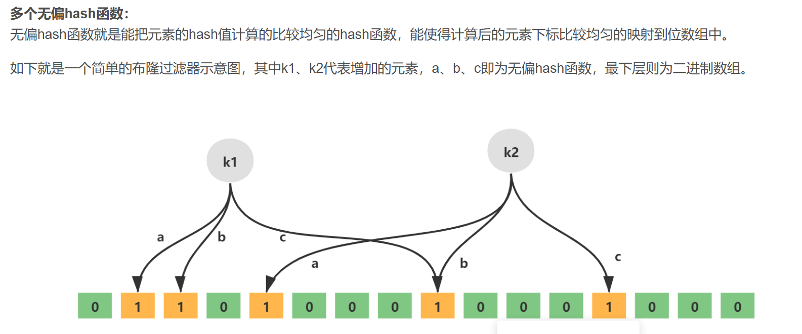

布隆过滤器增加元素前,需要初始化数组空间,计算无偏hash函数的个数
错误率越低,bit数组越长,空间占比大,无偏hash函数多,计算耗时也比较长

布隆过滤器增加元素时,需要根据多个hash函数计算出多个hash值,然后对数组长度取模获得下标
三个hash计算后获得三个index,将bit置1

查询元素时,对元素进行无偏hash获得多个hash值,对len去模获得索引下标
判断是否为1,全为1判定为存在(可能误判),存在0一定不存在

由于hash函数存在hash冲突,所以存在误判的可能性,同时也由于哈希冲突很难对元素进行修改和删除

---

### redis数据结构

[Redis 5 种基本数据类型详解 | JavaGuide](https://javaguide.cn/database/redis/redis-data-structures-01.html#总结)

| String | List                         | Hash          | Set          | Zset              |
| :----- | :--------------------------- | :------------ | :----------- | :---------------- |
| SDS    | LinkedList/ZipList/QuickList | Dict、ZipList | Dict、Intset | ZipList、SkipList |

### Redis 作为缓存、DB 还是混用？项目中如何使用与权衡

Redis 的定位取决于业务对 “数据一致性、性能、持久化” 的需求，核心是 “扬长避短”—— 利用其高性能（内存操作），规避其持久化短板（相比数据库，数据丢失风险更高）。实际项目中三种方式都可能用到，具体如下：

**纯缓存模式（最常用）**数据源头在 MySQL 等数据库，Redis 仅用于 “加速访问”，减轻数据库压力。

- 读操作：先查 Redis，命中则返回；未命中则查数据库，再将结果写入 Redis（设置合理 TTL）。
- 写操作：先更新数据库，再删除 / 更新 Redis（避免缓存脏数据，如 “更新后删除缓存，下次读时重新加载”）。

典型案例 商品详情页（热点数据，读多写少）、用户信息（非实时变更）。

优点：开发简单，充分利用 Redis 高性能，数据库压力小。
缺点：存在 “缓存与数据库一致性” 问题（需通过更新策略规避，如先更 DB 再删缓存）；
缓存失效时可能引发 “缓存穿透 / 雪崩”（需加防护，如布隆过滤器、随机 TTL）。

纯 DB 模式（特定场景）数据无需强持久化（允许少量丢失），但需要高频读写、原子操作或复杂数据结构（如计数器、排行榜）。

- 数据直接存储在 Redis，依赖其持久化机制（RDB+AOF）保证基本可靠性，不依赖其他数据库。
- 利用 Redis 的原子命令（如`INCR`、`SADD`）实现业务逻辑（如点赞数统计、用户在线状态）。

实时计数器（文章阅读量）、临时排行榜（今日热搜）、分布式锁（基于`SET NX`）。

- 优点：性能极致（纯内存操作），支持丰富的数据结构和原子操作，适合高频场景。
- 缺点：持久化有风险（AOF 重写可能丢数据，RDB 有间隔），不适合存储核心业务数据（如订单、用户余额）；数据量过大时内存成本高。

**混用模式（结合两者优势部分数据需缓存加速，部分数据需 Redis 作为主力存储**

- 缓存层：热点数据（如商品列表）用 Redis 缓存，关联 MySQL
- 存储层：非核心但高频的数据（如用户行为日志、临时会话）直接存在 Redis

社交平台 —— 用户资料（MySQL+Redis 缓存）、点赞关系（Redis 的 Set 存储，直接作为 DB）、消息通知（Redis 的 List 存储，临时队列）

- 优点：灵活适配不同数据的特性，平衡性能与可靠性。
- 缺点：架构复杂度提高，需维护两套存储的一致性（如点赞数最终同步到 MySQL 归档）

**核心权衡原则**：

- 若数据是 “核心业务数据”（如订单、支付记录），必须以数据库为基准，Redis 仅做缓存
- 若数据是 “高频、非核心、可丢失”（如计数器、临时状态），可让 Redis 作为 DB
- 优先考虑 “缓存模式”，除非 Redis 的特性（原子操作、数据结构）是业务刚需，否则不轻易用其做 DB


## 网络

### 网络的七层模型了解过吗？他和5层模型的区别在哪？为什么网络的模型这么设计

OSI七层模型和五层模型都是用于规范数据传输流程的经典框架

OSI从上到下分为
 应用层为用户提供网络服务,主要有HTTP FTP SMTP DNS
 表示层用于处理数据格式的转化,加密解密,压缩解压,比如JPG转化PNG,ASCII编码转化UTF8
 会话层用于建立管理终止通话信息,比如断点传输与会话保持,再比如SDP协议
 传输层提供端到端的数据传输,TCP具有差错控制以及保障交互,UDP广播速度快吞吐大
 网络层负责数据包的路由选择,比如IP ICMP OSPF以及路由协议
 数据链路层分为数据逻辑链路(LLC),和媒体访问控制(MAC),负责差错纠正,浏览控制,相邻设备之间的帧传输,物理地址的识别
 物理层定义了传输的介质,电压点平等要求

TCP/IP 五/四层模型
 应用层:合并了OSI的应用层,表示层,会话层,直接为用户提供服务
 传输层,网络层,网际接口层(数据链路层,物理层)

七层模型相比五层模型理论上更严谨,但实际中很难拆分,适合理论研究
五层模型简化层级,更符合实际的网络协议的实现

网络模型这么设计是因为需要将数据传输进行解耦,每一层只需要关注特定功能,调用下层服务,提供上层接口,避免上下层相互影响
推进兼容和标准化,让不同厂商设备按统一标准通信
易于维护扩展,每层功能独立,可以分层查找故障

---

### 打开网站发生了什么

1. 键入url后会先从浏览器中查找缓存,如果界面已经缓存并且没有过期而且版本是最新的
   就直接进行转码,否则从服务器拉取

2. 浏览器解析url中的协议,域名,端口,文件存储的路径信息
   然后去查浏览器本地缓存和os本地缓存,DNS去获取域名所对应的ip地址
   DNS迭代,本地dns服务器去请求根域`.`,顶级域`.com`,二级域`baidu.com`,子域名`www.baidu.com`

3. 传输层会进行3次握手建立tcp的连接

   1. client发送SYN,携带自己的seq=x,进入SYN-SEND
   2. server接受到返回ACK ,确认client的ack=x+1 ,携带自己的序号seq=y进入SYN-RECV
   3. client收到后返回ACK,确认server的seq=y+1 返回自己的ack=x+1,进入ESTABLISHED

   如果是HTTPS会进行tls/ssl的握手

4. 接下来将tcp封装成ip数据报,添加源ip目标ip

5. 然后会使用arp协议获取对应的mac地址

6. 浏览器接受服务器的响应会解析,看响应码是否可以访问,是否需要重定向,是否可以缓存等

7. 浏览器渲染界面,解析HTML生成DOM树,解析CSS生成CSSOM,计算与绘制界面

8. 最后关闭四次挥手关闭TCP连接

---

### DNS

在解析前，需先明确 `www.baidu.com` 的域名层级（从右到左为 “顶级域→二级域→子域名”）：

- **根域**：`.`（所有域名的最顶层，全球共 13 组根 DNS 服务器）
- **顶级域（TLD）**：`.com`（通用顶级域，由专门的机构管理）
- **二级域（SLD）**：`baidu.com`（百度的核心域名，需向域名注册商申请，并有对应的 “权威 DNS 服务器” 管理）
- **子域名**：`www`（百度为 “网页服务” 配置的子域名，可由百度自主管理）

1. 查询浏览器本地缓存 , 查询os的本地缓存
2. 查询本地DNS服务器,作为 “中间代理”，替用户设备完成后续的 “全球层级查询”
   本地 DNS 服务器会先检查自身缓存，若有 `www.baidu.com` 的记录，直接返回 IP；
   若没有，进入 “迭代查询”（即本地 DNS 主动向更上层的 DNS 服务器逐步查询）
3. 本地 DNS 向「根 DNS 服务器」查询,根 DNS 服务器返回 `.com 顶级域`
4. 本地 DNS 向「顶级域（.com）DNS 服务器」查询,返回**`baidu.com 权威 DNS 服务器` 的 IP 地址**：
5. 本地 DNS 向「baidu.com 权威 DNS 服务器」查询,获取 **`www.baidu.com` 的最终 IP 地址**
6. 本地 DNS 服务器将 `www.baidu.com` 的 IP 地址返回给用户的浏览器

###  MAC地址是怎么用的？我现在和你开视频会议的时候需要知道你的MAC地址吗

MAC 地址的核心作用是局域网内的设备身份标识

1. 局域网内的精准寻址当两台设备在同一局域网通信时，数据会封装成 数据帧。
   这个数据帧的头部必须携带目标设备的 MAC 地址，交换机才能根据 MAC 地址，把数据准确转发到目标设备
2. 配合 ARP 协议实现 IP 转 MAC,我们平时用 IP 地址（比如`192.168.1.100`）定位设备，但 IP 地址是 跨网段的逻辑地址，
   无法直接用于局域网内的数据帧投递。
   这时候需要**ARP 协议**：你的设备会先发送 ARP 请求，询问 谁是`192.168.1.100`请告诉我你的 MAC 地址，
   目标设备回复后，设备就会缓存 IP 和 MAC 的对应关系，后续局域网通信就用 MAC 地址寻址。

视频会议场景完全不需要知道对方的 MAC 地址

跨网段通信依赖 IP 地址，MAC 地址只在 每一跳 生效
视频会议的数据会从设备出发，经过路由器、运营商网络、服务器等多 “跳” 到达另一边。
每一跳的两个设备会在各自的局域网内，用 ARP 获取对方的 MAC 地址完成数据转发，
但**跳与跳之间的 MAC 地址是独立的**。比如数据帧到了路由器后，路由器会剥离原有的 MAC 地址，
重新封装上 “下一跳设备的 MAC 地址”，原 MAC 地址不会传递到广域网

端到端通信只需要 IP 地址，MAC 地址属于 底层细节:视频会议的连接建立，靠的是双方的**IP 地址 + 端口号**（
您的设备只需通过 IP 找到我的设备所在的广域网位置，剩下的 “每一段局域网内用什么 MAC 地址”，会由路由器、交换机自动处理，你不需要关心也无法获取。

### ws心跳

从 **触发方式、数据格式、作用范围** 等维度进一步拆解差异：

- **TCP 保活**：工作在传输层，仅关注 “TCP 连接是否通”，不感知应用层状态

  例如：客户端进程崩溃（但 TCP 连接未正常发送FIN包）、服务器应用挂了（但 TCP 连接还在），TCP 保活无法检测到 —— 它只知道 “底层链路能通”，但不知道 “应用层能不能处理消息”
  TCP 保活由操作系统内核控制，默认**不开启**，配置需修改内核参数
  触发逻辑固定（仅检测底层），应用层无法自定义（比如无法根据业务场景调整超时时间）
  TCP 保活发送的是 “无意义的 TCP 探测包”（仅含 TCP 头部，无应用数据），对方仅需 TCP 层回复`ACK`，无需应用层处理

- **HTTP 持久连接**：工作在应用层，但本质是 “连接复用”，无心跳能力。所谓 “Keep-Alive” 只是让 TCP 连接在多次请求间不关闭
  由 HTTP 协议头控制（`Connection: Keep-Alive`），超时时间由服务器配置（如 Nginx 的`keepalive_timeout`）

- **WS 心跳**：工作在应用层，直接感知应用层可用性

  WS 是全双工协议（双方可主动发消息），心跳是协议标准（Ping Pong帧）：客户端 / 服务器发Ping，对方必须回Pong
  若超时未收到Pong，可直接判断 “应用层通信故障”（如对方进程崩溃、业务逻辑阻塞），而非仅底层链路问题
  heartbeat由应用层（客户端 / 服务器）主动触发，**完全自定义**

WS 心跳的核心价值，是弥补 **TCP 保活的 应用层感知缺失** 和 **中间网络设备的 空闲断连问题**，确保全双工通信的可靠性：

1. 解决 “假在线” 问题：区分 “TCP 活” 和 “应用活”
   TCP 保活只能检测 底层链路通不通，但无法判断 应用层能不能用
   例 1：客户端 APP 被强制杀死（未触发 WS 断开逻辑），但 TCP 连接因未发送`FIN`包仍保持（操作系统可能延迟回收），服务器若仅依赖 TCP 保活，会误以为客户端仍在线，持续占用资源。
   例 2：服务器业务进程崩溃（如内存溢出），但 TCP 连接未被内核释放，客户端发送的实时消息会被 TCP 层接收，但应用层无法处理，导致消息丢失。
   WS 心跳通过`Ping/Pong`交互，直接验证 “对方应用层是否能正常响应”：若超时未收`Pong`，可立即判定 “通信失效”，主动断开连接并释放资源

2. 避免中间设备 “杀死” 空闲连接
   互联网中的 **防火墙、路由器、负载均衡器** 等中间设备，为了节省资源，会默认关闭 长时间无数据传输的 TCP 连接（超时时间通常为 30 秒～10 分钟，不同设备配置不同）。
   WS 是全双工协议，可能存在 “长时间无业务消息” 的场景（如聊天窗口打开但双方未发言）：
   若没有心跳，中间设备会认为连接 “空闲”，主动断开 TCP 连接；
   心跳包（`Ping`/`Pong`）属于 “有效数据”，能让连接保持 “活跃状态”，避免被中间设备强制断开，确保后续业务消息能正常传输主动回收无效连接

2. 优化资源占用WebSocket 服务通常需要支撑大量并发连接（如百万级实时用户），无效连接（如客户端离线、进程崩溃）会持续占用服务器的端口、内存、文件句柄等资源,通过心跳机制，服务器可主动检测并断开 “超时无响应” 的连接，避免资源泄漏，提升服务稳定性

3. 保障全双工通信的 “实时性”
   WS 的核心场景是**实时通信**（如实时通知、在线协作），要求 “连接随时可用”。若不维持心跳，等到需要发送业务消息时才发现 “连接已断”，会导致消息延迟或丢失，影响用户体验。
   心跳可提前发现连接故障，让客户端 / 服务器有时间主动重连（如客户端检测到心跳超时后，自动重新建立 WS 连接），确保通信通道的 “实时可用”。


### IP

在链路层，由以太网的物理特性决定了数据帧的长度为(46＋18)~(1500＋18)，其中的18是数据帧的头和尾，也就是说数据帧的内容最大为1500(不包括帧头和帧尾)，即MTU(Maximum Transmission Unit)为1500； 　

在网络层，因为IP包的首部要占用20字节，所以这的MTU为1500－20＝1480；

在传输层，对于UDP包的首部要占用8字节，所以这的MTU为1480－8＝1472
TCP 包的大小就应该是 1500 - IP头(20) - TCP头(20) = 1460 (Bytes)

IP header 最小20B

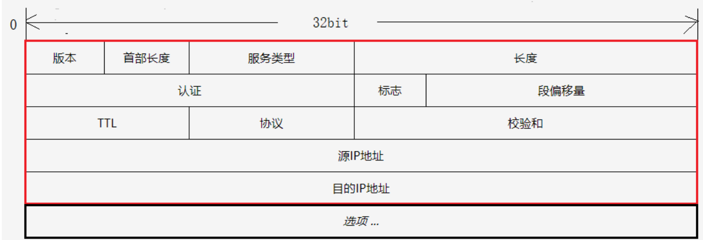

版本4b:表明是ipv4还是ipv6
首部长4b
服务类型8b:表示传输的优先级
长度16bit:ip包总长 max65535b
标志:0 不使用 ,1 DF位,表明路由器不能对上层数据包分段, 2MF 路由器杜迪数据包分段,表示后面还有数据
协议表明是tcp,udp,IGMP,OSPF等

### TCP和UDP区别

TCP传输控制协议和UDP用户数据报协议都是网络层重要的协议

TCP是面向连接协议,,需要经过三次握手四次挥手保证连接
UDP无连接

TCP可靠性需要ACK的应答机制,以及seq保证有序的交付,超时重传和checksum校验
UDP无确认不重传丢包不处理,但可以选择checksum

TCP是字节流传输,无边界,可能存在粘包问题
UDP是独立的数据包,不存在粘包问题

TCP支持流量控制和拥塞控制
维护接收方和发送方滑动窗口控制发送速率,避免丢包
使用拥塞控制(慢开始,拥塞避免,快重传,快恢复)
UDP无法感知拥塞,不支持流量控制和拥塞控制

TCP头20~60B UDP头8B


1. 结构

   1. TCP头 (20B~60B)
      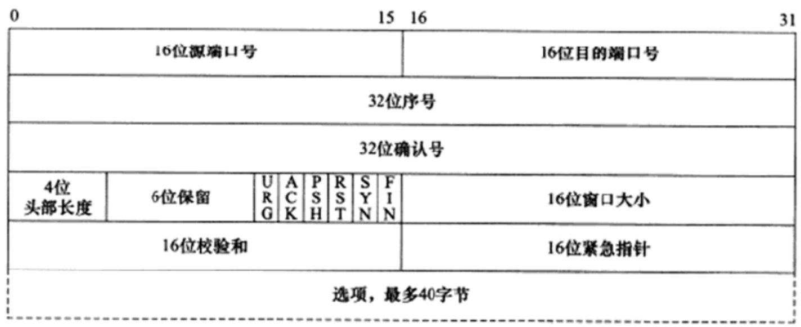
      端口号表名从哪里来到哪里去,seq表面自己发送数据的偏移量,ack确认对方的数据
      4位头部长,最大能标识1111就是15个4Byte,所以tcp最大60B

      URG表示需要紧急发送,配合紧急指针寻找要发生的字节序列(紧急=seq+紧急指针-1)
      ACK确认 RST重置连接  SYN同步  FIN终止通信
      PSH:发送端告诉接收端，应立即将这个报文段以及之前接收到的所有数据推送给应用层，而不是等待缓冲区填满,保证传输的实时性

      窗口大小用来流量控制,rwnd
      checksum确保数据没有被损坏

   2. UDP (8B)

      

      2B源端口 2B目标端口 2B数据包长度(UDP header+ DATA,因为header是8b,所以最小是8b) 2B的checksum

2. 连接性

   TCP是面向连接,通信前需要三次握手,结束后需要四次挥手断开连接
   UDP发送前无需建立连接,直接将数据封装成数据报

3. 可靠性

   TCP保证数据可靠准确的交付:

    确认应答:接收方接收到后需要返回ACK确认

    超时重传:发送发若超时没有收到数据,会重传数据

    拥塞控制:根据网络的拥堵情况调节接受方和发送方的窗口,避免网络过载数据丢失

    数据校验:检测数据传输中是否损坏

    有序传输:TCP会为数据段编号,接收方按编号重组,保证顺序

   UDP不保证可靠的传输
    可以提供基本的数据校验,但不保证数据交付,数据的顺序和完整性,没有重传机制

4. 传输效率

   TCP:传输前需要进行三次握手,启动后慢启动,需要ACK确认数据等方式导致TCP传输效率较低

   UDP:无连接,头部开销小,不需要确保交付,适合实时性高数据不重要的场景,比如直播,语言通话

5. 数据边界与流量控制

   TCP是字节流没有明确的数据边界,发送方发送连续的字节流,接收方通过缓冲区积累数据,有可能导致粘包
   TCP的接收方通过滑动窗口告知接收方最大接收数据量,避免发送太快导致缓冲溢出

   UDP是数据报传输,有明显边界,每个UDP报文段都是独立的数据包,发送一次读取一次,没有粘包问题
   UDP不提供流量控制 

6. 应用场景

   TCP适合可靠,要求数据完整交付的场景:比如文件传输FTP,网页预览HTTP,邮件发送SMTP,远程登陆SSH

   UDP适合实时性强的场合:比如实时通信,流媒体,游戏数据传输,广播多播

---

### TCP怎么保障可靠的传输

1. 建立可靠的传输连接

   TCP是面向连接的,通信前三次握手建立连接,确认双方的缓冲区,序列号,保证双方可以正常通信
   结束通信前需要四次挥手断连,确保所有数据都交付,并且不影响后续连接数据

2. 数据校验

   TCP发送方对每个数据段都会计算校验和写入tcp头部
   接收方收到后重新计算checksum进行对比,判定数据是否损坏

3. 确认机制与重传机制

   TCP发送方会携带序列号seq表示该数据的第一个字节序列号,接收方会返回ACK表示下个期望收到的序列号
   比如seq=100 包含10B 那么ack就会返回110

   超时重传:发送方要是没有在规定时间收到ACK,会认为数据丢失,重新传输

   快速重传:发送方收到3个同样的ACK,表名ACK开始的序列没有收到,会直接传输未确认的数据段

4. 有序传输

   TCP通过序列号机制包装数据段是有序的,接收方缓存区会将发出的数据段重新排序确保有序交付

5. 流量控制

   TCP通过滑动窗口实现流量控制,接收方在ACK告知自己的接收窗口大小,发送方根据窗口大小调节自己的发送速率,接收方缓冲区已满,发送方会停止发送

6. 拥塞避免

   核心是调节拥塞窗口的大小cwnd

   慢启动,建立连接后,cwnd发送一个segment,接收到一个ack就指增长(1-2-4-8)

   拥塞避免:当cwnd到达阈值后,每次收到ACK只会增长一个segment(8-9-10)

   超时重传:发生超时重传表示线路拥塞严重,会将阈值设置为原先的一半,cwnd从1开始慢开始

   快重传:收到3个重复ACK:表示轻微堵塞,阈值设置为cwnd的一半,cwnd减半,进入拥塞避免阶段

### TCP握手

TCP需要3次握手

1. 客户端发送SYN=1的报文,携带自己的发送字节序列号seq=x,进入SYN-SNED状态
2. 服务器LISTEN状态监听,收到后回复SYN=1 ACK=1的报文,
   确认ack=x+1,声明自己的序列seq=y后进入SYN-RECV
3. 客户端收到后进入ESTABLISHED,回复确认ACK=1 seq=x+1 seq=y+1,服务器收到后建立连接

两次握手网络拥塞,客户端发送请求无法到达超时重发后正确接受,然后开始通信后关闭
这时候旧的请求到达后,如果此时客户端已经关闭,那服务端收到后以为客户端还在通信,就会一直等待下去

### TCP挥手

1. client 向 server发送FIN报文段,并且表明自己的seq=u,进入**FIN-WAIT-1**阶段
2. server收到后返回ACK,携带自己的seq=v,确认ack=u+1,进入**CLOSE-WAIT**阶段
3. 同时server进入开始传输未被接受的数据,client进入**FIN-WAIT2**接收数据
4. 接收完毕后,server进入**LAST-ACK**阶段,回复ACK=1 FIN=1的报文段,确认seq=w,回复ack=u+1后进入**CLOSE**
5. client接收到后进入**TIME-WAIT**阶段,回复ACK=1,seq=u+1,确认ack=w+1,并等待2msl进入**CLOSE**

### TCP粘包拆包问题

TCP使用字节流传输,没有明显的边界,粘包拆包主要是接收方没有正确区分边界的问题
TCP接收端接受时,会维护一个接收窗口,发送方一次性发送的数据量超过缓冲区大小时,TCP会将一个包拆分多次发送,导致拆包;数据包过大超过MTU也会进行拆分
一次性发送数据过少,就会将请求合并为一个数据包后发后发送

解决思路主要是明确边界

1. 固定长度:让每个消息固定长度,不足补空位,接收方也按固定长度去接收,缺点是会浪费空间
2. 特殊分隔法:约定分隔符号比如`\r\n`作为一个消息的结束,但需要正确处理消息载荷中的分隔符,需要转义
3. 长度前缀:每个消息记录消息的长度,接收方先读取长度厚度去读取内容,读取指定长度内容才算读取完

### TCP拥塞控制和流量控制的区别

流量控制是为了解决发送方发送和接收方就接收速率不匹配的问题,是一个端到端的问题
基于滑动窗口去解决,限制发送窗口发送速率小于接收窗口

拥塞控制是整个网络全局性的问题,防止过多的数据进入网络中,拥塞放动态调节发送方的发送速率,防止过载
基于拥塞窗口,开始慢启动指数增长到慢启动阈值,然后进行拥塞避免线性增加,
遇到网络阻塞慢启动阈值会设置为当前cwnd的一半,并且cwnd从1开始慢启动
遇到3个重复ack表面拥塞不严重,阈值会设置为cwnd的一半,cwnd减半后开始拥塞避免

两者共同作用于发送窗口 发送窗口=min(cwnd,rwnd)

### 怎么理解RPC

RPC是远程调用过程协议,是一种进程间通信技术,允许一台计算机上的程序像调用本地函数一样,调用另一台计算机上的方法,无需显示处理网络细节

RPC的交互过程是先由客户端调用本地的存根(cliend stub)
client stub会对客户端发来的请求进行序列化,打包成json或者protobuf
然后通过tcp,http等协议传输到服务端
服务端存根(server stub)接收到数据会进行反序列化,解析出方法名和参数
server stub调用服务端真正的函数,序列化并返回结果传输给client stub
client stub再次反序列化给客户端

对于go来说,我经常使用gRPC,
grpc首先要编写proto文件来定义服务接口和消息格式
然后讲proto文件编译成go语言的客户端和服务端代码
然后实现服务端与客户端的接口

protobuf相比json更适用与高性能低延迟的数据交换,是一种二进制格式,更适合系统内部服务之间相互调用

### RPC和普通的HTTP，Rest使用场景有什么不同

PRC用于模拟本地函数调用,追求高性能低延迟一般用作:
微服务之间的内部调用,比如订单系统调用用户系统的用户信息,使用rpc更快
需要强类型约束的场景:proto文件在编写时需要指定类型,编译期可以检查参数,减少运行时错误
Rpc使用长连接,HTTP是短链接,Rpc不需要频繁握手挥手
Rpc一般使用protobuf等二进制协议作为传输协议,相比json快而且可以进行类型的约束
Rpc头部开销小
主流 RPC 框架默认集成服务注册/发现、负载均衡、熔断降级等能力，开发者无需重复开发；HTTP 需依赖额外组件（如 Nginx、Spring Cloud Gateway）才能实现类似功能

HTTP适合简单的内部接口实现,编写容易
Restful标准化了接口,适合公开的api服务,前后端分离后端接口,跨平台接口之间的编写

### GET POST

1. get一般从服务端获取信息,post一般用于将信息推送到服务端
2. get参数一般写在url中,只接受ascii字符,最多只能传输2KB数据,而且明文传输不安全
   post携带在请求体中
3. get只支持url编码
   post支持多种编码,可以为二进制数据采用多种编码
4. GET会被浏览器主动缓存下来,可以被保存为标签
   POST不会缓存,也不能被保存为标签
5. GET一般会产生一个TCP包,GET没有请求体,长度远小于MSS
   POST是会被拆分为请求头和请求体,一般分2个TCP发送
   HTTP/2以上二进制分帧多路复用而且进行头部压缩,维护头部索引表,数据包数量取决于帧的大小
6. GET一般是幂等的


### HTTP(80)

无状态(服务端使用cookie记录信息)
明文传输
不安全:明文传输 无法验证对方身份 无法确保报文完整 ==> 使用HTTPs

#### HTTP/0.9 最早版本,只支持Get

#### HTTP/1.0 第一个正式版本

引入请求头 响应头

支持多种请求方法

不支持长连接

#### HTTP/1.1 长连接

支持长连接
每次请求不需要重新建立TCP连接

支持管道网络传输
同一个TCP连接中,可以发起多个请求,**第一个请求发出去不必等响应则可发第二个**
服务器必须按接受请求的顺序发送对这些管道话请求的相应 

问题:

1. HTTP1.1解决请求队头的阻塞,但响应队头阻塞没有解决,
2. 客户端连续发送多个请求（如`GET /a` → `GET /b` → `GET /c`），服务器必须按照请求发送的顺序返回响应（先`/a`的响应，再`/b`，最后`/c`）
3. 没有请求优先级控制
4. 头部冗余,每个请求响应都带有一定的头部信息,通常巨大且重复
5. 只适用于幂等的请求如`GET`、`HEAD`、`PUT`、`DELETE`
6. 不支持服务器推送,请求只能从客户端开始,服务端被动响应
7. 并发连接有限,比如谷歌浏览器是6个,每一个连接都要经过tcp和tls握手,以及tcp慢启动带来的影响

#### HTTP/2 基于HTTPS

- 相比HTTP/1更安全,性能更好

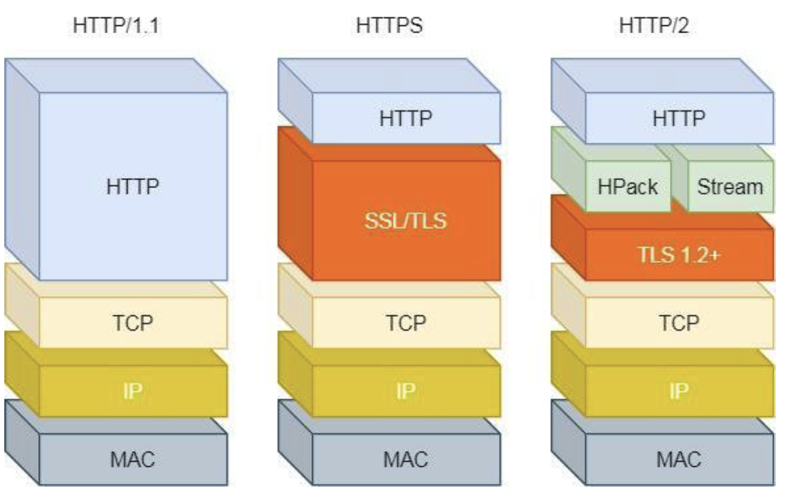

- 头部压缩 :使用Hpack压缩请求响应头,减少传输量,降低延迟

  同时发出多个请求，他们的头是一样的或是相似的，那么，协议会帮你**消除重复的部分**
  在客户端和服务器同时维护一张头信息表，所有字段都会存入这个表，生成一个索引号，以后就不发送同样字段了，只发送索引号

  ```txt
  请求头包含Cookie UserAgent Accept
  大量请求响应报文很多字段值重复
  字段ASCII编码,不利于传输
  采用静态表+哈夫曼编码进行优化
  
  - HPACK组成:
  - 静态字典:为⾼频出现在头部的字符串和字段建⽴了⼀张静态表，它是写⼊到 HTTP2 框架⾥的，不会变化的
  - 动态字典:同⼀个连接上，重复传输完全相同的HTTP头部
  - 哈夫曼编码(压缩算法)
  ```

- 二进制帧 :数据分割成二进制帧传输,分为header frame和 data frame 提高传输效率

- 多路复用并发传输 :多条Stream复用一个TCP连接,使用Stream ID 区分组装,
  一个TCP包含多条Stream,一个Stream包含多条Message(对应 HTTP/1 中的请求或响应),
  一个Message包含多个Frame(HTTP/2最小单位,二进制压缩),以二进制压缩格式存放 HTTP/1 中的内容（头部和包体）

  多个 Stream 跑在一条 TCP 连接，同一个 HTTP 请求与响应是跑在同一个 Stream 中，HTTP 消息可以由多个 Frame 构成， 一个 Frame 可以由多个 TCP 报文构成

  不同 Stream 的帧是可以乱序发送的（因此可以并发不同的 Stream ），因为每个帧的头部会携带 Stream ID 信息，所以接收端可以通过 Stream ID 有序组装成 HTTP 消息，而同一 Stream 内部的帧必须是严格有序的

- 服务器推送 :服务器可以对客户端的一个请求发送多条响应
  在 HTTP/2 中，客户端在访问 HTML 时，服务器可以直接主动推送 CSS 文件，减少了消息传递的次数

**HTTP/2**依旧存在队头阻塞问题,问题在于**传输层**:
TCP是字节流,TCP必须保证收到的字节数据是完整的,这样才会将缓冲区的数据返回给HTTP,
当前一个字节数据没有到达时,后面的字节数据只能放在缓冲区  
一个tcp内 HTTP/2 只要某个流中的数据包丢失了，其他流也会因此受影响

同时HTTP/2网络迁移仍然需要重新连接

#### HTTP/3 解决队头阻塞

队头阻塞由于TCP,

一个 TCP 连接是由四元组（源 IP 地址，源端口，目标 IP 地址，目标端口）确定的，这意味着如果 IP 地址或者端口变动了，就会导致需要 TCP 与 TLS 重新握手，这不利于移动设备切换网络的场景，比如 4G 网络环境切换成 WiFiHTTP/3

而 QUIC 协议没有用四元组的方式来“绑定”连接，而是通过**连接 ID** 来标记通信的两个端点
因此即使移动设备的网络变化后，导致 IP 地址变化了，只要仍保有上下文信息（比如连接 ID、TLS 密钥等），就可以“无缝”地复用原连接

HTTP3换用UDP+QUIC
QUIC 协议也有类似 HTTP/2 Stream 与多路复用的概念，也是可以在同一条连接上并发传输多个 Stream，Stream 可以认为就是一条 HTTP 请求。由于 QUIC 使用的传输协议是 UDP，UDP 不关心数据包的顺序，如果数据包丢失，UDP 也不关心

不过 QUIC 协议会保证数据包的可靠性，每个数据包都有一个序号唯一标识。当某个流中的一个数据包丢失了，即使该流的其他数据包到达了，数据也无法被 HTTP/3 读取，直到 QUIC 重传丢失的报文，数据才会交给 HTTP/3

>零RTT建立时间,减少延迟:QUIC允许首次连接零往返时间
>
>无队头阻塞:UDP,不确保交付不影响其他包交付
>
>连接迁移:QUIC允许在不同网络(WIFI -> 移动数据)中切换,迁移到新的ip,减少重连时间
>
>向前纠错:每个包不仅包含自身数据,还包含了部分其他包的数据,丢包减少重传

### HTTP1.1版本的请求报文结构是怎么样的？

HTTP 1.1 的请求报文结构可以分为**4 个核心部分**，
按顺序依次是：**请求行（Request Line）**、**请求头（Request Headers）**、**空行（Empty Line）**、**请求体（Request Body）**

**请求行**（Request Line）用于描述 “请求的核心动作”，**请求方法 + 请求URL + HTTP版本**
由3 个部分组成，用空格分隔，末尾以`CRLF`（即`\r\n`）结束

- 请求方法：表示对资源的操作，HTTP 1.1 支持 GET、POST、PUT、DELETE、HEAD、OPTIONS、TRACE、CONNECT 等（前 4 个最常用）
- 请求 URL：要访问的资源路径，可能是绝对路径（如`/api/user`）或完整 URL（如`https://example.com/path`，但通常省略协议和域名，因为由 Host 头指定）
- HTTP 版本：固定格式`HTTP/1.1`

例子：`GET /api/user?id=100 HTTP/1.1\r\n`

**请求头**（Request Headers）由**若干键值对**组成，格式为`Header-Name: value`，每行末尾用`CRLF`结束
作用是传递 “请求的元数据”（如客户端信息、期望的响应格式、连接策略等）

HTTP 1.1 相比 1.0 新增了一些核心头字段，且部分头字段是**必须的**，比如：

- `Host: example.com`：**HTTP 1.1 强制要求**，用于指定目标服务器的域名 / IP（解决一台服务器托管多个域名的问题，1.0 没有这个头）
- `Connection: keep-alive`：默认开启（1.1 的特性），表示希望保持 TCP 连接不关闭，以便后续请求复用（减少握手开销，1.0 默认关闭，需显式指定）
- `User-Agent: Mozilla/5.0 (Windows NT 10.0; ...)`：描述客户端（浏览器 / 程序）的类型和版本
- `Accept: application/json, text/html`：客户端可接受的响应数据格式
- `Content-Length: 100`：如果有请求体，指定其字节长度（用于服务器判断数据是否接收完整）
- `Transfer-Encoding: chunked`：HTTP 1.1 支持的 “分块传输”，当请求体大小不确定时（如大文件上传），用分块方式传输，无需提前指定 Content-Length

**空行**（Empty Line）请求头结束后，必须有一个**单独的`CRLF`**（即空行），用于明确分隔 “请求头” 和 “请求体”的边界。

**请求体**（Request Body）
空行之后的部分，用于携带 “请求的实际数据”（如表单提交的内容、JSON 数据等）。并非所有请求都有请求体：

- GET、HEAD 等方法：通常没有请求体（数据通过 URL 参数传递）。
- POST、PUT 等方法：需要携带数据（如`{"name":"test","age":20}`），此时请求体的格式由`Content-Type`头指定（如`application/json`、`application/x-www-form-urlencoded`）。

### 那么作为服务端，接收HTTP请求时怎么判断是否接收完毕

基于 `Content-Length` 的判断：已知请求体大小的场景

1. 解析请求头，获取总长度:服务端先读取并解析 HTTP 请求的请求行和请求头，从中提取 `Content-Length` 字段的值（比如 `Content-Length: 26` 表示请求体共 26 字节）。
2. 累加读取字节数，对比总长度:由于 TCP 是 “字节流”（可能分段传输，比如 26 字节分两次传 10 字节和 16 字节），服务端会维护一个 “已读取字节数” 的计数器，每次从 TCP 缓冲区读取数据后，就把计数器累加，直到：
   - 已读取字节数 等于 `Content-Length` 声明的总长度 → 判定请求体接收完毕。
   - 已读取字节数 超过 `Content-Length` → 属于 “数据过量”，服务端会丢弃多余数据，或返回 400 错误。
   - 连接中断但已读取字节数 小于*Content-Length` → 属于 “数据不完整”，服务端会判定请求失败（比如返回 400 或 411 Length Required）

当请求体大小无法提前确定（比如大文件上传、流式数据传输）时，
客户端会在请求头中声明 `Transfer-Encoding: chunked`（而非 `Content-Length`），
此时服务端靠 “分块格式的特殊结束标志” 判断接收完毕，核心是识别你提到的 `0\r\n\r\n`，具体逻辑如下：

### HTTP与HTTPS区别

http与https占用的默认端口不同,http是80,https是443

https相比http更加安全,https是运行在ssl/tls之上,基于tcp或者udp+quic协议,
传输过程经过加密保证数据可靠交付和安全性,但相比http会更加消耗资源

客户端会先请求向服务器建立加密通信的连接,

服务器收到后会将自己的公钥发送到CA机构,CA机构会用自己的私钥将服务器发来的公钥签名然后发送回去

服务器又将经过CA签名的公钥发送到客户端

客户端浏览器一般都会存储主流CA机构的公钥,解密验证后获得服务器的公钥

客户端会生成一个随机的key作为密钥为了后续对称加密通信,然后使用服务器的公钥进行签名发送给服务器

服务器收到后使用随机码key进行双方通信的对称加密

###  CA证书是怎么来的？客户端怎么样去验证CA证书是否合法呢

**CA 证书 “申请” 到 “签发” 的 3 个核心步骤**

需要 证书申请者（比如网站运营方、企业）向权威 CA 机构提交申请，经过审核后由 CA 用自己的私钥签名生成，整个流程确保证书的 “真实性” 和 “不可篡改性”：

步骤 1：申请者生成 密钥对 + CSR 请求文件
首先，申请者（比如要部署 HTTPS 的网站）需要先在自己的服务器上生成一套非对称密钥对（通常是 RSA 或 ECC 算法）：

- 私钥：自己留存，用于后续解密客户端发送的加密数据（绝对不能泄露）

- 公钥：需要嵌入到证书中，供客户端（比如浏览器）使用

  然后，申请者会用私钥签名生成一份CSR（证书签名请求）文件，
  里面包含关键信息：申请者的公钥、网站域名、申请者名称（企业 / 个人信息）、有效期需求等

步骤 2：CA 机构审核申请者的身份与域名所有权
CA 机构收到 CSR 文件后，会对申请者进行严格审核，核心是确认 “申请者是否有权使用申请的域名”，审核强度分不同等级
验证域名所有权,可能需要审核企业的工商信息、资质证明（如营业执照），
确保申请者身份真实合法（EV 证书会让浏览器地址栏显示绿色，增强信任）

审核不通过的话，CA 会拒绝签发证书；审核通过则进入下一步。

步骤 3：CA 用自身私钥签名，生成 CA 证书
CA 审核通过后，会基于 CSR 文件中的信息，生成一份 “证书文件”，
并使用**CA 自己的私钥**对证书进行 “数字签名”
先对证书内容做哈希运算，再用 CA 私钥对摘要加密hash，加密后的结果就是 “数字签名”，嵌入到证书末尾
最终生成的 CA 证书包含 3 类关键信息：

- 申请者信息：域名、公钥、有效期、申请者名称；
- CA 信息：签发 CA 的名称、CA 的公钥指纹；
- CA 的数字签名：用于客户端后续验证证书合法性。

**客户端验证 CA 证书合法性**

客户端在与服务端建立 HTTPS 连接时，会自动接收服务端发送的 CA 证书，然后通过 4 个步骤验证其合法性，只有全部通过才会继续通信，否则会提示 “证书不安全”：

步骤 1：检查证书的 “基础有效性”
客户端先做 “初步筛查”，排除明显无效的证书，若以下任意一项不满足，直接判定证书非法：

- 证书是否在 有效期 内：检查证书中的 Not Before生效时间和 Not After过期时间，若当前时间不在这个区间，判定过期
- 证书的 域名是否匹配：检查证书中 “Subject” 字段的域名，是否与当前访问的域名一致
- 证书是否被 “吊销”：客户端会查询 CA 提供的 “证书吊销列表（CRL）” 或通过 “在线证书状态协议（OCSP）”，
  确认证书是否因私钥泄露、域名变更等原因被 CA 吊销（若吊销则判定非法）。

步骤 2：获取 “签发该证书的 CA 的公钥”
验证签名需要用到 “签发方（CA）的公钥”，而这个公钥的来源是 “客户端预装的根 CA 公钥库”
操作系统（Windows、macOS、Linux）和浏览器（Chrome、Safari）会预装全球权威 CA 机构的 “根 CA 公钥”（

若证书是 “中间 CA 签发”（大部分场景，根 CA 不直接签发终端证书，而是授权中间 CA 签发），
客户端会先验证中间 CA 证书的合法性（流程和验证终端证书一致），直到追溯到 “根 CA 证书”，形成 “证书链验证”（

步骤 3：验证 CA 的 “数字签名”，确认证书未被篡改
这是验证的核心步骤，通过 “解密签名 + 比对哈希值” 确认证书内容未被篡改，流程如下：

1. 客户端从证书中提取 “CA 的数字签名” 和 “证书正文内容”
2. 用CA 公钥，对 “数字签名” 进行解密，得到 CA 当初对证书正文计算的hash
3. 客户端自己对当前的 “证书正文内容” 重新计算一次相同算法的哈希
4. 对比 “解密得到的原始哈希摘要” 和 “自己重新计算的哈希摘要”：若完全一致→证书内容未被篡改；若不一致→证书被篡改过，判定非法。

步骤 4：完成 “证书链验证”（针对中间 CA 场景）若终端证书是中间 CA 签发的，客户端需要 “链式验证”：

- 先用根 CA 公钥验证 “中间 CA 证书” 的签名（流程同上），确认中间 CA 证书合法；
- 再用中间 CA 证书中的公钥，验证 “终端证书” 的签名；
- 只有整个证书链的每一层签名都验证通过，且最终追溯到根 CA，才判定终端证书合法。

### 服务端建立连接每次都要生成证书吗？

服务端建立连接时**不需要每次都生成证书**，证书是服务端提前从 CA 机构申请并部署好的 “固定身份凭证”，
在证书的有效期内（通常是 1-3 年），每次客户端连接都会重复使用这份证书，核心是 “一次生成 / 申请，多次复用”。

### TLS 握手时的证书操作，只是 “验证” 而非 “生成”

客户端和服务端建立 HTTPS 连接时，涉及证书的环节是 “验证”，而非 “生成”，流程回顾：

1. 客户端发起 TLS 连接请求；
2. 服务端发送**已部署的 CA 证书**给客户端；
3. 客户端验证证书合法性（检查有效期、域名匹配、CA 签名，如之前聊过的流程）；
4. 验证通过后，客户端用证书中的公钥加密 “预主密钥”，发送给服务端；
5. 服务端用自己的私钥解密预主密钥，后续基于此生成对称密钥，用于加密传输数据。

整个过程中，证书只是 “身份凭证”，全程复用，没有任何生成操作。
简单说：服务端的证书就像 “网站的身份证”，是提前办好的，平时放在服务器里

### tls握手

传统的 TLS 握手基本都是使用 RSA 算法来实现密钥交换的，
在将 TLS 证书部署服务端时，证书文件其实就是服务端的公钥，会在 TLS 握手阶段传递给客户端，
而服务端的私钥则一直留在服务端，一定要确保私钥不能被窃取

在 RSA 密钥协商算法中，客户端会生成随机密钥，并使用服务端的公钥加密后再传给服务端。
根据非对称加密算法，公钥加密的消息仅能通过私钥解密，这样服务端解密后，双方就得到了相同的密钥，再用它加密应用消息。

tls四次握手:

1. 由客户端向服务器发起加密通信请求，也就是 ClientHello 请求。客户端主要向服务器发送以下信息：
   客户端支持的tls版本,客户端生成的随机数,支持的密码套件(RSA)
2. 服务器收到客户端请求后，向客户端发出响应，也就是 SeverHello,响应
   确认tls版本,服务端生成的随机数,确认密码套件(比如RSA)
3. 客户端收到服务器的回应之后，首先通过浏览器或者操作系统中的 CA 公钥，确认服务器的数字证书的真实性
   若真实:生成一个随机数(会被服务器公钥加密),加密通信算法改变通知,客户端握手结束通知
4. 服务端一共有**Client Random、Server Random、pre-master key**个随机数,
   服务器和客户端有了这三个随机数，接着就用双方协商的加密算法，各自生成本次通信的「会话秘钥」

接下来，客户端与服务器进入加密通信，就完全是使用普通的 HTTP 协议，只不过用「会话秘钥」加密内容

加入三个随机数后：**Client Random 和 Server Random 每次握手都会重新生成（且明文传输，双方实时确认）**，即使 pre-master 存在理论漏洞，三者组合的 “随机输入” 每次都不同 —— 这意味着**每次会话的密钥都是 “一次性” 的**，过往的会话数据无法被重放利用。

### 状态码

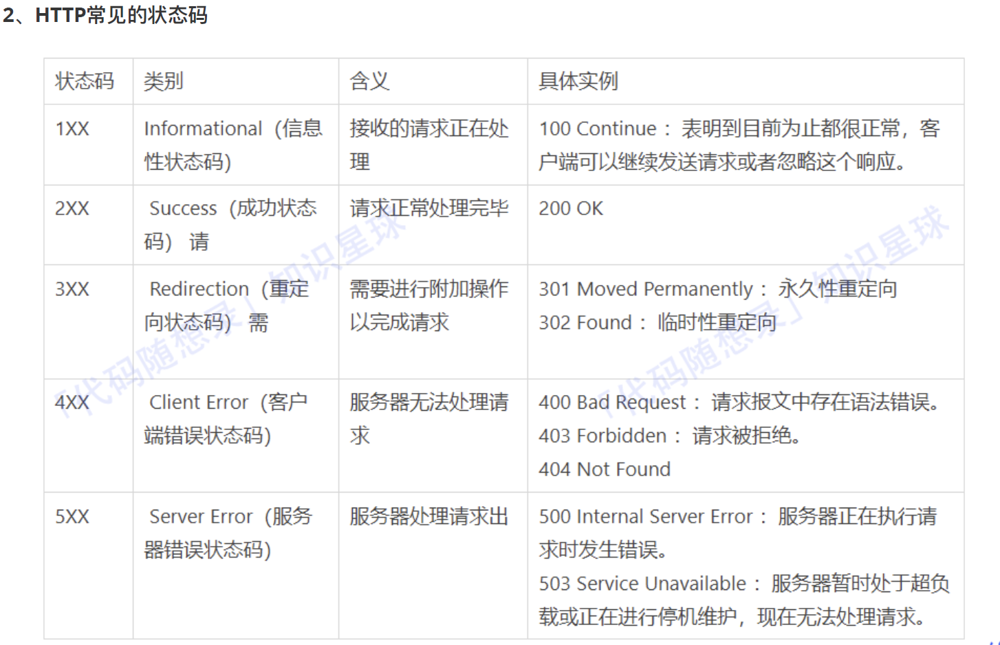

### 子网掩码

子网掩码的核心是**划分 IP 地址的 “网络部分” 和 “主机部分”** 的工具，它和 IP 地址配合使用，能明确 “某台设备属于哪个网络” 以及 “该网络内有多少可用设备”，是 TCP/IP 网络通信中判断 “是否在同一子网” 的关键一、先明确基础：IP 地址的结构（网络位 + 主机位）

IPv4 地址（如`192.168.1.100`）由 32 位二进制组成，本质上分为两部分：
**网络位**：标识设备所属的 “网络段”（类似 “小区编号”）**主机位**：标识网络内的 “具体设备”（类似 “小区内的门牌号”）。
子网掩码的作用就是**用 “1” 标记网络位，用 “0” 标记主机位**，通过和 IP 地址做 “与运算”，精准拆分这两部分。

1. 判断两台设备是否在 “同一子网”（能否直接通信）
   1. 两台设备要直接通信（不经过路由器），必须属于同一子网，判断方法是：
   2. 分别用各自的 IP 地址和子网掩码做 “与运算”，得到各自的网络地址；
   3. 若两个网络地址相同 → 同一子网，可直接通信；若不同 → 不同子网，需通过路由器转发。

2. 计算子网内的 “可用主机数”

   主机位决定了子网内最多能容纳多少台设备，规则是：

   - 主机位全为 “0” → 网络地址（标识子网，不可分配给设备）；
   - 主机位全为 “1” → 广播地址（子网内群发消息，不可分配给设备）；
   - 可用主机数 = 2^（主机位位数） - 2（减去网络地址和广播地址）。

## OS

### OS是什么

本质是运行在计算机上的软件,用来管理和调度计算机硬件和软件的程序
操作系统（OS）是 “硬件与应用程序的中间层”，核心功能是**管理硬件资源、抽象硬件接口、为应用提供服务**

操作系统存在屏蔽了硬件层复杂性

操作系统内核是操作系统的核心,负责管理:

1. 进程和线程调度管理:创建,阻塞,就绪,销毁以及进程间的相互通信
2. 存储管理:管理内存和外存的分配和存储
3. 文件管理:文件的读写创建
4. 设备管理:输入输出设备以及外部存储的管理
5. 网络管理:负责管理计算机网络的使用,管理配置配置,连接,通信,安全等
6. 安全管理:用户身份的认证,访问控制,文件加密等


---

### 内核态用户态

用户态是程序正常运行的状态,这个状态下程序只能访问受限的资源,不能直接操纵硬件或执行高权限的指令
内核态是操作系统核心运行的状态,拥有最高的权限,可以访问系统资源,比如内存,cpu

**只有内核态为什么不行?**
CPU所有指令中,有一些指令比较危险,比如内存分配,IO,所有程序都能运行这些指令会对系统产生影响
倘若统资源竞态和冲突,影响效率

**切换内核态:**

- 系统调用(system call):用户程序需要操作系统完成自己不能做的事情,
  比如读写文件,创建进程,网络通信,就会从用户态切到内核态
- 中断:当外部设备比如鼠标,网卡,键盘发生事件,就会触发中断,cpu暂停当前任务进入内核态处理
  中断可以被屏蔽或禁止,可以延时或忽略某些中断信号,避免干扰重要任务
- 异常:一般是由cpu产生,程序出现除以零,访问非法内存地址等错误,就会切换到内核态由操作系统处理错误

**系统调用有什么:**

1. 设备管理:完成设备(输入输出外部存储设备)的请求和释放,以及设备的启动功能
2. 文件管理:完成文件的读写创建
3. 进程管理:进程的创建,销毁,阻塞,唤醒,通信
4. 内存管理:内存的分配以及回收

**系统调用过程:**

1. 用户态程序发起系统调用,执行特权指令时权限不足会发生中断
2. 发生中断后,当前cpu执行的程序会中断,跳到中断处内核程序开始执行
3. 系统调度处理完成后,操作系统使用特权指令切换回用户态,恢复用户态上下文


### 异常中断

**中断分为外中断和内中断。**

外中断，就是我们指的中断，是指由于外部设备事件所引起的中断，如常见的磁盘中断、打印机中断等；中断由外因引起，与现行指令无关，是正在运行的程序所不期望的，中断的引入是为了支持CPU和设备之间的并行操作。

内中断，就是异常，是指由于 CPU 内部事件所引起的中断，比如程序的非法指令或者地址越界。异常是由CPU本身原因引起，表示CPU执行指令时本身出现的问题。


---

### 进程与线程

进程是资源分配的最小单位,进程拥有独立的内存空间,进程间地址空间隔离,
进程核心数据结构是PCB,存储进程的ID,状态,内存地址
切换进程开销较大,需要切换地址空间
进程间通过管道,消息队列,共享内存,socket等方式进行通信

线程是cpu调度的最小单位,一个进程内可以有多个线程,
共享进程的内存空间,仅拥有私有栈,程序计数器,寄存器组
主要数据结构是TCB,存储线程ID,优先级,私有栈指针
切换上下文开销小
通过共享进程内的全局变量进行通信,但需要同步互斥机制避免竞态问题

#### 进程之间采用多种方式通信

1. pipe:匿名管道,由于其没有名字只用于父子进程或兄弟进程之间半双工通信
2. 命名管道进程间通信,严格遵循先进先出,以磁盘文件的方式存在
3. 信号量机制,是一个计数器,控制多个进程对共享资源的访问,实现互斥或同步
4. 消息队列:存放在内存中并由消息队列标识符标识,可以FIFO,也可以随机查询
5. 共享内存来通信,多个内存共享同一块内存空间
6. socket套接字通信,跨主机之间网络通信
   1. socket是进程间通信的接口,通过ip地址+端口号标识网络中的进程,分装了tcp/udp等协议用来通信
   2. socket在本机通信时使用unix域套接字,网络通信使用ip协议
      在本机通信基于文件系统路径,网络通信基于ip:port
      本机直接通过内核缓冲区传输,网络需要经过tcp/ip协议封装
      本机通信效率更高,延迟低

#### 进程地址

地址从低到高
代码段:存储应用程序的可执行代码,二进制exe,通常只读
数据段:存储已初始化的全局变量和静态变量
BSS段:存储未初始化的全局变量和静态变量
Heap:用于动态内存分配,需手动管理或垃圾回收若未释放会导致内存泄漏,向上生长
Stack:存储局部变量,函数调用信息,向下生长,linux内大小默认8MB

#### 多线程多进程

多进程开销大,内存占用高,切换进程更复杂,并发数受到进程数量的控制,
但可靠性更高,适合于CPU密集型,对可靠性要求高的的任务,
若做 “视频编码”（CPU 密集，几乎无 IO 等待），多进程更优（避免线程切换开销，充分利用多核）；

多线程开销小内存占用低,切换线程只需要切换寄存器和栈,并发度高
可靠性相比进程低,一个线程崩溃可能导致整个进程崩溃
适合IO密集型的任务,充分利用等待时间,提高CPU占用率
比如 “爬虫”（IO 密集，大部分时间等网络响应），多线程更优（线程切换开销小，并发度高）。

#### 进程调度算法

1. FCFS,先来先服务
2. SJF,短作业有限,长作业会饥饿
3. RR,时间片轮转调度
4. MFQ,多级队列调度,优先级越高队列时间片越短,进程若在高优先级队列中执行完毕则退出；若未执行完，会被降级到低优先级队列（时间片更长）
5. 优先级调度

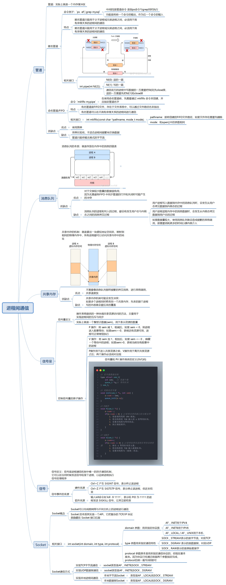

#### PCB

PCB是进程控制块,是操作系统中管理和追踪进程的数据结构,每个进程有独立的pcb

PCB包括:

1. 进程的描述信息包括进程的名称,标识符
2. 进程的调度信息,包括进程的阻塞原因进程状态(就绪阻塞运行),进程优先级
3. 进程对资源的需求情况,包括cpu时间,内存空间
4. 进程打开的文件的信息,报考文件标识符,文件类型,打开模式

#### 状态

**创建状态(new)**：进程正在被创建，尚未到就绪状态。
**就绪状态(ready)**：进程已处于准备运行状态，即进程获得了除了处理器之外的一切所需资源，一旦得到处理器资源(处理器分配的时间片)即可运行。
**运行状态(running)**：进程正在处理器上运行(单核 CPU 下任意时刻只有一个进程处于运行状态)。
**阻塞状态(waiting)**：又称为等待状态，进程正在等待某一事件而暂停运行如等待某资源为可用或等待 IO 操作完成。即使处理器空闲，该进程也不能运行。
**结束状态(terminated)**：进程正在从系统中消失。可能是进程正常结束或其他原因中断退出运行。

#### 僵尸进程 孤儿进程

linux中子进程通常fork创建,和父进程相互独立,有各自的PCB
当一个进程调度exit()系统调用结束自己的生命,
不会立马消失,会进入僵尸进程,释放cpu和资源,但仍然持有PCB,需要由父进程`wait()/waitpid()`调用回收

- 僵尸进程:子进程终止,父进程运行但没有`wait()`获取子进程的状态信息并释放
  导致子进程PCB仍然存在,所以需要父进程及时调用`wait()/waitpid()`
- 孤儿进程:一个进程的父进程终止或者不存在,但该进程仍然在运行
  孤儿进程通常是父进程意外终止或未及时调用`wait()`
  操作系统会将孤儿进程的父进程设置为init进程,有init进程来回收孤儿进程的资源

```bash
top 
top指令查找
zombie表示僵尸进程数量,o表示没有僵尸进程

定位僵尸进程和父进程
ps -A -ostat,ppid,pid,cmd |grep -e '^[Zz]'
```

---

#### 死锁

下述条件都满足才会死锁

1. **互斥**：资源必须处于非共享模式，即一次只有一个进程可以使用。如果另一进程申请该资源，那么必须等待直到该资源被释放为止。

2. **占有并等待**：一个进程至少应该占有一个资源，并等待另一资源，而该资源被其他进程所占有。

3. **非抢占**：资源不能被抢占。只能在持有资源的进程完成任务后，该资源才会被释放。

4. **循环等待**：有一组等待进程 `{P0, P1,..., Pn}`， `P0` 等待的资源被 `P1` 占有，`P1` 等待的资源被 `P2` 占有，……，`Pn-1` 等待的资源被 `Pn` 占有，`Pn` 等待的资源被 `P0` 占有。

***预防 避免 检测 接触***

1. 死锁预防:
   1. 互斥条件:一般无法打破
   2. 请求并保持:防止线程在持有资源后并申请其他资源的情况,线程一次性申请所有需要的资源。申请成功就运行，不成功就等待。但容易导致饥饿
   3. 不可剥夺条件:当想要申请新资源并且失败的时候，将当前拥有的资源释放。当新资源可用时，会重新申请之前放弃的资源。
   4. 循环等待:将所有的资源从小到大编号，线程申请资源按照编号从小到大申请
2. 死锁避免
   1. 系统状态分为*安全,不安全*两种
   2. 每当在为申请者分配资源前先测试系统状态，若把系统资源分配给申请者会产生死锁，则拒绝分配，否则接受申请，并为它分配资源。
   3. 使用`Dijkstra迪克斯特拉`的银行家算法,当一个进程申请使用资源的时候，**银行家算法** 通过先 **试探** 分配给该进程资源，然后通过 **安全性算法** 判断分配后系统是否处于安全状态，若不安全则试探分配作废，让该进程继续等待，若能够进入到安全的状态，则就 **真的分配资源给该进程
3. 死锁检测
   1. 用**进程-资源分配图**来表示,是一个有向图
   2. 无环路没有死锁
   3. 存在环路且资源类仅有一个资源发生死锁
   4. 存在环路但资源类有多个资源,如果存在一个**既不阻塞又非独立的进程**,
      消除有向边就不会死锁
4. 死锁的解除
   1. 撤销死锁的所有进程,但会导致有些耗时的进程作业全部清空
   2. 逐个接触死锁进程,直到解开死锁
   3. 抢占资源:把夺得的资源再分配给涉及死锁的进程直至死锁解除

#### 线程同步

线程同步机制是指在多线程编程中，为了保证线程之间的互不干扰，而采用的一种机制。

常见的线程同步机制有以下几种：

- 互斥锁：互斥锁是最常见的线程同步机制。它允许只有一个线程同时访问被保护的临界区（共享资源）
- 条件变量：条件变量用于线程间通信，允许一个线程等待某个条件满足，而其他线程可以发出信号通知等待线程。通常与互斥锁一起使用。线程可以睡眠等待，而不是忙等待，这样可以节约CPU的资源。等某个条件成立的时候，线程再被唤醒。
- 读写锁： 读写锁允许多个线程同时读取共享资源，但只允许一个线程写入资源。
- 信号量：用于控制多个线程对共享资源进行访问的工具。允许多个线程同时访问同一个资源，当信号量大于1时，可以对资源进行访问；信号量为0时，其他线程阻塞。信号量为几，代表可以同时几个线程访问该资源
- 原子操作

---

### 内存

1. 负责内存的分配和回收
2. 地址转化:虚拟内存地址转化成物理地址
3. 内存扩充:系统没有足够的内存,利用虚拟内存或自动覆盖技术
4. 内存映射:将一个文件直接映射到进程的进程空间中，这样可以通过内存指针用读写内存的办法直接存取文件内容，速度更快
5. 内存优化:调整内存的分配和回收策略来优化内存使用效率
6. 内存安全:保证进程间使用内存互不干扰

#### 内存碎片

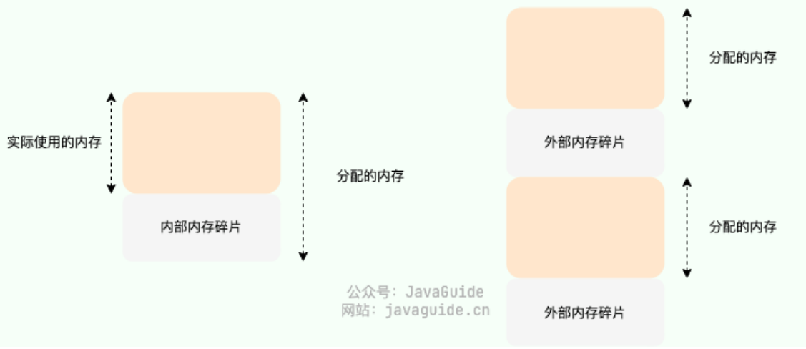

- 内部碎片
  - 当采用固定比例比如 2 的幂次方进行内存分配时，进程所分配的内存可能会比其实际所需要的大
    一个进程只需要 65 字节的内存，但为其分配了 128（2^7） 大小的内存，那 63 字节的内存就成为了内部内存碎片
- 外部碎片
  - 由于未分配的内存区域太小,无法满足任意进程所需要到空间
    就会空出来而且没有办法使用

#### 内存管理

- 连续内存管理:每个用户分配一段连续的内存,利用率低
- 非连续内存管理

##### 连续

块式管理:早期计算机os采用,将内存分为几个固定大小的块
一个块中只有一个进程,程序运行需要内存,os就分配
存在很多浪费的内存,内存碎片多

linux中采用了伙伴系统来连续分配内存,有效解决碎片化
将内存按 2 的幂次划分,将相邻的内存合成一对伙伴
伙伴系统会尝试找到大小最合适的内存块。如果找到的内存块过大，就将其一分为二，分成两个大小相等的伙伴块
有效解决了外部碎片问题,但内部碎片仍未解决,当需要分配的内存大小不是 2^n 的整数倍时，会浪费一定的内存空间

##### 非连续

- 段式管理
  以段(一段连续的物理内存)的形式管理/分配物理内存。应用程序的虚拟地址空间被分为大小不等的段，段是有实际意义的，每个段定义了一组逻辑信息，例如有主程序段 MAIN、子程序段 X、数据段 D 及栈段 S 等
  会产生外部碎片，进程必须全部装入内存

- 页式管理

  把物理内存分为连续等长的物理页，应用程序的虚拟地址空间也被划分为连续等长的虚拟页，是现代操作系统广泛使用的一种内存管理方式
  没有外部碎片，每个页内碎片不超过页的大小

- 段页式管理机制

  结合了段式管理和页式管理的一种内存管理机制，把物理内存先分成若干段，每个段又继续分成若干大小相等的页

#### 虚拟内存

逻辑存在,作用是作为进程访问主存的桥梁,简化内存

虚拟内存在每一个进程创建加载的过程中，会分配一个连续虚拟地址空间，它不是真实存在的，而是通过映射与实际地址空间对应，这样就可以使每个进程看起来都有自己独立的连续地址空间，并允许程序访问比物理内存RAM更大的地址空间, 每个程序都可以认为它拥有足够的内存来运行。

- 隔离进程
  - 每个进程使用虚拟内存,会认为自己拥有独立的物理内存,进程间相互隔离
- 提高物理内存的利用率
  - os只需要将进程当前正在使用的部分数据或指令加载入物理内存
- 简化内存管理
  - 进程拥有独立虚拟的地址空间,不需要和真正的物理内存打交道
- 多个进程共享物理内存
  - 进程运行中会加载很多动态库,这些库对于每个进程而言都是公用的，它们在内存中实际只会加载一份，这部分称为共享内存
- 提高内存安全性
  - OS提供隔离程度不同的访问权限

CPU通过虚拟地址访问主存,由**MMU**(**内存管理单元**)翻译成物理地址

#### 分段

通过段表映射虚拟地址和物理地址
段表由段号(表示虚拟地址属于哪一段)和段内偏移量组成

1. MMU首先解析得到虚拟地址中的段号
2. 通过短号到段表找出段信息
3. 物理地址=段号的起始地址+偏移量

分段机制会导致外碎片,段与段之间留下碎片空间不足以映射新的段

#### 分页

**分页机制（Paging）** 把主存（物理内存）分为连续等长的物理页
页是连续等长的,通过页表映射虚拟和物理地址,页表包括页号和页内偏移量

1. MMU解析虚拟地址获得虚拟页号
2. 查找页表获得物理页号
3. 物理地址=物理页号+业内偏移量

运行的程序多起来后页表占用空间很大,然而绝大多程序只用到页表的其中几项
所以os引入了多级页表

#### 分段分页区别

- 分页是以页面为单位,大小固定; 分段以段为单位,大小不固定
- 页是物理单位,通常是2的幂次方; 页是逻辑单位
- 分页存在内部碎片; 分段存在外部碎片
- 分页使用页表完成映射,分段使用段表完成映射
- 分页机制对程序没有任何要求，程序只需要按照虚拟地址进行访问即可；而分段机制需要程序员将程序分为多个段，并且显式地使用段寄存器来访问不同的段

#### 段页式机制

内存被划分为多个逻辑段,每个逻辑段进一步被划分为多个页

寻址包括两部,先段后页

1. **段式地址映射（虚拟地址 → 线性地址）：**
   1. 虚拟地址 = 段选择符（段号）+ 段内偏移。 
   2. 根据段号查段表，找到段基址，加上段内偏移得到线性地址。

2. **页式地址映射（线性地址 → 物理地址）：**
   1. 线性地址 = 页号 + 页内偏移。
   2. 根据页号查页表，找到物理页框号，加上页内偏移得到物理地址

#### TLB 快表

为了提高虚拟地址到物理地址的转换速度，操作系统在 **页表方案** 基础之上引入了 **转址旁路缓存**也成为**快表**

1. 虚拟地址的虚拟页号先去快表查询
2. 查到就不去查页表,缓存命中
3. 查不到再去查页表并更新缓存
4. 快表填满后会淘汰掉快表中的某一页

#### 换页机制

空间换时间
当物理内存不够的时候,OS会将一些物理页放到磁盘,等用的时候再写入内存

#### 页缺失

页缺失是硬中断,软件试图访问映射在虚拟地址空间但未被加载到内存的分页
会触发中断

- 硬性页缺失:物理地址没有对应的物理页,页中断处理器会指示CPU从磁盘读取
  然后由MMU建立相应的映射关系
- 软性页缺失:物理内存中有对应的页,但是没有建立映射
- 无效缺页错误:程序访问不小的物理空间

#### 页面置换算法

- OPT 有限选择淘汰的界面是以后不再使用的
  OPT是理想的算法,无法实现,其他算法越接近OPT表明效果越好

- FIFO 易于理解,性能不是很好

  较早调入的页往往是经常被访问或者需要长期存在的页，这些页会被反复调入和调出
  **存在 Belady 现象**：被置换的页面并不是进程不会访问的，有时就会出现分配的页面数增多但缺页率反而提高的异常现象

- LRU 每个页维护一个访问时间,最久未被访问的淘汰

- LFU 最少使用页面置换,选择一段时间内使用最少的页淘汰

- 时钟置换算法:出的页面都是最近没有使用的那个

---

### 文件系统

文件系统负责管理和组织计算机存储设备上的文件和目录

- 存储管理:将文件数据存储到物理媒介中,管理空间分配
- 文件管理:文件的创建,删除,移动,复制,加密,共享,压缩
- 目录管理:目录的创建、删除、移动、重命名
- 文件访问权限:对不同用户或进程采用不同的访问权限

---

### 磁盘调度

1. FCFS
   由于没有考虑磁头移动的路径和方向，平均寻道时间较长。
   该算法简单,容易出现饥饿问题,效率不高

2. 最短寻道时间:优先选择距离当前磁头位置最近的请求进行服务,存在饥饿

3. SCAN 电梯式双向扫描(单向)
   磁头沿着一个方向扫描磁盘到边缘，如果经过的磁道有请求就处理
   然后回到起点继续单向扫描开始循环

4. LOOK:边扫描边观察算法(单向)
   SCAN算法到边界才反转方向
   LOOK如果磁头移动方向上已经没有别的请求，就可以立即改变磁头移动方向

5. CSCAN(双向)
   由于SCAN算法偏向于处理那些接近最里或最外的磁道的访问请求，所以使用改进型的C-SCAN算法来避免这个问题
   单向扫描,到边缘就跳回起点

6. CLOOK 均衡循环扫描(双向)
   如果磁头移动的方向上已经没有磁道访问请求了，就可以立即让磁头返回，并且磁头只需要返回到有磁道访问请求的位置即可

### 内存比磁盘快

1. 存储的介质不同
   内存基于半导体电路,数据变化是电信号操作,只需要通过地址线定位到目标存储单元不需要机械运动
   磁盘使用磁性材料,每次读写都要磁头移到目标轨道,旋转到目标扇区,在进行电磁感应读写
   固态硬盘基于闪存芯片,无法直接覆盖写入,需要擦除再写入

2. 数据访问不同
   内存是随机访问,通过地址总线直接寻址,访问第一个和第10000个字节的市场几乎一样
   磁盘顺序访问为主,需要移动磁头
   固态闪存芯片随机读写需要擦除整个块,随机访问非常慢

3. 内存通过总线直接与CPU连接
   磁盘需要通过IO总线与主板连接,数据要先由磁盘存储到内存,然后被cpu防伪码

### 锁

两个基础的锁：

- 互斥锁：互斥锁是一种最常见的锁类型，用于实现互斥访问共享资源。在任何时刻，只有一个线程可以持有互斥锁，其他线程必须等待直到锁被释放。这确保了同一时间只有一个线程能够访问被保护的资源。

- 自旋锁：自旋锁是一种基于忙等待的锁，即线程在尝试获取锁时会不断轮询，直到锁被释放。

其他的锁都是基于这两个锁的

- 读写锁：允许多个线程同时读共享资源，只允许一个线程进行写操作。分为读（共享）和写（排他）两种状态。
- 悲观锁：认为多线程同时修改共享资源的概率比较高，所以访问共享资源时候要上锁
- 乐观锁：先不管，修改了共享资源再说，如果出现同时修改的情况，再放弃本次操作。

### 零拷贝

零拷贝是为了消减数据在内存中不必要的复制

传统的I/O设计了四次的数据拷贝和两次系统调用

比如从磁盘读取一个文件并发送,需要系统调用`read()`和`write()`

1. DMA(直接存储器访问,不需要cpu进行干预)将数据从磁盘读取到内核空间缓冲区
2. CPU将数据从拷贝到用户空间缓冲区
3. CPU将数据从用户空间缓冲区拷贝回内核空间的socket缓冲
4. DMA将数据从socket缓冲区拷贝到网络接口卡才能发送出去

零拷贝是为了**消除用户空间和内核空间之间的那2次CPU参与的数据拷贝**(第2,3次)

1. `sendfile`的系统调用
   DMA将文件数据从磁盘读取到内核缓冲区,内核将数据直接从文件的内核缓冲区拷贝到socket的内核缓冲区
2. `mmap+write`
   使用 `mmap()` 将文件映射到用户空间的内存,
   CPU将数据从用户空间映射区拷贝到socket内核缓冲区后DMA拷贝到网络接口卡
   这样仍然需要1次cpu,没有sendfile彻底
3. `splice`可以在两个文件描述符之间移动数据，**无需经过用户空间**
   作为管道,直接推送数据到socket缓冲区

### NIO BIO

BIO是同步阻塞IO,一个连接对应一个线程
如果只有一个线程,在进行系统调用时会阻塞,无法处理其他的工作,效率低下,在 recv 或 send 调用阻塞时，将无法 accept 其他请求,无法并发
而如果是在多线程环境下，需要不断地新建线程来接收客户端，这样会浪费大量的空间

NIO是同步非阻塞IO,NIO是非阻塞式的。当线程从某通道进行读写数据时，若没有数据可用时，该线程会去执行其他任务。线程通常将非阻塞IO的空闲时间用于在其他通道上执行IO操作，所以单独的线程可以管理多个输入和输出通道。因此NIO可以让服务器端使用一个或有限几个线程来同时处理连接到服务器端的所有客户端

### I/O多路复用

**文件描述符（File descriptor）**是计算机科学中的一个术语，是一个用于表述指向文件的引用的抽象化概念。
文件描述符在形式上是一个非负整数。实际上，它是一个索引值，指向内核为每一个进程所维护的该进程打开文件的记录表。
当程序打开一个现有文件或者创建一个新文件时，内核向进程返回一个文件描述符。
在程序设计中，一些涉及底层的程序编写往往会围绕着文件描述符展开。
但是文件描述符这一概念往往只适用于UNIX、Linux这样的操作系统。

**BIO** Block IO：同步阻塞IO
服务端采用单线程，当 accept 一个请求后，在 recv 或 send 调用阻塞时，将无法 accept 其他请求,无法并发
（必须等上一个请求处理 recv 或 send 完 ）
而如果是在多线程环境下，需要不断地新建线程来接收客户端，这样会浪费大量的空间
并且线程切换会带来很大的开销，10000个线程真正发生读写实际的线程数不会超过20%

**NIO** NoBlack IO：同步非阻塞IO。非阻塞意味着程序无需等到结果,持续进行
需要遍历list中的每个集合查看有无监听的事件发生，时间复杂度为O(n),浪费CPU资源
服务器端当 accept 一个请求后，加入 fds 集合，每次轮询一遍 fds 集合 recv (非阻塞)数据，没有数据则立即返回错误，每次轮询所有 fd （包括没有发生读写实际的 fd）会很浪费 CPU

**IO多路复用**
服务器端采用单线程通过 select/poll/epoll 等系统调用获取 fd 列表，
遍历有事件的 fd 进行 accept/recv/send ，使其能支持更多的并发连接请求。

#### select

它仅仅知道了，有I/O事件发生了，却并不知道是哪几个流（可能有一个，多个，甚至全部），
我们只能无差别轮询所有流，找出能读出数据，或者写入数据的流，对它们进行操作。
所以**select具有O(n)的无差别轮询复杂度**，同时处理的流越多，无差别轮询时间就越长。

- `select` 的工作逻辑是：用户进程将需要监听的 `fd`（文件描述符，对应 “流”，如 socket、文件）放入 `fd_set` 集合，传给内核
- 内核监听这些 `fd` 的 IO 事件（读 / 写 / 异常），**只有当至少一个 `fd` 有事件时才返回**，将整个 `fd_set` 拷贝回用户态,
  但返回时仅告知 “有事件发生”，不会直接标记 “具体是哪个 `fd`”
- 用户进程必须自己遍历整个 `fd_set`（从第一个到最后一个），通过 `FD_ISSET()` 检查每个 `fd` 是否有事件，这个遍历过程的复杂度是 **O(n)**—— 监听的 `fd` 越多，遍历耗时越长，这是 `select` 无法规避的性能瓶颈

`fd_set` 本质是**固定大小的位图数组**（比如默认 1024 位，对应 1024 个 `fd`）

#### poll

poll本质上和select没有区别，它将用户传入的数组拷贝到内核空间，
然后查询每个fd对应的设备状态， **但是它没有最大连接数的限制**，原因是它是基于链表来存储的

#### epoll

**epoll可以理解为event poll**，不同于忙轮询和无差别轮询，
epoll会把哪个流发生了怎样的I/O事件通知我们。
所以我们说epoll实际上是*事件驱动（每个事件关联上fd）*的，此时我们对这些流的操作都是有意义的。（复杂度降低到了O(1))

为了解决:FD数量限制,用户态内核态拷贝开销大,无差别O(n)的轮询

epoll 的高效，源于内核中两个关键数据结构和一套 “事件通知机制”，整体流程可概括为 “**注册 - 监控 - 就绪通知**”

**结构**

1. **红黑树（RB-Tree）**：用于**管理所有注册的 FD 和对应的 “感兴趣事件”**（比如 “读事件 EPOLLIN”“写事件 EPOLLOUT”）
   红黑树的优势是 **增删查效率为 O (logn)**（n 是注册的 FD 总数）
   能快速处理 “新增 / 删除 FD”“修改 FD 的感兴趣事件” 等操作，且无 FD 数量限制（仅受系统内存限制）
2. **就绪队列（双向链表）**：仅存放**已经就绪的 FD**（比如 “某个 socket 有数据可读了”）
   内核监控到 FD 就绪后，会直接将其移入就绪队列；用户调用 `epoll_wait` 时，只需从就绪队列中取结果，
   无需遍历所有注册的 FD—— 这是 epoll 摆脱 O (n) 轮询的关键

步骤:

| 步骤                     | 核心 API                                                     | 作用                                                         | 内核操作                                                     |
| ------------------------ | ------------------------------------------------------------ | ------------------------------------------------------------ | ------------------------------------------------------------ |
| 1. 初始化                | `epoll_create(int size)`                                     | 创建一个 epoll 实例（返回一个 epoll 文件描述符 `epfd`）      | 内核为该实例分配红黑树和就绪队列的内存                       |
| 2. 注册 / 修改 / 删除 FD | `epoll_ctl(int epfd, int op, int fd, struct epoll_event *event)` | 向 epoll 实例注册 FD，或修改 / 删除已注册的 FD 及感兴趣事件  | - `op=EPOLL_CTL_ADD`：将 FD 和事件（如 EPOLLIN）插入红黑树 - `op=EPOLL_CTL_MOD`：修改红黑树中 FD 的感兴趣事件 - `op=EPOLL_CTL_DEL`：从红黑树中删除 FD |
| 3. 等待就绪事件          | `epoll_wait(int epfd, struct epoll_event *events, int maxevents, int timeout)` | 阻塞等待就绪事件，返回就绪的 FD 数量，并将结果存入 `events` 数组 |                                                              |

**触发模式**

*LT*水平触发:只要 FD 处于 “就绪状态”,每次调用 `epoll_wait` 都会**重复通知**该 FD 就绪
安全易用,无需担心数据漏读
比如nginx

*ET*边缘触发:仅在 FD 从 “未就绪” 变为 “就绪” 的**瞬间通知一次**,
之后即使有未读完的数据，也不会再通知，除非 FD 再次从 “未就绪” 变为 “就绪”
高效(减少通知次数),但编程复杂度高 —— 必须**一次性读完 FD 中的所有数据**否则会被遗漏
比如kafka redis

---

## linux

[Linux面试题（史上最全、持续更新、吐血推荐） - 技术自由圈 - 博客园](https://www.cnblogs.com/crazymakercircle/p/14366893.html)

[Linux实战技能100讲 - dongye95 - 博客园](https://www.cnblogs.com/dongye95/p/12434448.html)

### inode

文件元信息（例如权限、大小、修改时间以及数据块位置）存储在 inode（索引节点）中。每个文件都有唯一的 inode
inode 本身不存储文件数据，而是存储指向数据块的指针
innode是一种固定大小的数据结构，其大小在文件系统创建时就确定了,文件的生命周期不变

#### 硬连接和软连接

linux中每个文件和目录有一个唯一的索引节点 `Inode`用来标识该文件或目录

硬链接通过inode创建连接,硬连接和源文件的inode相同,两者完全平等
**硬链接的本质是 “同一个文件的不同文件名”**
删除一份对另一个没有影响,inode仍然存在, 
硬链接不会创建inode，它跟源文件是同一个文件，inode也跟源文件是同一个，因此它是不能跨文件系统的
**修改 B 会直接影响 A**，反之修改 A 也会影响 B
硬链接为了避免循环引用,不支持连接目录
硬连接不能跨文件系统:每个文件系统有自己独立的inode表,且每个 inode 表只维护该文件系统内的 inode,在不同的文件中创建硬链接会导致inode节点冲突

软链接和源文件的 inode 节点号不同，而是指向一个文件路径
源文件删除后，软链接依然存在，但是指向的是一个无效的文件路径
类似于快捷方式,修改软连接不影响源文件(仅修改了指针的指向)

#### 文件类型

**普通文件（-）**：用于存储信息和数据， Linux 用户可以根据访问权限对普通文件进行查看、更改和删除。比如：图片、声音、PDF、text、视频、源代码等等。

**目录文件（d，directory file）**：目录也是文件的一种，用于表示和管理系统中的文件，目录文件中包含一些文件名和子目录名。打开目录事实上就是打开目录文件。

**符号链接文件（l，symbolic link）**：保留了指向文件的地址而不是文件本身。

**字符设备（c，char）**：用来访问字符设备比如键盘。

**设备文件（b，block）**：用来访问块设备比如硬盘、软盘。

**管道文件(p，pipe)** : 一种特殊类型的文件，用于进程之间的通信。

**套接字文件(s，socket)**：用于进程间的网络通信，也可以用于本机之间的非网络通信。

### 查看进程

```shell
ps -ef | grep  go
kill -9  pid
```

### 查看文件

```bash
more -1000 xx.log
```

一般用于动态看日志

```bash
tail -f xx.log  # 动态看日志
tail -1000 xx.log #  看最近1000行
```

### 查看端口

```bash
是否被占用
netstat -anp | grep 8080
已经使用的端口
netstat -nultp
```

### 文件

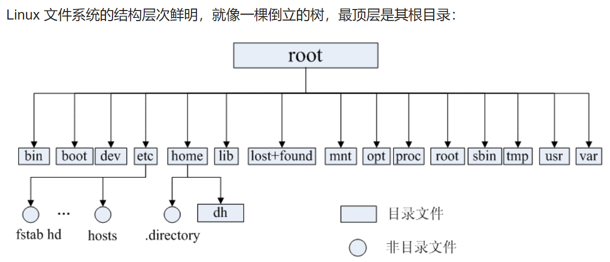

linux一切都是文件

- **/bin**： 存放二进制可执行文件(ls,cat,mkdir等)，常用命令一般都在这里；
- **/etc**： 存放系统管理和配置文件；
- **/home**： 存放所有用户文件的根目录，是用户主目录的基点，比如用户user的主目录就是/home/user，可以用~user表示；
- **/usr**： 用于存放系统应用程序；
- **/opt**： 额外安装的可选应用程序包所放置的位置。一般情况下，我们可以把tomcat等都安装到这里；
- **/proc**： 虚拟文件系统目录，是系统内存的映射。可直接访问这个目录来获取系统信息；
- **/root**： 超级用户（系统管理员）的主目录（特权阶级o）；
- **/sbin:** 存放二进制可执行文件，只有root才能访问。这里存放的是系统管理员使用的系统级别的管理命令和程序。如ifconfig等；
- **/dev**： 用于存放设备文件；
- **/mnt**： 系统管理员安装临时文件系统的安装点，系统提供这个目录是让用户临时挂载其他的文件系统；
- **/boot**： 存放用于系统引导时使用的各种文件；
- **/lib**： 存放着和系统运行相关的库文件 ；
- **/tmp**： 用于存放各种临时文件，是公用的临时文件存储点；
- **/var**： 用于存放运行时需要改变数据的文件，也是某些大文件的溢出区，比方说各种服务的日志文件（系统启动日志等。）等；
- **/lost+found**： 这个目录平时是空的，存放系统非正常关机而留下“无家可归”的文件

查找文件

```bash
find [path] [匹配条件] [动作]
大于10M
find .  -size +10M
find .  -size +10M -a -size -20M // -a 表示与
按名称
find / -name main.go
```

修改权限

```bash
chmod 777 main.go
文件所有者  用户组 其他用户
rwx4 2 1 去分配读 写 执行的权限
4+2+1=7 表示rwx
4+1=5 表示rx
4 表示r
常用 755 644 700
```

创建文件

```bash
mkdir 创建目录
touch 创建文件 
 cp [options] source dest 复制文件
-r递归复制 -i交互用户确认 -f强制 -p保留原始属性 -u源文件比目标新才创建
```

删除

```bash
rm -rf 目录名字
```

解压

```shell
解压 tar包
tar –xvf file.tar 
解压zip
unzip file.zip
解压  rar
unrar e file.rar
```


### cat

cat 命令用于连接文件并打印到标准输出设备上。

cat 主要有三大功能：

1.一次显示整个文件:

```sh
cat filename
```

2.从键盘创建/追加一个文件:

```shell
cat > filename 
cat >> filename  # 追加
```

只能创建新文件，不能编辑已有文件。

3.将几个文件合并为一个文件:

```shell
cat file1 file2 > file
```

- -b 对非空输出行号
- -n 输出所有行号

tac 反向显示

```bash
tac main.go
}
        }
          fmt.Println("hello")
      for {
func main() {
import "fmt"
package main

```

### chmod 

以文件 log2012.log 为例：

```shell
-rw-r--r-- 1 root root 296K 11-13 06:03 log2012.log
```

第一列共有 10 个位置，第一个字符指定了文件类型。在通常意义上，一个目录也是一个文件。如果第一个字符是横线，表示是一个非目录的文件。如果是 d，表示是一个目录。
权限字符用横线代表空许可，r 代表只读，w 代表写，x 代表可执行
文件属主 与属主同组的用户 系统中其他用户

**常用参数**：

```bash
-c 当发生改变时，报告处理信息
-R 处理指定目录以及其子目录下所有文件
```

权限范围：

```bash
u ：目录或者文件的当前的用户
g ：目录或者文件的当前的群组
o ：除了目录或者文件的当前用户或群组之外的用户或者群组
a ：所有的用户及群组
```

权限代号：

```bash
r ：读权限，用数字4表示
w ：写权限，用数字2表示
x ：执行权限，用数字1表示
- ：删除权限，用数字0表示
s ：特殊权限
```

**实例**：

（1）增加文件 t.log 所有用户可执行权限

```shell
chmod a+x t.log
```

（2）撤销原来所有的权限，然后使拥有者具有可读权限,并输出处理信息

```shell
chmod u=r t.log -c
```

（3）给 file 的属主分配读、写、执行(7)的权限，给file的所在组分配读、执行(5)的权限，给其他用户分配执行(1)的权限

```shell
chmod 751 t.log -c（或者：chmod u=rwx,g=rx,o=x t.log -c)
```

（4）将 test 目录及其子目录所有文件添加可读权限

```shell
chmod u+r,g+r,o+r -R text/ -c
```

### 目录的执行权限（x）有什么用？

目录的`x`权限和文件的`x`权限（执行程序）完全不同，它的核心作用是 **“允许进入目录并访问目录下文件的元数据”**，
没有`x`权限，即使有`r`或`w`权限，也无法正常使用目录，具体体现在 3 个场景：

没有`x`权限：无法进入目录（cd）
无论目录的`r`和`w`权限是否存在，只要没有`x`权限，就无法通过`cd dir`进入该目录，执行会报错 “权限不够”

没有`x`权限：即使有`r`权限，也无法完整访问目录内容
目录的`r`权限允许 “列出文件名”（如`ls test`），但如果没有`x`权限，无法获取文件的元数据（如文件大小、修改时间、权限等）：执行`ls test`：只能看到文件名，但无法显示文件的详细信息（如`ls -l test`会报错 “权限不够”）；
即使知道目录下有文件`test/file.txt`，也无法通过`cat test/file.txt`访问文件内容（因为进入目录的元数据访问需要`x`权限）。

没有`x`权限：即使有`w`权限，也无法增删目录下的文件
目录的`w`权限允许 “增删文件”，但前提是有`x`权限（因为增删文件需要先访问目录的元数据，确定文件位置）：
目录`test`权限为`-w-r--r--`（有写权限，无执行权限），执行`touch test/new.txt`会报错 “权限不够”，无法创建新文件；
反之，若目录权限为`--x--x--x`（只有执行权限），虽能`cd`进入，但无法`ls`列文件名（缺`r`）、无法`touch`创建文件（缺`w`），只能访问已知路径的文件（如`cat test/exist.txt`，若文件权限允许）。

目录的权限中，`x`是 “基础准入权限”，`r`是 “查看文件名权限”，`w`是 “增删文件权限”—— 三者的关系是：
**没有`x`，`r`和`w`基本失效；有`x`无`r`，能进目录但看不到文件名；有`x`无`w`，能进目录看文件但不能增删**。


### chown 

chown 将指定文件的拥有者改为指定的用户或组，用户可以是用户名或者用户 ID；组可以是组名或者组 ID；文件是以空格分开的要改变权限的文件列表，支持通配符。

```diff
-c 显示更改的部分的信息
-R 处理指定目录及子目录
```

**实例**：

（1）改变拥有者和群组 并显示改变信息

```shell
chown -c mail:mail log2012.log
```

（2）改变文件群组

```shell
chown -c :mail t.log
```

（3）改变文件夹及子文件目录属主及属组为 mail

```shell
chown -cR mail: test/
```

### cp

`cp [option] sources dest`
-i 提示 -r 复制目录及目录内所有项目 -a 复制的文件与原文件时间一样

1）复制 a.txt 到 test 目录下，保持原文件时间，如果原文件存在提示是否覆盖。

```shell
cp -ai a.txt test
```

（2）为 a.txt 建议一个链接（快捷方式）

```shell
cp -s a.txt link_a.txt
```

复制目录必须携带 -r表示递归复制

### wc

```bash
yu@yu:~/gotest$ wc -wclm main.go 
10 12 78 78 main.go
-w 单词数
-c 字节数
-l 行数
-m 字符数
```

### 压缩

- zip：
- 打包 ：zip something.zip something （目录请加 -r 参数）
- 解包：unzip something.zip
- 指定路径：-d 参数
- tar：
- 打包：tar -cf something.tar something
- 解包：tar -xf something.tar
- 指定路径：-C 参数


## docker

[Docker面试题（史上最全 + 持续更新） - 技术自由圈 - 博客园](https://www.cnblogs.com/crazymakercircle/p/17052047.html#autoid-h2-2-0-0)

[Docker 面试题汇总(附答案) - 滑滑蛋的个人博客](https://slipegg.github.io/2024/04/18/dockerInterview/)

### 介绍Docker容器

基于Linux内核实现的轻量级虚拟化技术,将应用程序以及其依赖打包成一个独立的可移植的标准化单元

- 镜像
  容器的 “模板”，是只读的静态文件，包含了运行应用所需的完整文件系统

- 容器

  镜像的 “运行实例”，是可读写的动态对象。镜像相当于 “类”，容器就是 “对象”
  通过`docker run`命令启动镜像后，就会生成一个独立的容器，我们可以对其进行启动、停止、重启、删除等操作

- Dockerhub仓库

  镜像的 “仓库”，类似代码仓库

- Dockerfile
  构建镜像的 “脚本文件”，通过指令（如`FROM`指定基础镜像、`COPY`复制 Go 编译后的二进制文件、`CMD`指定容器启动命令）定义镜像的构建流程

### docker的实现

Docker 的实现本质是**基于 Linux 内核的核心技术**,
Docker 的整体架构是C/S模型,
client是开发者操作的命令入口（如`docker run`、`docker build`），负责接收用户指令并发送给 Docker Daemon
Docker Daemo守护进进程是运行在宿主机的后台服务,负责核心工作:管理镜像、容器、网络、数据卷等资源,处理客户端的所有指令
Docker Registry存储 Docker 镜像的仓库

Docker 的轻量级、隔离性、可移植性，完全依赖 Linux 内核的三大技术,Namespace cgourp UnionFS 
**Namespace** 是 Linux 内核提供的 “进程级资源隔离机制”，通过为容器内的进程创建独立的 “资源命名空间”，让进程只能看到该命名空间内的资源（如进程 ID、网络、文件系统），从而实现逻辑上的 “独立环境”。
**cgroups** 是 Linux 内核提供的 “资源配额管理机制”，通过限制容器的 CPU、内存、磁盘 IO 等资源使用上限，避免单个容器耗尽宿主机资源。
**UnionFS** 通过 “分层存储 + 写时复制（Copy-on-Write）” 解决这一问题，是 Docker 镜像和容器文件系统的基础

容器运行时：OCI 标准与容器的生命周期管理,还需遵循**OCI开放容器倡议**，确保容器的可移植性和互操作性

1. **OCI 镜像规范**：定义镜像的格式确保不同容器引擎（如 Docker、containerd）能识别同一镜像
2. **OCI 运行时规范**：定义容器的生命周期（创建、启动、停止、删除）接口，Docker 通过`runc`（符合 OCI 标准的运行时工具）实际创建容器。

当执行`docker run my-go-api`时，完整流程如下：

1. Docker Client 将指令发送给 Daemon；
2. Daemon 检查本地是否有`my-go-api`镜像，若无则从 Registry 拉取；
3. Daemon 调用`runc`，由`runc`完成：
   - 创建 6 种 Namespace（隔离资源视图）；
   - 配置 cgroups（限制 CPU / 内存等资源）；
   - 挂载 UnionFS（叠加镜像层 + 可写层，形成容器文件系统）；
   - 在新的 Namespace 中执行容器启动命令（如`./go-api`）；
4. 容器启动后，`runc`退出，Daemon 接管容器的生命周期管理（如监控、日志收集）

### docker如何实现应用隔离

基于**Linux 内核的三大核心技术**（Namespace、cgroups、Union 文件系统）构建，
本质是 “资源视图隔离 + 资源使用限制 + 文件系统隔离” 的组合

#### Namespace 

实现 “资源视图隔离”,容器看不到外部资源,容器内进程只能看到该 Namespace 内的资源(如进程、网络、文件目录)

1. PID Namespace 隔离进程id,容器内的进程有独立的 PID 编号如 Go 服务进程在容器内是 PID=1，看不到宿主机其他进程，避免 PID 冲突,在 Go API 容器内执行`ps aux`，只能看到容器内的 Go 进程和少量基础进程,看不到宿主机的pid
2. Network Namespace,隔离网络资源,每个容器有独立的网络栈：独立的虚拟网卡、私有 IP、路由表和端口空间，容器间网络默认隔离，需通过 “桥接” 或 “端口映射” 通信。
3. Mount Namespace,隔离文件系统,容器有独立的根文件系统（`/`），只能看到自己的挂载目录（如`/app`、`/etc`），看不到宿主机的`/home`或其他容器的文件
4. User Namespace 隔离用户和用户组id,容器内的 root 用户UID=0映射到宿主机的 普通用户 UID=1000，即使容器内提权，也无法获得宿主机的 root 权限
5. UTS Namespace 隔离主机名和域名,容器有独立的主机名，与宿主机和其他容器不同，避免主机名冲突
6. IPC Namespace 隔离进程间通信（IPC）资源（如信号量、消息队列）,容器内的进程只能与同一容器内的进程通过 IPC 通信

#### cgroups

实现 “资源使用限制”,Linux 内核提供的资源限制机制,分配固定的 CPU、内存、磁盘 IO 等资源
Namespace 解决了 “容器看不到外部资源” 的问题，但无法限制 “容器能用多少资源”

1. 内存:限制容器可使用的最大物理内存和交换分区
   `--memory=2g(最大物理内存2G) --memory-swap=4g(物理+swap 4G)`

2. CPU: 
   `--cpus=1.5(限制使用 1.5 个 CPU 核心)  `

   `--cpu-shares=512（CPU 资源竞争时的权重，默认 1024，权重越高分配到的 CPU 时间越多）`

####  Union 文件系统

Docker 还需为每个容器提供独立的文件系统,通过 分层存储 + 写时复制(Copy-on-Write)实现文件系统的隔离与复用

Docker 镜像（如 Go 服务镜像）是 “只读的分层结构”，从下到上分为：

1. **基础层**：操作系统核心文件（如`alpine`镜像的`/bin`、`/etc`）；
2. **依赖层**：应用依赖（如 Go 1.21 的运行时库、Redis 客户端库）；
3. **应用层**：Go 服务的二进制文件（如`/app/go-api`）和配置文件（如`/app/config.yaml`）。

容器启动时，Docker 会在镜像的只读层之上添加一层**可写层**（容器层），
容器内的文件修改（如日志写入、配置更新）只发生在可写层，不会影响底层的只读镜像。

写时复制（Copy-on-Write）：空间复用与隔离

- 当容器需要修改某文件（如`/app/config.yaml`）时，会先将该文件从只读的镜像层 “复制” 到可写层，再在可写层修改，底层镜像层的文件保持不变；
- 多个容器共享同一镜像的只读层，只需各自维护自己的可写层，大幅节省磁盘空间（如 10 个 Go 服务容器共享同一基础镜像，只需存储 1 份基础层文件）

### 虚拟机

相比传统虚拟机（如 VMware），容器在后端开发和部署中更具优势

1. **轻量级，资源占用低**：容器不依赖完整的操作系统内核（而是共享宿主机的 Linux 内核），启动时间通常在秒级（虚拟机需要分钟级）
2. **环境一致性**：在本地用 Go 1.21 开发，依赖 Redis 6.2，若直接部署到生产服，可能因生产环境的 Go 版本、Redis 配置不同导致服务崩溃；而用 Docker 打包后，生产环境只需拉取相同镜像启动容器，完全规避环境差异问题
3. **隔离性与安全性**：容器通过 Linux 内核的`Namespace`（实现 PID、网络、文件系统等资源隔离）和`cgroups`（限制 CPU、内存等资源使用），确保每个容器的运行不影响其他容器。比如我开发的用户认证服务容器，即使出现内存泄漏，也只会被`cgroups`限制在指定内存范围内，不会拖垮整个宿主机。
4. **部署与扩展便捷**：Go 后端服务编译后是静态二进制文件，与 Docker 结合后可实现 “一次构建，到处运行”。比如之前做的订单服务，需要扩容时，只需通过`docker-compose`,批量启动多个容器,无需重复配置环境


### 命令

#### 镜像

`docker pull` - 从仓库拉取镜像 `docker pull golang:1.21-alpine`
`docker push` - 推送镜像到仓库 `docker push registry.example.com/my-go-api:v1.0`

`docker build` - 基于 Dockerfile 构建镜像

```bash
docker build -t my-go-api:v1.0 --no-cache .
-t 镜像名:标签：指定镜像名称和版本（如 -t my-go-api:v1.0）。
-f 自定义Dockerfile路径：若 Dockerfile 不在当前目录或文件名非 Dockerfile，需指定（如 -f ./build/Dockerfile）。
--no-cache：不使用缓存，强制重新构建（避免缓存导致的依赖更新问题）。
```

`docker images` - 查看本地镜像

```bash
-q：只显示镜像 ID（用于批量操作，如 docker rmi $(docker images -q -f "dangling=true") 删除虚悬镜像）。
-f "dangling=true"：只显示虚悬镜像（标签为<none>的无用镜像）。
```

`docker rmi` - 删除本地镜像

`docker save/load` - 保存 / 加载镜像为 tar 包

```bash
docker save -o my-go-api.tar my-go-api:v1.0（保存镜像为 tar 包）
docker load -i my-go-api.tar（加载 tar 包为镜像）
```

虚悬镜像
(Dangling Image) 指的是仓库名 (镜像名) 和标签 TAG 都是 `<none>` 的镜像
`docker image ls -f dangling=true`查看
`docker image prune`删除

#### 容器

`docker run` - 基于镜像创建并启动容器

```bash
docker run -d -p 8080:8080 -v go-api-data:/app/data --name go-api --restart=always my-go-api:v1.0
-d：后台运行容器（守护态）。
-p 宿主机端口:容器端口：端口映射（如 -p 8080:80 把容器 80 端口映射到宿主机 8080）。
-v 宿主机路径:容器路径 或 -v 卷名:容器路径：挂载数据卷 / 目录（持久化数据）。
--name 容器名：指定容器名称（避免用随机名）。
--restart=always：容器退出后自动重启（适合生产环境）。
--network 网络名：指定容器所属网络（实现容器间通信）
bridge模式：--net=bridge 桥接模式（默认设置，自己创建也使用bridge 模式）
host模式：--net=host 和宿主即共享网络
```

`docker ps` - 查看容器状态

```bash
docker ps -a
-a：显示所有容器（包括已停止的）。
-q：只显示容器 ID（常用于批量操作，如 docker rm $(docker ps -aq) 删除所有容器）。
-l：显示最近创建的容器。
```

`docker exec` - 进入运行中的容器执行命令

```bash
docker exec -it go-api /bin/sh
-it：交互式终端
```

`docker logs` - 查看容器日志

```bash
docker logs -f --tail 50 go-api
-f：实时跟踪日志（类似 tail -f）。
--tail 100：只显示最后 100 行日志。
-t：显示日志的时间戳。
```

`docker start/rm/stop/restart/pause/unpause` - 启动/ 删除 / 停止 / 重启/ 暂停 / 恢复

`docker export/import` 导出 / 导入容器为 tar 包

`docker cp` - 在容器与宿主机间复制文件

```bash
docker cp ./config.yaml go-api:/app/config.yaml（把宿主机的 config.yaml 复制到容器内 /app 目录）
docker cp go-api:/app/logs/app.log ./app.log（把容器内的日志文件复制到宿主机当前目录）
```

#### 数据卷

```bash
docker volume create - 创建数据卷
docker volume ls - 查看所有数据卷
docker volume rm - 删除数据卷
docker volume inspect - 查看数据卷详情,获取数据卷的存储路径（宿主机上的实际位置）、创建时间等信息
```

#### 网络管理

`docker network create xxxnet`创建自定义bridge模式

`docker network ls` - 查看所有网络,列出本地所有 Docker 网络（包括默认的 bridge、host、none）

`docker network connect` - 将容器加入网络,让已创建的容器加入指定网络,实现跨网络通信

```bash
docker network connect go-api-network mysql
将 mysql 容器加入 go-api-network，使 go-api 容器能通过mysql名称访问它
```

`docker network rm` - 删除网络

#### 系统与信息查询

`docker info` - 查看 Docker 系统信息
`docker version` - 查看 Docker 版本
`docker stats` - 实时监控容器资源使用
`docker inspect` - 查看容器 / 镜像 / 网络 / 卷的详细元数据
`docker top` - 查看容器内运行的进程,类似 Linux 的 top 命令，显示容器内的进程 PID、CPU 占用等


### Docker网络

Docker 提供了几种默认网络驱动程序：
`bridge`（独立容器的默认驱动程序，隔离网络）
bridge模式适用于单个宿主机上的场景,是Docker的默认网络驱动程序。
它会在宿主机上创建一个虚拟网桥（通常是docker0），并将容器连接到这个网桥上。
使用 bridge 模式新创建的容器，容器内部都会有一个虚拟网卡，名为 eth0，容器之间可以通过容器内部的IP相互通信

多个容器需要互相通信（如微服务中的服务间调用），但又需要网络隔离（避免端口冲突、权限隔离）。
开发 / 测试环境中，需要模拟独立的网络环境，同时允许容器通过端口映射与外部交互。
大多数常规场景，尤其是容器数量较多、需要灵活管理网络规则的情况。

`host`容器共享主机的网络堆栈，无隔离,使用宿主主机的网络信息
对网络性能要求极高的场景（如高并发服务，避免 NAT 转发损耗）。
容器需要直接使用宿主机的网络资源（如绑定宿主机的特定端口，且不需要隔离）。
临时调试场景（快速暴露端口，无需配置映射）。

注意：由于端口共享，可能导致端口冲突（容器和宿主机 / 其他容器不能使用同一端口）

`none`（容器没有网络接口）。
容器将处于完全隔离的状态。它通常用于一些特殊场景，如运行与网络无关的应用程序或进行网络调试

`overlay` 用于 Swarm 中的多主机通信，
overlay网络驱动程序用于创建跨多个Docker的分布式网络。它通过内置的DNS服务实现容器之间的跨主机通信。
overlay模式适用于需要构建的场景，可以让容器在不同宿主机之间进行通信。

`macvlan` 为容器分配一个 MAC 地址，使其在网络上显示为物理设备。

### Bind Mount 和 Volume

*Bind Mount* 是指将主机文件系统中的一个文件或目录挂载到容器中的一个指定位置,
容器中的文件或目录直接映射到主机上的文件或目录
这意味着对容器内文件或目录的更改会直接反映到主机上，反之亦然
**由主机系统直接管理，路径是主机文件系统中的路径**
需要手动指定主机路径，可能会增加复杂性
容器和主机共享同一个文件或目录，没有数据隔离
使用 Bind Mount 时，需要使用 `-v` 或 `--mount` 选项指定主机路径和容器路径。
`使用 -v 选项 docker run -d -v /path/on/host:/path/in/container my_image`
当需要直接访问主机文件系统，或需要快速测试和开发时，可以选择 Bind Mount

*Volume* 是**由 Docker 管理的一块存储区域**，存储在 Docker 的存储驱动程序所管理的专用位置
由 Docker 自动创建和管理，更加便捷,不依赖于主机文件系统路径，适用于多容器共享数据的场景
Volume 可以很方便地备份、恢复和迁移，并且在容器删除时可以选择保留数据
容器和主机通过 Docker 的存储驱动进行数据交互，有一定的数据隔离

```bash
# 创建一个 Volume
docker volume create my_volume
# 使用 -v 选项
docker run -d -v my_volume:/path/in/container my_image
# 使用 --mount 选项
docker run -d --mount type=volume,source=my_volume,target=/path/in/container my_image
```

当需要数据持久化、多容器共享数据，或需要方便的备份和恢复时，Volume 是更好的选择

### docker缺点

1. 隔离性有限:本质是基于共享宿主机 Linux 内核,隔离性自然不如虚拟机
   比如，若宿主机内核存在漏洞,攻击者可能通过容器突破隔离,获取宿主机的操作权限
2. 强依赖宿主机内核，跨平台兼容性受限
   虽然 Docker Desktop 在 Windows 和 macOS 上能运行
   但本质是通过 “在本地启动一个轻量级 Linux 虚拟机” 来承载容器（如 Windows 依赖 WSL),并非原生运行
   不同 Linux 内核版本的兼容性问题,若宿主机内核版本过低,可能不支持 Docker 所需的新特性,导致容器启动失败
3. 数据持久化方案复杂，易出现数据丢失风险
   比如，我们项目初期用 Docker 部署 MySQL 时，未正确挂载数据卷（Volume） ，而是直接将数据存在容器内部；
   某次测试中误执行了`docker rm -f mysql-container`，导致测试数据全部丢失
4. 网络配置复杂
   Docker 的网络模型在多容器、跨主机通信时，配置和排障成本较高
   比如，本地用 Docker Compose 管理多服务时，默认的 “桥接网络” 能实现容器间通过服务名通信（如`http://user-service:8081`）
   但一旦部署到多台服务器（如测试服分两台，一台跑用户服务，一台跑订单服务），就需要配置**overlay 网络**（跨主机容器网络），不仅要部署 Consul 等服务发现组件，还要处理网络延迟、DNS 解析失败等问题；
   之前项目中曾因 overlay 网络的 DNS 缓存问题，导致订单服务调用用户服务时频繁超时，
   排查了 3 小时才发现是 Docker DNS 的缓存未及时更新。

### docker容器失效了怎么办

1. 看容器状态`docker ps -a`
   查看容器状态以及退出码 `Exited (1) 2 seconds ago` exited非0时,
   退出码`1`可能是应用启动失败，`137`是容器被强制 kill（内存不足），`128+信号量`（如 139）是应用段错误
   如果退出码为0,容器启动但端口不通,可能是应用卡在初始化（如等待依赖服务），或网络配置错误
2. 查日志 `docker logs xxx`
   查看是否容器有某种依赖没有成功加载
3. 看容器详细配置`docker inspect xxx`
   比如查网络配置：看`NetworkSettings`下的`IPAddress`和`Ports`，确认端口是否正确映射（如是否误将 8080 映射到 8081）。查环境变量：看`Config.Env`，确认 Go 服务依赖的环境变量（如`MYSQL_URL`、`REDIS_ADDR`）是否正确设置，
   曾有一次因环境变量`GO_ENV`设为`test`而非`prod`，导致 Go 服务读取错配置文件。

### 容器无法启动

端口冲突:报错`bind: address already in use`
① 查宿主机占用端口的进程：`netstat -tulpn | grep 8080`
② 要么停止占用端口的进程，要么修改容器端口映射（如`-p 8081:8080`）

镜像损坏或标签错误:`docker run`报错`no such image`或`manifest unknown`
① 检查镜像是否存在：`docker images | grep go-api`；
② 若镜像缺失，重新构建（`docker build -t go-api .`）或拉取（`docker pull [仓库地址]/go-api`）；
③ 若标签错误，用正确标签启动（如错用`go-api:latest`，实际是`go-api:v1.0`）。

依赖服务未就绪:日志显示`dial tcp: connection refused`）
① 确保依赖容器已启动：`docker ps | grep mysql`；
② 若用`docker-compose`，通过`depends_on`配置启动顺序（但需注意`depends_on`只保证 “容器启动顺序”，不保证 “服务就绪”，需在 Go 服务中加 “依赖重试逻辑”，比如用`github.com/avast/retry-go`库，连接 MySQL 失败后重试 3 次，每次间隔 2 秒）

### 容器启动后立刻退出

**应用启动后无前台进程:**
Go 服务是 “后台运行” 模式（如用`nohup ./app &`），
导致容器认为 “任务完成” 而退出（Docker 要求容器必须有一个前台进程）。
解决：修改容器启动命令，让 Go 服务以 “前台进程” 运行，比如在 Dockerfile 中用`CMD ["./app"]`
直接启动二进制文件，默认前台运行，而非后台启动。

**应用配置错误:**
Go 服务启动时因配置文件错误（如数据库账号密码错、端口配置非法）而退出
日志显示`invalid config`或`authentication failed`
① 检查配置文件：若配置文件挂载到容器，在宿主机修改（如`/data/go-app/config.yaml`）；
② 若用环境变量传递配置，重新启动时指定正确变量（如`docker run -e MYSQL_PASSWORD=123456 go-api`）。

**容器资源不足:**
`docker inspect`显示`OOMKilled: true`（内存不足被 kill），或`CPUQuota`超限
① 查看宿主机资源：`free -m`（内存）、`top`（CPU）；
② 启动时增加资源限制：`docker run --memory=2g --cpus=1.5 go-api`

### 容器运行中突然崩溃

**应用代码 bug（如内存泄漏、panic）:**
① 查 Go 服务的错误日志，定位 bug 位置（如内存泄漏可通过`pprof`分析：在 Go 服务中引入`net/http/pprof`，启动后访问`http://[容器IP]:6060/debug/pprof/`，查看内存使用情况）；
② 修复代码后重新构建镜像，替换旧容器（`docker stop go-api && docker rm go-api && docker run -d --name go-api go-api`）

**依赖服务故障**
Go 服务运行中因 MySQL/Redis 突然宕机，导致连接超时
① 恢复依赖服务（`docker start mysql redis`）；
② 优化 Go 服务代码：给数据库 / Redis 客户端配置 “自动重连”（如`github.com/go-sql-driver/mysql`默认支持重连，只需在 DSN 中加`parseTime=true&autoreconnect=true`），并捕获连接错误，避免服务直接 panic（用`defer recover()`处理 goroutine 中的 panic）。

###  数据恢复

用 数据卷Volume 持久化 
查看数据卷是否还在`docker volume ls | grep [卷名]`
若卷未丢失，重新启动容器时挂载原卷：`docker run -d -v mysql-data:/var/lib/mysql --name mysql mysql:8.0`

用 绑定挂载（Bind Mount）
只要宿主机目录未删除，重新启动容器时挂载该目录即可恢复数据]

### 运行项目时内存爆了

我曾在im项目中遇到过两次类似情况
（一次是用户批量上传大文件导致内存溢出，一次是 goroutine 泄漏引发内存持续增长）

1. 立即释放占用资源，重启服务若为本地开发环境（如 Go 程序直接运行）：
   先用`ps aux | grep go`找到占用内存过高的 Go 进程，再用`kill -9 oid`强制终止，然后重新启动项目
   同时暂时关闭非必要功能（如批量上传、大数据统计），优先保证核心接口可用。
   若为Docker 容器环境：先用`docker stats`确认内存超标的容器，用`docker stop [容器ID]` 
   停止（若无法正常停止，加-t 0强制停止），
   再重新启动时临时增加内存限制（如`docker run --memory=4g --name go-api go-api`，比之前的限制高 1-2 倍），
   避免重启后立即再次 OOM

### CPU 100%

1. 临时重启高cpu容器,限制容器cpu的使用`docker update --cpus=1 `

2. 确定高 CPU 容器`docker stats`,定位容器内高 CPU 进程,进入高 CPU 容器，用`top`或`pidstat`找到具体占用 CPU 的进程

3. 分析进程高 CPU 的原因:go:pprof mysql:慢查询、锁竞争、连接风暴

4. 修复代码（如 Go 服务的 for 循环条件错误），重新构建镜像并替换容器：

   `docker stop 旧容器 && docker rm 旧容器 && docker run -d --name 新容器 新镜像`。

   - **若为高并发请求过载**：
     1. 前端加限流（如 Nginx 限制 QPS）
     2. 后端扩容容器（如用`docker-compose`启动多个实例，配合负载均衡）
     3. 优化业务逻辑（如缓存热点数据到 Redis，减少数据库查询）

#### Mysql

进入 MySQL 容器，查看数据库连接与活跃会话
执行`show processlist;`查看当前连接和 SQL 执行状态，重点关注`State`和`Info`列：

- **若大量连接处于 “Sending data” 状态**：说明有慢查询（如全表扫描、未加索引），导致 CPU 持续计算
  分析慢查询日志 若`type=ALL`且`key=NULL`，说明未加索引，导致全表扫描，占用大量 CPU

- **若大量连接处于 “Waiting for table metadata lock” 状态**：说明有锁竞争（如某 SQL 加表锁，其他 SQL 等待锁释放）

  检查数据库锁与事务

  1. 查看表锁状态：`show open tables where in_use>0;`（`in_use>0`表示表被锁定）。
  2. 查看行锁状态（InnoDB）：`select * from information_schema.innodb_locks;`（查看持有锁和等待锁的会话）。
  3. 查看长事务：`select * from information_schema.innodb_trx where TIME_TO_SEC(timediff(now(), trx_started))>60;`（查找执行超过 60 秒的事务）
     若某会话长期持有锁，临时`kill`该会话
     若发现某事务持有`order`表的行锁超过 10 分钟，且其他事务在等待该锁，说明长事务导致锁竞争，CPU 用于处理锁等待队列，导致占用飙升
     拆分长事务如把 “查询 + 更新 + 插入” 拆分为多个短事务,避免在事务中执行慢查询（如全表扫描）

- **若连接数远超配置（如超过`max_connections`）**：说明连接风暴（如 Go 服务未关闭数据库连接，导致连接泄漏）
  增加 MySQL 最大连接数（临时生效）：`set global max_connections=500;`（永久生效需修改`my.cnf`的`max_connections=500`，重启容器）；
  优化应用连接池（如 Go 服务用`database/sql`时，设置`SetMaxOpenConns(100)`和`SetMaxIdleConns(20)`，避免连接泄漏）。

### dockerfile

1. **FROM**

   定义基础镜像，是构建过程的起点，所有后续指令都基于此镜像进行
   必须是 Dockerfile 的第一个非注释指令，奠定整个构建的基础环境

2. **LABEL**添加镜像元数据（如作者、版本、描述等），用于标识和说明镜像,紧随 FROM 之后，属于镜像的基础属性定义，与镜像来源相关联

3. **MAINTAINER**定义镜像创建者信息（已被 LABEL 替代，推荐用`LABEL maintainer="name@example.com"`）。

4. **WORKDIR** 设置后续命令（RUN/CMD/ENTRYPOINT/COPY/ADD）的工作目录，避免路径混乱

5. **ENV** 设置环境变量（如路径、配置参数等），供后续命令和容器运行时使用

6. **ADD**复制主机文件到容器，支持自动解压压缩包和 URL 下载

7. **COPY**复制主机文件到容器（仅复制，不解压 / 下载），比 ADD 更简洁安全

8. **RUN**执行命令（如安装依赖、编译代码、修改配置等），是构建镜像的核心操作

9. **VOLUME**定义数据卷，用于持久化容器数据（避免容器删除时数据丢失）

10. **EXPOSE**声明容器运行时监听的端口（仅声明，需配合`-p`映射），用于说明镜像网络特性

11. **USER**设置容器运行时的用户（非 root 用户更安全），限制容器内操作权限

12. **ENTRYPOINT**

    设置容器启动的默认程序（不可被`docker run`命令参数覆盖，或作为参数前缀）
    在 CMD 之前，定义启动的核心程序（如`ENTRYPOINT ["./app"]`）

13. **CMD**

    设置容器启动的默认命令或参数（可被`docker run`命令参数覆盖）
    位置：通常是 Dockerfile 的最后一个指令，用于补充 ENTRYPOINT 的参数或直接定义启动命令

```dockerfile
# 第一阶段：构建 Go 二进制文件（多阶段构建的第一部分，专注于编译应用）
# FROM 指令：定义基础镜像，这里使用官方golang 1.23版本作为构建环境
# AS builder 给这个阶段命名为builder，方便后续阶段引用
FROM golang:1.23 AS builder
# ENV 指令：设置环境变量，影响后续命令的执行环境
# GO111MODULE=on：启用Go模块支持
# CGO_ENABLED=0：禁用CGO，生成静态链接的二进制文件，不依赖系统库
# GOOS=linux：指定目标操作系统为Linux
# GOARCH=amd64：指定目标架构为amd64
ENV GO111MODULE=on \
    CGO_ENABLED=0 \
    GOOS=linux \
    GOARCH=amd64
# WORKDIR 指令：设置当前工作目录，后续命令将在这个目录下执行
WORKDIR /app
# COPY 指令：将主机上的文件复制到容器中
# 先复制go.mod和go.sum，这两个文件包含项目依赖信息
COPY go.mod .
COPY go.sum .
# RUN 指令：在容器中执行命令，这里下载项目依赖
# 单独复制依赖文件再下载依赖，可以利用Docker缓存，加快后续构建
RUN go mod download
# 将当前目录下的所有代码复制到容器的工作目录中
COPY . .
# 编译Go代码，生成名为bluebell_app的二进制可执行文件
RUN go build -o bluebell_app .


# 第二阶段：运行环境（多阶段构建的第二部分，专注于运行应用，精简镜像体积）
# 使用轻量级的alpine:latest作为基础镜像，相比第一阶段体积小很多
FROM alpine:latest
# RUN 指令：在容器中执行命令，安装时区数据
# apk是Alpine的包管理器，--no-cache表示不缓存包索引，减小镜像体积
RUN apk add --no-cache tzdata 
# ENV 指令：设置时区环境变量为亚洲/上海
ENV TZ=Asia/Shanghai
# 配置时区，将时区文件链接到系统目录，使容器内时间与指定时区一致
RUN ln -sf /usr/share/zoneinfo/${TZ} /etc/localtime
# 设置工作目录为/app
WORKDIR /app
# COPY --from=builder：从之前命名为builder的阶段复制文件到当前阶段
# 只复制编译好的二进制文件，不需要源代码和编译环境，减小镜像体积
COPY --from=builder /app/bluebell_app .
# 复制配置文件到容器中
COPY ./settings.yaml .
# 复制上传目录及其内容
COPY ./uploads/ ./uploads/
# 复制Elasticsearch模型映射文件
COPY ./models/esmodels/article_mapper.json ./models/esmodels/article_mapper.json
COPY ./models/esmodels/fulltext_mapper.json ./models/esmodels/fulltext_mapper.json
# EXPOSE 指令：声明容器运行时监听的端口，只是一个声明，方便用户了解镜像特性
# 实际端口映射需要在运行容器时使用-p参数指定
EXPOSE 8080

# CMD 指令：指定容器启动时执行的命令，这里启动我们的应用程序
# 使用数组形式可以避免shell解析带来的问题，是推荐的写法
CMD ["./bluebell_app"]

```


#### CMD ENTRYPOINT RUN 区别

RUN
**作用**：在**镜像构建阶段**执行命令，用于安装软件、配置环境等，会创建新的镜像层
**场景**：构建镜像时需要预处理的操作
`RUN apt-get update && apt-get install -y nginx # 安装 nginx 并更新包管理`

CMD
**作用**：在**容器启动时**执行命令，提供容器默认的执行命令
**特点**：如果 Docker 运行时指定了命令，会覆盖 `CMD` 的命令,一个 Dockerfile 中只能有一个 `CMD` 生效（最后一个）

```dockerfile
# 容器启动时默认运行 nginx 在前台
CMD ["nginx", "-g", "daemon off;"]

# 这个命令会覆盖 CMD，容器启动后执行 bash 而非 nginx
docker run -it my-nginx-image bash
```

 ENTRYPOINT

**作用**：在**容器启动时**执行命令，定义容器的主要执行命令
**特点**：运行时指定的命令会作为参数追加到 `ENTRYPOINT` 之后,不会被运行时命令覆盖（除非使用 `--entrypoint` 参数）

```dockerfile
# 定义入口命令为 nginx
ENTRYPOINT ["nginx", "-g", "daemon off;"]

# 实际执行的命令是：nginx -g "daemon off;" -v
docker run my-nginx-image -v
```


实际使用中，常将 `ENTRYPOINT` 与 `CMD` 结合，用 `ENTRYPOINT` 定义固定命令，`CMD` 提供默认参数

```dockerfile
# 固定执行 echo 命令，默认参数为 "Hello World"
ENTRYPOINT ["echo"]
CMD ["Hello World"]

# 实际执行：echo "Hello Docker"
docker run my-echo-image "Hello Docker"
```


### docker compose

Dockerfile 是拿来构建自定义镜像的,并没有直接生成容器,只是可以在运行镜像时运行容器而已。
做容器编排以部署环境，是使用 docker-compose.yml 文件进行的，需要用到 Dockerfile 


##  数据结构算法

### B+tree 和 Btree优劣,各自作用场景

| 特性       | B                                                            | B+                                                           |
| ---------- | ------------------------------------------------------------ | ------------------------------------------------------------ |
| 结构       | 多路平衡查找树,每个节点包含关键字,记录指针,子节点指针        | B树变体,非叶子节点只存储关键字和子节点指针<br />叶子节点存储实际的数据,节点之间使用双向链表连接,形成有序的序列 |
| 存储效率   | 每个节点需要存储关键字,记录指针,子节点指针<br />相同空间下保存到关键字少,树更高 | 非叶子节点只保存关键字和子树的指针,叶子节点存储记录,树更低,io次数少 |
| 查询效率   | 查询关键字所在的非叶子节点可以o(1)实现<br />但实际上树比较高,而且范围查询叶子节点是需要回溯到父节点继续查找,效率偏低 | 必须遍历到叶子节点才可以才可以获取到记录数据<br />范围查询时叶子节点之间维护双向指针,效率极高 |
| 插入删除   | 插入删除可能导致节点分裂合并,因为关键字和记录指针是绑定的<br />插入新的关键字,叶子节点未慢直接插入,叶子节点满后需要进行节点分裂,并调整父节点确保包含新的关键字 | 插入删除仅影响叶子节点和非叶子节点的关键字<br />叶子节点未满直接插入,父节点不需要存储记录,不会受到记录指针的影响 |
| 数据一致性 | 记录分散在所有节点，若数据更新，需同步更新节点中的记录指针，一致性维护较复杂。 | 所有记录集中在叶子节点，更新仅需操作叶子，一致性维护更简单。 |

B树适合文件索引系统,随机查询为主,范围查询很少,非叶子节点可以直接命中,减少io
B+树适合范围,数据量大的查询:比如innodb的索引是基于B+tree实现

### LRU

```GO
package main

import "fmt"

type LruCache struct {
    size     int
    limit    int
    cacheMap map[int]*DLinkedList
    head     *DLinkedList
    tail     *DLinkedList
}
type DLinkedList struct {
    key   int
    value int
    prev  *DLinkedList
    next  *DLinkedList
}

func (l *LruCache) Get(key int) int {
    if _, ok := l.cacheMap[key]; !ok {
       return -1
    }
    node := l.cacheMap[key]
    l.moveToFront(node)
    return node.value
}

func (l *LruCache) Put(key, value int) {
    // key 不存在
    if _, ok := l.cacheMap[key]; !ok {
       node := &DLinkedList{key: key, value: value}
       l.cacheMap[key] = node
       l.addToFront(node)
       l.size++
       // 淘汰
       if l.size > l.limit {
          tail := l.tail.prev
          l.remove(tail)
          delete(l.cacheMap, tail.key)
          l.size--
       }
    }
    // 存在
    node := l.cacheMap[key]
    node.value = value
    l.moveToFront(node)
}

func (l *LruCache) addToFront(node *DLinkedList) {
    node.next = l.head.next
    node.prev = l.head
    l.head.next.prev = node
    l.head.next = node
}

func (l *LruCache) remove(node *DLinkedList) {
    node.prev.next = node.next
    node.next.prev = node.prev
}

func (l *LruCache) moveToFront(node *DLinkedList) {
    l.remove(node)
    l.addToFront(node)
}

func NewLruCache(limit int) LruCache {
    lc := LruCache{
       size:     0,
       limit:    limit,
       cacheMap: make(map[int]*DLinkedList),
       head:     &DLinkedList{key: -1, value: -1},
       tail:     &DLinkedList{key: -1, value: -1},
    }
    lc.head.next = lc.tail
    lc.tail.prev = lc.head
    return lc
}

func main() {
    lRUCache := NewLruCache(2)

    lRUCache.Put(1, 1)           // 缓存是 {1=1}
    lRUCache.Put(2, 2)           // 缓存是 {1=1, 2=2}
    fmt.Println(lRUCache.Get(1)) // 返回 1
    lRUCache.Put(3, 3)           // 该操作会使得关键字 2 作废，缓存是 {1=1, 3=3}
    fmt.Println(lRUCache.Get(2)) // 返回 -1 (未找到)
    lRUCache.Put(4, 4)           // 该操作会使得关键字 1 作废，缓存是 {4=4, 3=3}
    fmt.Println(lRUCache.Get(1)) // 返回 -1 (未找到)
    fmt.Println(lRUCache.Get(3)) // 返回 3
    fmt.Println(lRUCache.Get(4)) // 返回 4
}
```

过期时间戳 惰性删除

```go
package main

import (
    "fmt"
    "time"
)

// LruCache 带过期时间的LRU缓存
type LruCache struct {
    size     int           // 当前缓存大小
    limit    int           // 缓存容量限制
    cacheMap map[int]*DLinkedList // 哈希表用于快速查找
    head     *DLinkedList  // 双向链表头节点(哨兵)
    tail     *DLinkedList  // 双向链表尾节点(哨兵)
}

// DLinkedList 双向链表节点，包含过期时间字段
type DLinkedList struct {
    key           int           // 键
    value         int           // 值
    expirationTime time.Time     // 过期时间点
    prev          *DLinkedList  // 前一个节点
    next          *DLinkedList  // 后一个节点
}

// Get 获取缓存项，若存在且未过期则返回值，否则返回-1
func (l *LruCache) Get(key int) int {
    node, ok := l.cacheMap[key]
    if !ok {
       return -1
    }

    // 检查是否过期
    if time.Now().After(node.expirationTime) {
       // 已过期，移除该节点
       l.remove(node)
       delete(l.cacheMap, key)
       l.size--
       return -1
    }

    // 未过期，移到队首并返回值
    l.moveToFront(node)
    return node.value
}

// Put 插入或更新缓存项，指定过期时间（生存周期）
// expiration参数表示从现在开始的生存时间
func (l *LruCache) Put(key, value int, expiration time.Duration) {
    // 计算过期时间点
    expirationTime := time.Now().Add(expiration)

    // 键已存在
    if node, ok := l.cacheMap[key]; ok {
       // 更新值和过期时间
       node.value = value
       node.expirationTime = expirationTime
       l.moveToFront(node)
       return
    }

    // 键不存在，创建新节点
    node := &DLinkedList{
       key:           key,
       value:         value,
       expirationTime: expirationTime,
    }
    l.cacheMap[key] = node
    l.addToFront(node)
    l.size++

    // 超过容量限制，淘汰最久未使用的节点
    if l.size > l.limit {
       tail := l.tail.prev
       l.remove(tail)
       delete(l.cacheMap, tail.key)
       l.size--
    }
}

// addToFront 将节点添加到链表头部(紧接head哨兵)
func (l *LruCache) addToFront(node *DLinkedList) {
    node.next = l.head.next
    node.prev = l.head
    l.head.next.prev = node
    l.head.next = node
}

// remove 从链表中移除指定节点
func (l *LruCache) remove(node *DLinkedList) {
    node.prev.next = node.next
    node.next.prev = node.prev
}

// moveToFront 将节点移到链表头部
func (l *LruCache) moveToFront(node *DLinkedList) {
    l.remove(node)
    l.addToFront(node)
}

// NewLruCache 创建新的LRU缓存实例
func NewLruCache(limit int) LruCache {
    lc := LruCache{
       size:     0,
       limit:    limit,
       cacheMap: make(map[int]*DLinkedList),
       head:     &DLinkedList{key: -1, value: -1},
       tail:     &DLinkedList{key: -1, value: -1},
    }
    lc.head.next = lc.tail
    lc.tail.prev = lc.head
    return lc
}

// IsExpired 检查指定键是否已过期
func (l *LruCache) IsExpired(key int) bool {
    node, ok := l.cacheMap[key]
    if !ok {
       return true // 不存在视为已过期
    }
    return time.Now().After(node.expirationTime)
}

func main() {
    lRUCache := NewLruCache(2)

    // 添加缓存项，设置1秒过期
    lRUCache.Put(1, 1, time.Second*1)
    lRUCache.Put(2, 2, time.Second*5)
    
    fmt.Println(lRUCache.Get(1)) // 返回 1（未过期）
    
    // 等待2秒，让key=1过期
    time.Sleep(time.Second * 2)
    fmt.Println(lRUCache.Get(1)) // 返回 -1（已过期）
    fmt.Println(lRUCache.Get(2)) // 返回 2（未过期）
    
    lRUCache.Put(3, 3, time.Second*3) // 淘汰最久未使用的key=2
    fmt.Println(lRUCache.Get(2)) // 返回 -1（已被淘汰）
    
    fmt.Println(lRUCache.Get(3)) // 返回 3
}
    
```

### sort

#### quick

```go
package main

import "fmt"

func quickSort(arr []int,left int, right int)  {
    if left>=right{
       return 
    }
    idx:=partition(arr,left,right)
    quickSort(arr,left,idx-1)
    quickSort(arr,idx+1,right)
}

func partition(arr []int, left int, right int) int {
    // k作为基准元素（pivot）
    k := arr[right]
    i := left-1

    for j:=left;j < right; j++ {
       if arr[j] < k {
          i++
          arr[i], arr[j] = arr[j], arr[i]
       }
    }
 //  基准元素放到正确的位置
 arr[i+1], arr[right] = arr[right], arr[i+1]
 return i + 1
}
func main() {
    arr:=[]int{2,3,1,4,56,657,3,1,0,12,-1}
    quickSort(arr,0,len(arr)-1)
    fmt.Println(arr)
}
```

#### merge

```go
package main

import "fmt"

func main() {
    arr:=[]int{2,3,1,4,56,657,3,1,0,12,-1}
    res:=mergesort(arr)
    fmt.Println(res)
}

func mergesort(arr []int) []int {
    if len(arr) < 2 {
       return arr
    }
    i := len(arr) / 2
    l := mergesort(arr[:i])
    r := mergesort(arr[i:])
    return merge(l, r)
}

func merge(left []int, right []int) []int {
    res := make([]int, 0)
    ln, rn := len(left), len(right)
    i, j := 0, 0
    for i < ln && j < rn {
       if left[i] < right[j] {
          res = append(res, left[i])
          i++
       }else{
          res = append(res, right[j])
          j++
       }
    }
    res=append(res, left[i:]...)
    res=append(res, right[j:]...)
    return res
}
```

#### heap

```go
package main

import "fmt"

// heap n元素数量,rootidx父节点,通过索引rootidx对数组arr的前n个元素进行堆调整
func heap(arr []int, n, rootidx int) {
    fmt.Println(arr)
    largest := rootidx
    l, r := rootidx*2+1, rootidx*2+2
    if l < n && arr[l] > arr[largest] {
       largest = l
    }
    if r < n && arr[r] > arr[largest] {
       largest = r
    }
    if largest != rootidx {
       arr[largest], arr[rootidx] = arr[rootidx], arr[largest]
       heap(arr, n, largest)
    }
}
func heapSort(arr []int) {
    n := len(arr)
    // 建立heap
    for i := n/2 - 1; i >= 0; i-- {
       heap(arr, n, i)
    }
    fmt.Println("-------------------------------------------")
    // 固定最大值
    for i := n - 1; i > 0; i-- {
       arr[0], arr[i] = arr[i], arr[0]
       heap(arr, i, 0)
    }
}
func main() {
    arr := []int{2, 3, 1, 4, 56, 657, 3, 1, 0, 12, -1}
    heapSort(arr)
    // fmt.Println(arr)
}
```

#### bubble

```go
func bubbleSort(arr []int)[]int{
    n:=len(arr)
    for i:=0;i<n-1;i++{
       for j := 0; j < n-i-1; j++ {
          if arr[j] > arr[j+1] {
             arr[j], arr[j+1] = arr[j+1], arr[j]
          }
       }
    }
    return arr
}
```

## 分布式

### CAP

一致性是指在分布式系统中,多个节点如何保证数据或者状态一致

| 分类       |                                                     |               |
| ---------- | --------------------------------------------------- | ------------- |
| 强一致性   | 节点读取到的数据必须是新值,写入后立刻生效           | 金融交易      |
| 弱一致性   | 写入一段时间后,任然有节点可以读取到旧值             | 高并发场景    |
| 最终一致性 | 写入后存在短暂不一致,但最终所有节点会达成一致的状态 | 社交媒体,缓存 |

CAP

- 一致性:所有节点访问的都是同一份最新的数据

- 可用性:非故障节点在合理时间内返回合理的响应

- 分区容错性:分布式出现网络分区的时候,仍然能正确向外提供服务

网络分区是指分布式系统中,多个节点的网络本来是连通的,由于某些故障,导致网络被划分为几块区域

当发生网络分区的时候,强一致性和可用性只能二选一
分布式系统中P是一定要满足的,在此基础上满足CP或AP架构
如果使用CA架构,在分区后,节点无法通信,为了保证一致性会阻止节点写入数据,那么就会违反A
如果为了保证A,那么就无法保持节点间数据的一致性
当然,在P正常的时候,CA是可以保证的

常见的CP:数据强一致性,要求准确性高,比如转账

- zookeeper 基于ZAB
- etcd 基于raft,保证分区容错和强一致,牺牲一部分的可用性
  分区节点不足半数会无法选出leader导致不可用

常见的AP:高可用,常用补偿手段弥补数据不一致
比如kafka异步更新消息,保证最终一致性

### BASE

- 基本可用 basically available:分布式系统出现不可预知故障,允许损失部分可用性,
  比如响应时间变长,非核心功能无法访问
- 软状态 soft-state:允许系统中的数据存在中间状态,即允许不同节点之间数据同步存在延时
- 最终一致性 eventually consistent:系统保证在一定的时间内达到数据一直

BASE理论是对CAP中C和A权衡的结果

即使无法做到强一致性,可以采用适当的方法达到最终一致性,AP方案在网络分区放弃强一致性
分区故障修复后应确保最终一致性

### Paxos(帕克斯)算法

**Basic Paxos 算法**：描述的是多节点之间如何就某个值(提案 Value)达成共识

**Multi-Paxos 思想**：描述的是执行多个 Basic Paxos 实例，就一系列值达成共识。Multi-Paxos 说白了就是执行多次 Basic Paxos ，核心还是 Basic Paxos

paxos角色:

- proposer 提案者:提出要达成一致的 “值”（比如提议 “事务 A 提交”）
- acceptor 接受者:负责对提案进行投票，决定是否接受某个 “值”（只有多数 Acceptor 接受，提案才生效）
- learner 学习者:不参与投票，只同步最终达成一致的 “值”（比如从 Acceptor 那里获取最终结果，保证自己的数据和集群一致）

proposer提出全局唯一的提案编号N,向所有acceptor发送
acceptor接收后,若N>自己最大编号,发送promise准备接受,若小于自己的编号就拒绝

proposer接受多数acceptor的promise后进入接受阶段,
然后向acceptor发送Accept(N,V),提议编号N,值V

acceptor接收后,N不小于自己就近承诺的编号就接受,并向proposer和learner发送"已接受"

paxos过于复杂,一次只能解决一个值,后续ZAB,Raft就是对paxos改进

### Raft

raft算法允许一组节点像一个整体一样工作,其中一些节点出现故障也能继续工作下去
其正确性主要源于复制状态机,会将多台服务器构成集群

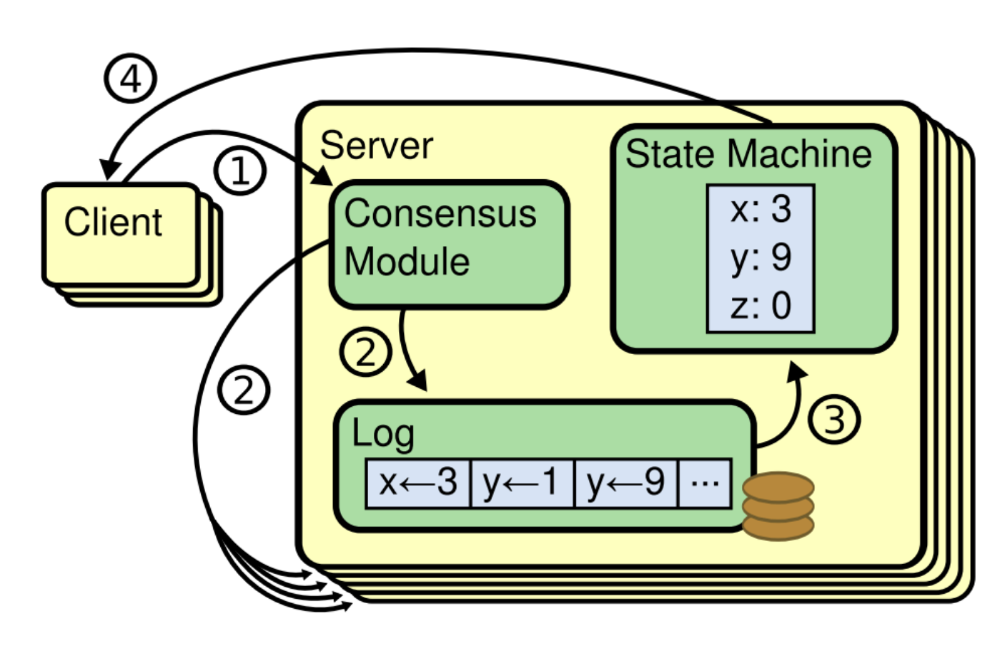

客户端发送命令后,集群收到后,会将该命令同步到集群的多台服务器(复制LOG),集群可以计算出每个变量的最新状态
集群内变量状态时一致的,集群中部分节点宕机后仍然能稳定对外提供服务

Raft算法角色

- Leader:负责发起心跳,响应客户端,创建日志,同步日志
  leader向其他node发送心跳,防止其他节点选举
  raft是强领导者,只有领导者可以接收客户端的写入请求进行处理

- Follower:接受leader心跳和日志同步,投票给candidate

- Candidate:leader选举临时角色,follower转变而来

正常情况下,只有一个leader和多个follower,
follower是被动的,不会发送任何请求,只响应来自leader和candidate的请求

#### 任期

Raft遇到故障后,集群里每一个follower都有可能成为candidate,所以每个节点要知道现在的任期term
term是一个严格递增的数字,一个term内只有一个leader,只有leader存在才对外提供服务
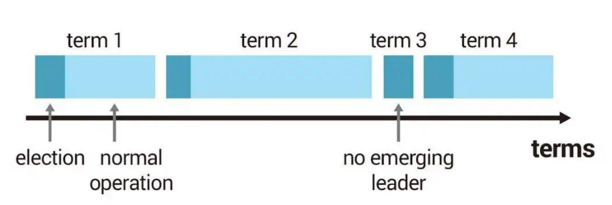
深蓝色选举leader,浅蓝色才是正常的服务时间

#### 选举

Raft使用心跳触发leader选举,当服务器启动,初始化为follower
leader向所有follower发生heartbeat,如果follower在选举超时时间内没有收到heartbeat
就会发起leader选举

每个节点刚启动都是follower,维持领导者心跳计时器

- 计时器倒数为0之前收到heartbeat或者收到candidate的vote请求,会重置计时器继续follower
- 倒数为0之时,都没收到heartbeat,也没有其他vote,会变为candidate,term+1并给自己投一票
  然后发布 Requestvote Rpc,表示上个任期已经结束

节点成为candidate之后,并维持一个选举计时器election timeout:

- 如果票过半数,成为新的leader,并向其他节点发生心跳

  投票规则

  1. 高term不投给低term,高日志索引不投给低日志索引,确保leader节点持有最新数据
  2. follower优先投给满足条件的最早请求candidate
  3. 每个节点每个任期只有一票

- 选举期间发现有同任期的leader或者更高term,会变为follower

- 选举超时,选举失败,candidate会将自己的term+1,票置为1重新选举

网络分区恢复后,低term的leader会跟随高term的leader

#### log复制

日志由索引（Index）、任期（表示那个任期的记录）及指令（Command）组成
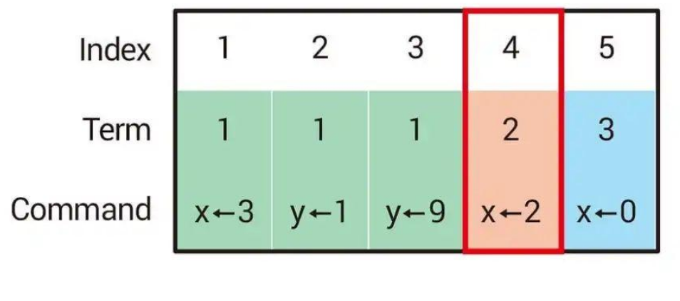

只有领导者可以接收客户端的写入请求进行处理,领导者接收到客户端请求后,将客户端指令写入日志
接下来进行日志复制请求,只要leader收到板书的成功回复,leader就会执行这条日志的指令
改变自己的状态数据机,然后返回给客户端 

raft在日志复制请求(AppendEntries Rpc)设计上,不允许直接复制最新指令,而跳过中间未复制的指令
leadr给followerA(idx只有5)发送idx=7的指令,
followerA会拒绝,之后leader会发idx=6,直到发送至idx=5才能被接收

#### 分区容错

日志复制只有在大多数节点成功响应之后，领导者才会回传成功给客户端，所以不管分区怎么切， **至多只会有一个分区有超过一半的节点** ，因此也只有一个领导者可以继续对外服务，其他的领导者即使接到客户端的请求，也只能回复失败。

### Gossip

Gossip(高斯普)

随机且带有传染性的信息传播方式,并在一定时间内使系统内所有节点达成最终一致性
gossip内节点地位是一致的,去中心化的

比如redis cluster就是基于gossip达成最终一致性
每个redis cluster节点维护了一份集群的状态信息
redis cluster节点之间会发送多种Gossip消息

- MEET

  向指定redis节点发送,用于将其添加进集群

- PING/PONG

  cluster节点定时向其他节点发送ping,来交换节点信息

- FAIL

  节点A通过ping发现节点B PFAIL(疑似下线),并且在下线报告有效期内,半数node标记为疑似下线
  节点A会广播Fail正式通知节点B下线

Gossip设计了两种消息传播模式:反熵和传谣

- 反熵

  会传播所有node的数据

  - 推方式，就是将自己的所有副本数据，推给对方，修复对方副本中的熵。
  - 拉方式，就是拉取对方的所有副本数据，修复自己副本中的熵。
  - 推拉就是同时修复自己副本和对方副本中的熵。

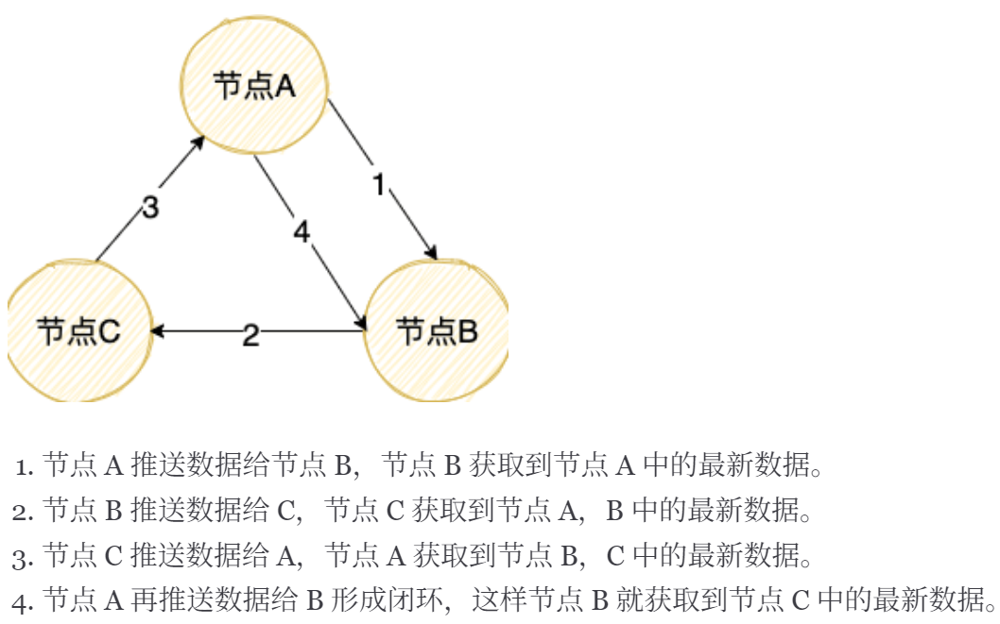

- 谣言传播

  只会传播新增node的数据

  谣言传播指的是分布式系统中的一个节点一旦有了新数据之后，就会变为活跃节点，活跃节点会周期性地联系其他节点向其发送新数据，直到所有的节点都存储了该新数据

---

### 幂等性

幂等性（Idempotency）是**分布式系统设计中的核心特性**，
指：**对同一个操作，无论执行 1 次、多次还是 N 次，最终产生的结果完全一致，且不会引发额外副作用**。

核心是重复执行无害,比如重复扣款重复插入只执行一次

- **唯一标识（Idempotency Key）**：每次请求生成唯一 ID（如 UUID），系统首次执行时记录该 ID，后续重复 ID 直接返回 “成功”（不重复处理）。
  例：API 接口要求客户端携带唯一请求 ID，服务端校验 ID 是否已处理。
- **状态机校验**：业务状态按固定流程流转（如 “待支付→支付中→已支付”），若请求对应的状态已完成（如用 “已支付” 状态接收 “支付” 请求），则直接拒绝处理。
  例：订单已显示 “已支付”，再次收到支付请求时直接返回错误。
- **幂等令牌**：服务端先生成唯一令牌（Token）并返回给客户端，客户端后续请求需携带该令牌，服务端执行后立即失效令牌，重复令牌无法触发操作。
  例：支付前先获取 “支付令牌”，支付时提交令牌，令牌使用后销毁。

### 分布式事务

ACID

- 原子性:一个事务所有操作要么全部完成,要么全部不做
- 一致性:事务开始前后,数据库的完整性约束没有被破坏,数据改变合法
- 隔离性:数据库允许并发事务同时修改,隔离性确保事务并发执行导致的数据不一致
- 持久性:事务完成后对数据的修改时永久的,不会丢失

#### XA 2PC

XA是X/Open定义的分布式事务规范,2PC是其最核心的实现机制

XA事务由一个或多个资源管理器(RM),一个事务管理器(TM),一个应用管理器(Application Program)
构成

XA 2PC简单易理解,但是锁资源时间长,不利于并发

**2PC**

- **协调者（Coordinator）TM**：像 “总指挥”，统筹整个分布式事务流程，决定事务是提交还是回滚。
- **参与者（Participant）RM**：即各业务服务（如订单服务、支付服务 ），执行本地事务操作，并反馈执行结果给协调者

XA分为连个阶段

1. prepare

   所有参与者RM准备执行事务并锁住资源,然后向TM报告ready

2. commit/rollback

   TM确认所有RM都ready后,向所有参与者发送commit命令

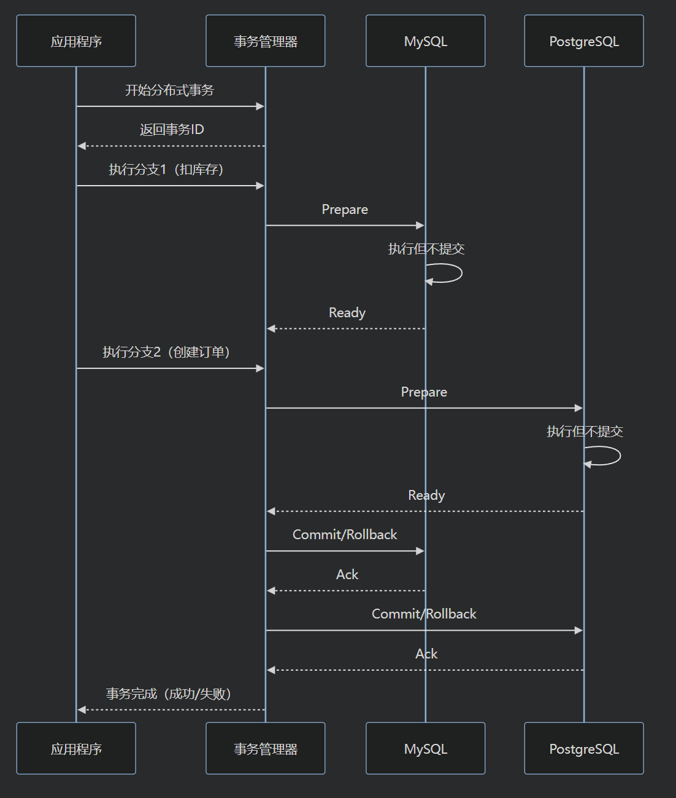

#### SAGA

思想是将一个分布式事务拆分成多个本地子事务
Saga事务协调器协调
正常结束就表示完成
某个步骤失败就根据相反顺序调用一次补偿操作

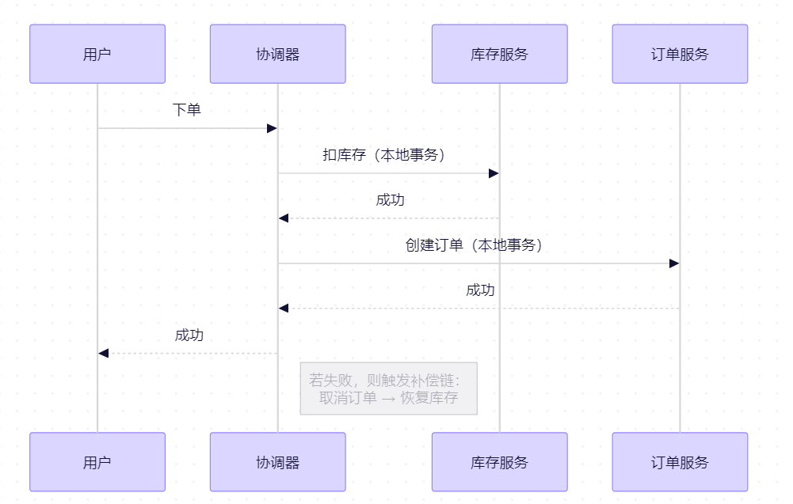

事务失败的时候先进行执行一个反向的业务操作抵消前一个影响实现回退

SAGA并发度高,但需要定义正常操作以及补偿操作,开发量币XA多

#### TCC

TCC是try-confirm-cancel

- try是尝试执行,完成所有业务一致性的检查,预留必须的业务资源
- confirm执行业务,使用try阶段的资源不检查执行业务,confirm需要保证幂等性,失败后需要重试
- cancel是取消,释放try资源,回滚confirm执行的操作


TCC并发性好,开发量大,一致性好,适用于订单业务

#### 本地消息表

写本地消息和业务操作放在一个事务里，保证了业务和发消息的原子性，要么他们全都成功，要么全都失败。


消息一旦发出到mq,就由mq去轮询查询消费者,无法回滚
订单失败只能补偿

---

## kafka

是一个分布式的、可扩展的、容错的、支持分区的（Partition）、多副本的（replica）、
基于Zookeeper框架的发布-订阅消息系统(后期不在依赖zk)，Kafka适合离线和在线消息消费是什么 有什么用

kafka是一个开源的高吞吐分布式消息中间件

1. 具有缓冲和削峰功能:上游有突发的流量,下游可能扛不住,使用kafka起一个缓存的作用
2. 解耦和扩展性:初建项目并不能确定具体需求,kafka用作消息队列解耦业务流程,方便后续扩展
3. 冗余:采用一对多的方式,可以多个毫无关联消费者组消费一个topic消息
4. 健壮性:消息队列可以堆积请求,可以对消息持久化
5. 异步通信:客户端不需要立即处理消息,可以放入消息队列,异步处理不阻塞主线程

### 指定的配置（生产者配置、消费者配置）

broker端需要配置kafka节点的唯一id,监听的端口,连接的zk,持久化的路径,是否可以手动创建topic

topic需要配置分区的数量,默认的副本数,分区日志的大小,每个分区消息保存多久

生产者端需要配置数据序列化,压缩的方式,消息分区的策略,比如随机,轮询,hash
写入多少个副本返回确认,比如ack=0不响应确认,ack=1表示leader收到就行,ack=all表示所有副本都收到
以及生产失败重试的次数,一个批次内数据大大小

消费者需要指定消费后ack的提交,比如手动或者自动提交
分区分配的策略粘性分区,轮询分区

### kafka基本术语

- **消息Message**:kafka的数据单元

  ```json
  {
    "key": "user123",#消息发送到哪个分区
    "value": {"action": "login", "details": {"ip": "192.168.1.1"}},#实际的数据
    "timestamp": 1754647200000,#表明创建时间或者追加时间
    "metadata": {
      "topic": "user-actions",
      "partition": 1,
      "offset": 1234,
      "timestampType": "CreateTime",
      "headers": [
        {"headerKey": "session-id", "headerValue": "abcd1234"}
      ]
    }
  }
  ```
  
- **批次Batch**:消息分批次写入kafka

- **主题Topic**:一类topic代表一类主题,相当于db的表

  - **分区Partition**:partition,topic可以被分为若干分区,可以部署在多个broker上,来实现kafka伸缩性
  - 分区是kafka并行处理和水平扩展的基础
  - 每个分区是一个有序不可变的消息队列

- **生产者Producer**:向topic发布消息的客户端

- **消费者Consumer**:订阅topic消息的客户端

- **消费者组ConsumerGroup**:一个或者多个消费者组成

  - 一组消费者消费一个topic
  - 每个分区在同一个消费者组只能被一个消费者消费

- **偏移量Offser**:offset为每个分区中的每个消息分配一个唯一标识(连续整数,从0递增),记录消息在分区的位置

- **broker**:一个独立的kafka服务器称为broker,接收来自生产者的消息并设置offset

- **broker集群**:多个broker组合而成,每个集群有一个broker充当集群控制者的角色

- **副本Replica**:kafka某个主题分区的多个备份,分为领导者和跟随者副本

  - 领导者:每个分区任意时刻只有一个Leader副本
    所有读写请求都要经过leader
    负责维护管理该分区数据一致性

  - follower:除了leader以外的副本

    不直接处理客户端请求,从leader拉去数据,保持同步
    热备份,用来接替leader

- **重平衡Rebalance**:消费者组某个消费者实例挂掉,其他消费者自动重新分配订阅主题分区

### Replica=Leader+Follower

Kafka 中的 Partition 是有序消息日志，为了实现高可用性，需要采用备份机制，将相同的数据复制到多个Broker上，而这些备份日志就是 Replica，目的是为了 **防止数据丢失**。
所有Partition 的副本默认情况下都会均匀地分布到所有 Broker 上,一旦领导者副本所在的Broker宕机，Kafka 会从追随者副本中选举出新的领导者继续提供服务。

**Leader：**负责对外提供服务，与客户端进行交互。生产者总是向 Leader副本些消息，消费者总是从 Leader 读消息
**Follower：**被动地追随 Leader，不能与外界进行交付。只是向Leader发送消息，请求Leader把最新生产的消息发给它，进而保持同步。

### 特性(kafka为什么快)

- 低延迟:kafka的消息收发非常快,而且利用了pageCache缓存,磁盘顺序读写
  Page Cache是针对文件系统的缓存，通过将磁盘中的文件数据缓存到内存中，从而减少磁盘I/O操作提高性能
  对于数据文件的读取，如果一次读取文件时出现未命中,OS从磁盘上访问读取文件的同时，会顺序对其他相邻块的数据文件进行预读取
- 高并发:支持多个客户端并发使用
- 零拷贝:传统IO需要`磁盘->内核缓冲区->用户程序缓冲区->socket缓冲区->网卡` (切换4次上下文,4次拷贝)
  kafka采用`sendfile()`数据直接从文件缓冲区发送到网络,不经过用户空间
- kafka消息是分批发送的,分批拉取,分批去压缩传输
- 高伸缩性:每个topic包含多个partition 可以并行处理水平扩展

- 持久可靠:支持持久化,消息持久化到磁盘

- 容错性:节点宕机不影响kafka集群仍然能正常消费

应用:

活动追踪:用来追踪客户行为,用户浏览信息点击可以发送到kafka,消费者拿到后进行分析
传递消息:消息队列
度量指标:用来记录运营监控数据,收集各种分布式应用数据
日志记录:数据库的更新发送到kafka
流式处理:Kafka Streams api对数据流实施处理
削峰限流:某一刻请求非常多,可以写入kafka,避免大量请求导致数据库崩溃

### push/pull

1. kafka生产者使用push推送message到broker

   如果采用pull,broker需要连接多个生产者轮询监控,导致broker负担加重,延迟高,吞吐量低

2. broker是kafka集群服务器节点,负责接收存储分发消息

3. zookeeper集群负责维护kafka集群的metadata,比如broker状态,topic的分区分配,协调管理

4. kafka消费者使用pull+长轮询从broker拉取消息,一方面避免push模式下消费者被大量消息冲垮,
   又避免pull时没有消息,短轮询情况下,cpu和网络资源浪费,长轮询时消费者线程阻塞,有消息就返回,没有就等待30s

### kafka api

producer api:生成记录流,发布消息到kafka
consumer api:订阅并处理kafka的消息记录流
streams api:进行实时的记录流数据处理与分析，如过滤、转换、聚合等
connector api:实现Kafka与其他系统之间的数据导入导出

### broker端配置

- id 集群内唯一

- port 默认监听9092端口

- zookeeper.connect

  指定保存broker的metadata的地址,比如指定zookeeper在localhost:2181运行,
  也可以通过      `hostname:port/path`   如   `zk1:2181,zk2:2181`指定zookeeper.connect多个参数值
  hostname是zk的服务器名称或ip
  port是客户端端口号
  /path是zk内部的路径前缀(chroot路径),用来命名空间隔离

  如果有两套 Kafka 集群，假设分别叫它们 kafka1 和 kafka2，那么两套集群的`zookeeper.connect`参数可以这样指定：`zk1:2181,zk2:2181,zk3:2181/kafka1`和`zk1:2181,zk2:2181,zk3:2181/kafka2`

  ```
  ├── kafka1/
  │   ├── brokers/
  │   ├── topics/
  │   └── consumers/
  ├── kafka2/
  │   ├── brokers/
  │   ├── topics/
  │   └── consumers/
  └── zookeeper/
      └── (zk 自身元数据)
  ```

  独立运行两套kafka集群

  - `kafka-cluster-A`
  - `kafka-cluster-B`

  如果不加path两套kafka同时往一个zk路径写数据,会冲突

  ```bash
  # kafka-cluster-A 的配置
  zookeeper.connect=zk1:2181,zk2:2181,zk3:2181
  # kafka-cluster-B 的配置
  zookeeper.connect=zk1:2181,zk2:2181,zk3:2181
  
  ## 隔离
  zookeeper.connect=zk1:2181,zk2:2181,zk3:2181/kafkaA
  zookeeper.connect=zk1:2181,zk2:2181,zk3:2181/kafkaB
  ```

- log.dirs

  持久化到磁盘使用log.dirs指定,它是用一组逗号来分割的本地系统路径

  `log.dirs=/disk1/kafka-logs,/disk2/kafka-logs,/disk3/kafka-logs`
  kafka轮流使用这些目录创建新的partition日志
  一个partition的所有数据只会放在一个log文件中,不会跨目录

- num.recovery.threads.per.data.dir

  控制kafka启动或关闭,每个日志目录使用多少个线程并行处理日志恢复操作

  `总线程数=num.recovery.threads.per.data.dir × log.dirs 的目录数量`

  - 不要设置太多,线程太多容易让系统崩溃
  - 只会在kafka启动关闭时起作用
  - 不影响生产消费效率

  

### topic配置

```kafka
Topic
└── Partition（分区）
    └── Log（逻辑日志）
        └── Segment（物理文件段）
            ├── .log（消息数据）
            ├── .index（offset 索引）
            └── .timeindex（时间戳索引）
                                
  kafka日志结构,kafka以log segment为单位存储
log是一个partition的完整日志
seg是log被拆分成多个物理文件
```

| 层级          | 说明                                                |
| ------------- | --------------------------------------------------- |
| **Topic**     | 消息的逻辑分类                                      |
| **Partition** | 并行单元，每个 partition 是一个有序日志             |
| **Log**       | 一个 partition 的完整日志（逻辑概念）               |
| **Segment**   | Log 被拆分成多个固定大小或时间的文件（物理存储单位) |

- num.partition制定新建的topic包含多少个分区,default=1,分区数修改时只能增加
  
- default.replication.factory备份副本数

- log.retention.ms

  每个**partition**数据保存多久,默认log.retention.hours(168h),决定消息多久后被删除

- log.retention.bytes

  限制每个**分区**日志大小,默认1GB,当分区数据大小超过这个值,删除最老的消息

  一个包含8分区的topic,每个1GB,可以保存8GB消息

- log.segment.bytes segment是每个**日志片段**的大小,超过后写入新的日志片段文件

  ```kafka
  Topic: user-events
  └── Partition 0
      └── Log（逻辑日志）
          ├── Segment 00000000000000000000.log     ← 当前写入的 segment
          ├── Segment 00000000000000000000.index
          ├── Segment 00000000000000000000.timeindex
          ├── Segment 00000000000000001073741824.log ← 已关闭，等待过期
          └── Segment 00000000000000001073741824.index
  ```
  
- log.segment.ms指定seg多长时间关闭

- message.max.bytes压缩后单个msg的大小,默认1MB,producer生产超过这个大小会报错

- retention.ms该**topic**里msg保存的时长,默认7days

- retention.bytes规定要为该**topic**预留多大的磁盘空间,默认-1,表示无限制


| 参数                  | 作用对象           | 说明                        | 默认值       |
| --------------------- | ------------------ | --------------------------- | ------------ |
| `message.max.bytes`   | **单条消息**       | 压缩后单个消息最大允许大小  | 1MB          |
| `log.segment.bytes`   | **Segment 文件**   | 每个 segment 文件最大大小   | 1GB          |
| `log.retention.bytes` | **每个 Partition** | 每个分区最多保留多少数据    | 无限制（-1） |
| `retention.bytes`     | **整个 Topic**     | 整个 topic 最多保留多少数据 | 无限制（-1） |

kafka删除消息logic:
删除是按seg删除
topic级别的优先级大于partition

1. 时间过期淘汰:老seg最后一条msg timestamp>retention.ms/log.retention.ms

2. 空间过期淘汰

   topic总大小>retention.bytes

   当前总的partition大小>log.retention.bytes

---

### producer

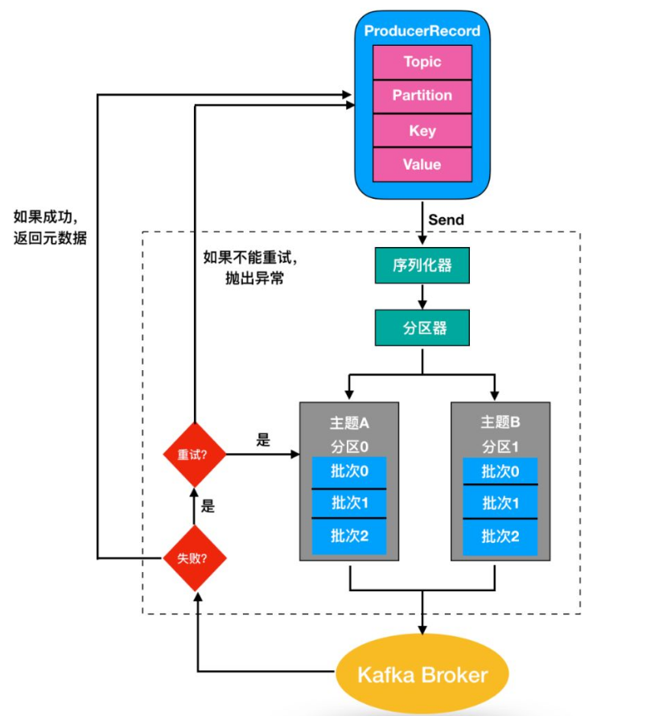

ProdecerRecord是kfk的核心类,包含topicName partition key value

发送时将kv对象序列化成字节码后到分区器

**分区器进行分区,发生过程指定partition使用设定的分区,**
**没有指定分区对key作hash**
**连key都没有指定就循环方式先写入分区**

producerRecord关联了有关的时间戳,客户端提供后就使用客户端的,没有就使用当前时间
kafka最终使用时间戳取决于topic主题配置的时间类型
kafka broker收到后,根据配置`CreateTime 使用生产者提供的时间`或`LogAppendTime使用broker收到消息的时间`重写生产者的时间戳,可以确保安全

然后这条消息会被存放在一个记录的批次里,这个batch会被发送到相同的主题和分区上

broker收到消息后返回相应,
成功会返回一个RecordMetaData(包含topic 分区信息,offset,时间戳)
失败会返回一个错误,生产者收到会重试,几次失败后返回客户端错误信息


### 消息分区策略

- 顺序轮询(默认)

  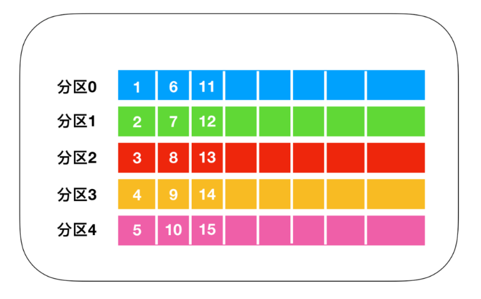

- 随机轮询

  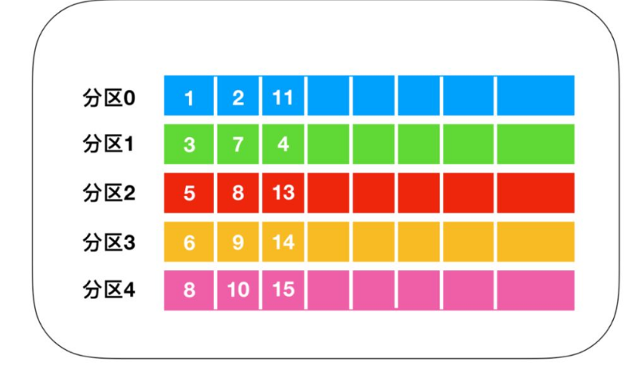

- Hash模式:按key保存,消息被设置key,同个key会进入一个partition

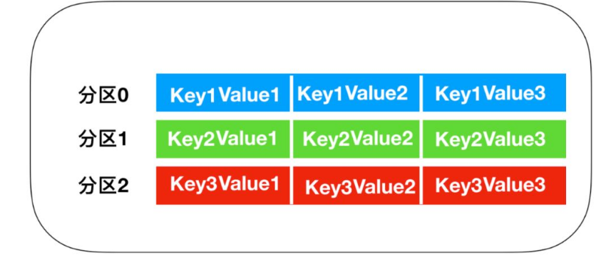

### Kafka日志压缩Log Compaction

Kafka的日志压缩功能是通过保留每个唯一键的最新消息来实现的。
在启用了日志压缩的主题中，Kafka不会删除所有旧的数据，而是保留每个键的最后一条消息，这样确保每个键在日志中总有唯一的一条最新消息

- **保留每个键的最新值**：无论消息何时被写入，只要键相同，旧值都会被新值替换
- **非阻塞操作**：压缩在后台进行，不影响前端读写性能
- **可配置性**：可以针对每个主题单独配置是否启用压缩
- **不完全清理**：由于性能考虑，Kafka可能不会100%清理所有过时记录

### 压缩机制与副本写入

kafka的msg分为消息集合和消息,一个消息集合中包含若干条日志项,日志项才是分装消息的地方
kafka消息日志由一系列的消息集合日志项组成,Follower定期向Leader发送拉取请求，获取新的日志数据

1. 一条消息发过来首先会被封装成一个 ProducerRecord 对象
2. 对该对象进行序列化处理（可以使用默认，也可以自定义序列化）
3. 对消息进行分区处理，分区的时候需要获取集群的元数据，决定这个消息会被发送到哪个主题的哪个分区
4. 分好区的消息不会直接发送到服务端，而是放入生产者的缓存区，多条消息会被封装成一个批次（Batch），默认一个批次的大小是 16KB
5. Sender 线程启动以后会从缓存里面去获取可以发送的批次
6. Sender 线程把一个一个批次发送到服务端

### 生产者配置

- key.serializer/value.serializer

  用于key/value的序列化

- **acks**

  **ack指定了要有多少个分区副本接收消息,producer才认为消息是写入成功的**

  - **acks=0**
    **生产者发送消息不等待resp,直接任务发送成功**
    **延迟极低,吞吐量极高,但消息丢失风险高**

  - **acks=1**

    **leader收到就算成功**
    **延迟低性能好,但leader收到消息宕机导致follower没有同步会丢失**
    **日志采集,监控数据使用,或者网络环境差使用**

  - **acks=all(acks=-1)**

    **所有同步副本都要确认**

    **可靠性强但延迟高,吞吐低**
    **订单交付使用**

- buffer.memory 设置生产者缓冲区的大小,发送消息速度过快会导致生产者空间不足,send()会被阻塞

- compression.type 表明压缩算法:snappy gzip lz4

- retires 决定重试的次数,生产者收到服务器错误响应,进行重试,超过后放弃重试返回错误

- batch.size 一个批次的内存大小(byte),批次满后会将消息发送出去

- client.id 任意字符串,服务器用它来识别消息来源

- max.in.flight.requests.per.connection

  生产者收到服务器响应前可以发送多少消息,设定越高越占内存,吞吐量也会高
  设置为1保证消息按照发送顺序写入服务器

- timeout.ms        request.timeout.ms        metadata.fetch.timeout.ms

  | 参数                        | 作用对象                                          | 默认值                       | 说明                                                         |
  | --------------------------- | ------------------------------------------------- | ---------------------------- | ------------------------------------------------------------ |
  | `request.timeout.ms`        | **生产者客户端**                                  | 30秒（30000）                | 等待 broker 对**任意请求**的响应时间                         |
  | `metadata.fetch.timeout.ms` | **生产者客户端**                                  | 60秒（60000）                | 等待元数据（如 leader 信息）的超时时间                       |
  | `timeout.ms`                | **Broker 端（内部使用,不可自行配置,客户端决定）** | 与 `request.timeout.ms` 相关 | 等待 ISR 副本确认写入的时间（配合 `acks=all` ack设置all leader broker需要等待所有ISR副本写入,要等多久） |

- max.block.ms 指定了在调用send()或者partitionFor()获取元数据时阻塞生产者时间 超过max.block.ms抛出异常

- max.request.size 控制生产者发送请求的大小,指能发送单个消息的最大值,也可以指单个请求里所有消息的总大小

- receive.buffer.bytes  send.buffer.bytes

  kafka基于tcp,为了保证可靠的消息传输,这两个参数分别指定tcp socket接受和发送数据包的缓冲区大小,设置为-1使用os默认值

### consumer

应用程序使用kafkaConsumer从kafka中订阅主题并接收来自这些主题的消息,然后保存起来

kafka消费者属于消费者群组,一个群组中消费者订阅的都是相同的主题,每个消费者主题收取一部分分区消息

每个partition只能被群组内的一个消费者订阅

|                                |                                                              |                                                              |
| ------------------------------ | ------------------------------------------------------------ | ------------------------------------------------------------ |
| 一个消费则消费4个partition消息 | 消费者压力过大                                               | 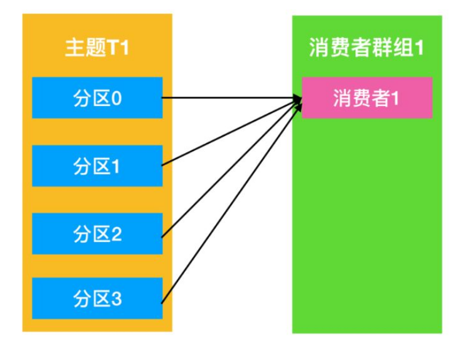 |
| 两个消费者                     | 当消息特别多可以继续增加消费者                               | 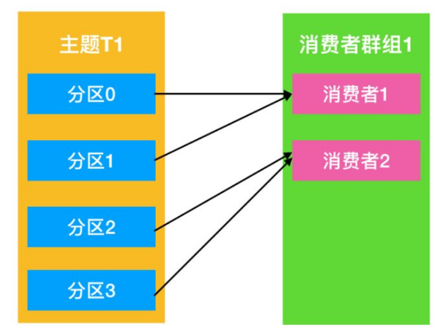 |
| 四个消费者                     | 增加水平扩展提升消费能力,消费者数量不应该多余分区,多余出来的是空闲的 | 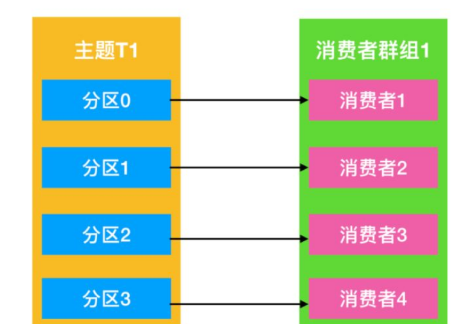 |
| 两个消费者群组                 | 两个群组的消费者订阅同一个分区                               |  |

### 消费者组冲平衡

由一个或多个消费者实例组成的群组,消费者组内的消费者共享一个消费者组id(GroupID)

组内的消费者共同订阅一个topic,一个分区只能被一个消费者组内一个消费者订阅,多余的消费者会闲置,我们可以对消费者进行重平衡

将分区所有权通过一个消费者转移到其他消费者称为重平衡
重平衡为消费者组带来了高可用性和伸缩性,可以放心添加和移除消费者,
但重平衡期间STW,消费者无法读取消息,造成整个消费者组不可用,当分区被重新分配给另一个消费者,消息读取状态会丢失,需要重新去刷新缓存

消费者向k所属的afka broker coordinator(组织协调者)发送心跳来维护自己是消费者组成员,确认存活
当停止发送心跳,session就会过期,coordinator会组织进行一次重平衡

### 消费者配置

- fetch.min.bytes 指定消费者从服务器获取的最小字节数,达到后返回给消费者

- fetch.max.wait.ms 指定broker等待时间,默认500ms,如果没有足够字节,到达时间也会被返回给消费者
  
- max.partition.fetch.bytes
  规定了服务器每个分区返回给消费者的最大字节数,默认1MB
  kafkaConsumer.poll()从分区返回的数不超过max.partition.fetch.bytes
  20个分区5个消费者,那么每个消费者至少需要4MB内存接收数据,
  max.partition.fetch.bytes必须要大于max.message.size()(最大消息的字节数),否则无法接受消息

- session.timeout.ms 消费者死亡前可以与服务器断联的时间,超过正式死亡

- auto.offset.reset 指定消费者在读取没有偏移量的分区如何处理
  默认latest,最新记录,还有earliest从分区起始开始读取
  
- enable.auto.commit 指定消费者是否自动提交偏移量,默认true

- partition.assignment.strategy
  分区分配策略

  - Range:按topic分组,对单个topic进行分配,吧一个topic内所有分区按序号排序

    消费者按名称排序,一个分区分配给一个消费者

  - RoundRobin 轮询分配
    所有消费者和所有topic分区放在一起讨论,轮询分配分区给消费者

  - StickyAssignor 粘性分配器
    保持现有分配方案不变,只有在必要时重分配

- client.id 任意字符串,broker用来表示从客户端发来的消息

- max.poll.records 单次调用call()能返回的记录数量

- receive.buffer.bytes 和 send.buffer.bytes
  kafka基于tcp,为了保证可靠的消息传输,这两个参数分别指定tcp socket接受和发送数据包的缓冲区大小,设置为-1使用os默认值

### 偏移量提交机制

消费者每次调用poll(),会返回由生产者写入kafka但是没被消费的记录,
用来追踪那些记录是被group哪个消费者读取的

消费者会向`_consumer_offset`的topic发送消息,
会保存每次发送的分区偏移量,如果提交的offset小于最后一次处理的offset
两个offset之间的消息会被重复处理
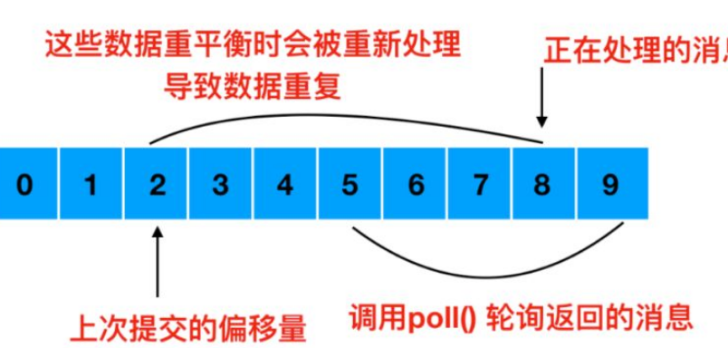

如果大于最后一次偏移量,中间记录会丢失

**提交偏移量方式**

- **auto commit**

  enable.auto.commit=true 没过5s消费者自动把从poll()方法轮询到的最大偏移量提交上去,通过auto.commit.interval.ms指定间隔时长

  - 但是可能对丢失消息

    假设 10:00:00 poll 到 offset 100~105

    10:00:03 程序崩溃

    但 offset 已在 10:00:05 提交 → Kafka 认为 105 已处理

    重启后从 106 开始 → **100~105 被跳过（丢失）**

  - 消息可能重复

    如果处理完消息但还没到提交时间就宕机 → 重启后重复消费

- **提交当前偏移量**

  auto.commit.offset=false 由应用程序觉得何时提交偏移量

  使用commitSync() 提交由poll()返回的最新偏移量

  - 阻塞式 等到broker返回确认

    会重试 网络问题一直重试

    强一致性 确保offset提交成功

  - 延迟高吞吐低

- **异步提交**
  commitAsync()

  - 非阻塞,调用后立即返回,继续poll
    不重试
    高性能
  - 但不保证成功,可能重复消费
  - 回调中不能做复杂操作

- 组合(异步+同步)

  ```java
  try {
      while (true) {
          ConsumerRecords<String, String> records = consumer.poll(Duration.ofSeconds(1));
          for (ConsumerRecord record : records) {
              // 处理消息...
          }
          // 正常情况下异步提交
          consumer.commitAsync();
      }
  } finally {
      // 关闭前：确保最后一次提交成功
      try {
          consumer.commitSync(); // 阻塞直到成功
      } finally {
          consumer.close();
      }
  }
  ```

- 提交指定偏移量

  - 结合数据库做事务
  - 手动控制提交点
  - 跳过脏数据

### AR ISR OSR

- AR:Assigned Replicas是当前分区中所有的副本

  AR=ISR**∪**OSR

```BASH
# 创建 topic，3 个副本
kafka-topics.sh --create \
  --topic user-events \
  --partitions 1 \
  --replication-factor 3 
  # replication-factor决定创建多少副本
```

- ISR:in-Sync Replicas 副本同步队列

  ISR中包含Leader和Follower,leader挂掉会在ISR队列选出新的leader

  决定acks=all是否成功,只有isr所有副本都写入,才算成功(`min.insync.replicas`结合acks=all使用)

- OSR:out-of-sync Replicas 非同步副本队列

  与leader副本同步滞后过多的副本,如果OSR集合中的副本追上ISR,那么它会被转移到ISR

  OSR中不可以选举leader(`unclean.leader.election.enable=false`,不建议改为true,可能会丢失数据)

### HW、LEO

- LEO:log end offset 标识当前日志文件下一条待写入msg的offset

  最后一条消息offset=8(LEO=9 offset的索引0开始) 那么下一条msg就会在offset=9的位置写入
  follower根据leader拉取消息更新自己的leo

- HW:replica高水印值,副本最新一条已提交消息的offset

  消费者只能读取offset<HW的消息
  大小取决于ISR中leader和follower的HW最小值

  只有当一条消息被所有ISR写入,leader的HW才向前移动1

  LEO是为了防止数据丢失

### 主从同步

Kafka动态维护了一个同步状态的副本的集合（a set of In-SyncReplicas），简称ISR，
在这个集合中的结点都是和Leader保持高度一致的，任何一条消息只有被这个集合中的每个结点读取并追加到日志中，才会向外部通知“这个消息已经被提交”

**同步复制**
Producer 会先通过Zookeeper识别到Leader，然后向 Leader 发送消息，Leader 收到消息后写入到本地 log文件。
这个时候Follower 再向 Leader Pull 消息，Pull 回来的消息会写入的本地 log 中，
写入完成后会向 Leader 发送 Ack 回执，等到 Leader 收到所有 Follower 的回执之后，才会向 Producer 回传 Ack

**异步复制**
Kafka 中 Producer 异步发送消息是基于同步发送消息的接口来实现的，
客户端消息发送过来以后，会先放入一个 `BlackingQueue` 队列中然后就返回了
Producer 再开启一个线程 `ProducerSendTread` 不断从队列中取出消息，然后调用同步发送消息的接口将消息发送给 Broker

### zk作用

Kafka 是一个使用 Zookeeper 构建的分布式系统,
Kafka 的各 Broker 在启动时都要在Zookeeper上注册，由Zookeeper统一协调管理。
如果任何节点失败，可通过Zookeeper从先前提交的偏移量中恢复，因为它会做周期性提交偏移量工作。
同一个Topic的消息会被分成多个分区并将其分布在多个Broker上，这些分区信息及与Broker的对应关系也是Zookeeper在维护。

使用zk需要维护两个分布式的系统,后续使用group协调者进行消费者的管理和重平衡
offset存储在kafka内部的一个特殊topic,避免以来zk,zk只负责group的注册信息,controller选举,broker注册检查存活


### zookeeper作用(早期版本)

1. 注册broker

   broker分布式部署且独立,zk维护整个集群中broker管理

2. 注册topic

   kafka中一个topic的消息会分区分布在多个broker上,由zk维护

3. 注册消费者

   - 注册到消费者组,每个消费者服务器启动时,到zk的指定节点创建自己的消费者节点`/consumer/{group_id}/ids/{consumerid}`,完成节点创建后,消费者会将订阅的topic写入临时节点

   - 监听broker

     监听/broker/ids 如果broker增减会触rebalance

   - rebalance

     组内消费者或者broker变化,kfk重新分配消费者和分区

   - 维护offset

     消费进度存储在zk `/consumers/[group_id]/offsets/[topic]/[partition]`

### zookeeper过渡到kraft

1. 早期kafka使用zk作metadata的信息存储,consumer的消费状态,group管理以及offset值,中心化容易单点故障,性能低不擅长高频写入(比如offset提交),需要维护2个分布式系统,复杂度高

2. 逐渐弱化zookeeper
   转向完全去中心化元数据管理,使用Group Coordinator来管理消费者和重平衡
   offset存储在kafka内部的一个特殊topic,不依赖zk,zk只保留group注册信息
   只用Kafka协议通信,但controller选举 ,broker注册,检测存活仍然依赖zk

3. Kraft

   使用kafka自己的raft协议实现zk功能,完全取代zk

   | 原功能                     | 旧方式（ZooKeeper） | 新方式（KRaft）                             |
   | -------------------------- | ------------------- | ------------------------------------------- |
   | Controller 选举            | ZK 选 controller    | KRaft 协议选 Leader                         |
   | Broker 注册                | 注册到 ZK           | 通过 KRaft 协议加入集群                     |
   | Topic 元数据管理           | 存在 ZK             | 存在 Kafka 内部的元数据日志（metadata.log） |
   | 分区状态管理（ISR 变化等） | ZK 通知             | KRaft 协议同步                              |


### kraft

1. 集群启动与初始化

   节点角色定义:kraft模式下,节点担当controller或者broker

   配置文件:需要在配置文件指定这些角色以及必要的网络和存储参数

   格式化存储目录:每个节点需要一个唯一id,首次启动之前需要对存储目录格式化

2. 控制器选举

   raft协议:利用raft进行控制器选举选出leader

   仲裁机制:使用静态或动态仲裁决定哪些节点参与控制器的选举过程

3. metadata管理

   元数据日志:kafka集群metadata变更会记录在一个专门的log `metadata log`

   复制与同步:这个日志被复制到其他控制器节点保证高可用性

4. 数据复制

   对实际数据(msg),按照传统方式在broker之间复制

   ISR维护:维护一个isr确保数据可靠一致

5. 消费者组协调

   消费者组协调:没有zk时,kafka内部服务负责管理消费者组的状态

   负载均衡:消费者离开或加入,系统自动执行负载均衡rebalance

6. 故障恢复

   故障转移:leader ccontroller挂掉,剩下的控制器节点会根据raft协议选出新的leader controller

   数据恢复:broker节点失效,其上的分区会被其他副本所在的节点接管

### 脑裂

分布式系统中,网络问题导致一个系统被分割成两个,含有连个主节点做出决策,会导致命令不一致冲突
kafka中多个控制器同时发出冲突命令

#### 产生原因

| 原因                              | 说明                                                         |
| --------------------------------- | ------------------------------------------------------------ |
| **网络分区（Network Partition）** | 集群中部分节点因网络问题无法通信，导致某些节点误认为主 Controller 已宕机，从而触发重新选举。 |
| **GC 停顿或系统暂停**             | 原 Controller 因长时间 GC 或系统负载过高，未能及时向 ZooKeeper 发送心跳，被误判为“已下线”。 |
| **ZooKeeper 会话超时**            | 在 ZooKeeper 模式下，Controller 与 ZK 的会话超时（session timeout），ZK 触发重新选举。 |
| **旧 Controller “复活”**          | 原 Controller 恢复后，仍认为自己是主控，继续发指令，而新 Controller 也在运行 → 两个 Controller 并存。 |

#### 处理

- 选举时采取多数派原则:获得多数节点支持的controller才能被选举出
- 运行时采用Epoch Num纪元编号:节点只接受最新编号controller的命令

#### zookeeper

- 依赖zookeeper的ZAB选举

  超过半数,使用奇数节点,便于形成多数派

- controller通过zk获取epoch num

  每次新的controller选出 num+1

- broker拒绝旧num命令

  - `epoch < 当前最大 epoch` → **忽略**
  - 如果 `epoch > 当前最大 epoch` → 接受，并更新本地最大 epoch

- 若分区后，某一子集 **无法形成多数派**,则 **无法选出新 Controller**,该子集停止服务（不可用），但保证了数据一致性（不会脑裂)

#### KRaft

- 使用raft算法进行controller选举和metadata的复制
  raft本事就是为了解决分布式一致性问题

- controller Quorum 控制器仲裁组

  一组broker被设定为controller,他们组成raft集群,投票选举选出Active controller(过半数)

- 使用Leader Epoch

  元数据携带epoch num,follower只接受更大的num

- metadata变更写入一个特殊的日志,通过raft复制,多数副本确认后提交

- 若分区后，某一子集 **无法形成多数派**,则 **无法选出新 Controller**,该子集停止服务（不可用），但保证了数据一致性（不会脑裂)

### 生产者幂等性

幂等性主要避免生产者数据重复提交至broker,生产者提交提交成功后,broker返回ack,ack丢失,生产者会再次推送,造成数据重复

为了实现幂等性,kfk引入produceID(PID) 和 Sequence Number

- PID:每个producer初始化时会被分配一个用户不可见的PID
- sequence number:对于每个PID,该producer发送的msg每个都有对应从0递增的seq num
- broker端缓存了这个seq num,对于提交的msg,若其seq num大于broker才会写入
- 只能保证单个生产者对同一个分区不重复写入,多个分区多个生产者要确保不重复,需要使用事务

### kafka事务

在分布式场景下为 **消息的生产（Producer）** 和 **消费 - 生产联动（Consumer → Producer）** 提供 **原子性保证**

kafka事务用于解决

1. **生产者单事务多分区写入**：生产者一次事务内向多个 Topic/Partition 发送消息，确保所有消息要么都被提交（消费者可见），要么都被中止（消费者不可见）。
2. **消费者 - 生产者联动事务（Read-Process-Write 链路）**：消费者从 Topic A 消费消息 → 业务处理 → 向 Topic B 生产消息，确保 “消费偏移量提交” 和 “新消息生产” 原子性（例如：若生产失败，消费偏移量不提交，后续可重新消费）。

 为支持事务机制，kafka引入了两个新的组件：`Transaction Coordinator`和 `Transaction Log`
**transaction coordinator** 是运行在每个 kafka broker 上的一个模块,
负责管理事务生命周期（分配事务 ID、记录事务状态、协调提交 / 中止)

**transaction log** 是 kafka 的一个内部 topic,有多个分区,每个分区有一个leader,
用于持久化事务元数据（如事务 ID、涉及的分区、事务状态）

幂等性可以保证单个producer会话,单个topicPartition,单个session不重复不漏

Kafka幂等性生产者（Idempotent Producer）的核心机制是通过Producer ID（PID）和每个分区的Sequence Number来跟踪消息序列，确保每条消息在每个分区中只被写入一次，从而实现'Exactly Once'语义

若producer重启,跨partition写入,幂等性无法保证
这时候需要使用kafka事务

kafka事务可以做到:

1. 跨session的幂等性
2. 跨session的事务恢复
3. 跨多个topic-partition的幂等性写入,要么成功要么失败

kafka有两种事务隔离级别:

1. readcommited

   生产者事务只能读取到已经提交了的数据,在commitTransaction或abortTransaction
   设置为readcommitted是读取不到这些消息的
   同时KafkaConsumer会根据分区对数据进行整合

   - 如果是 `COMMIT` → 把缓存的消息 **标记为可交付**
   - 如果是 `ABORT` → 把缓存的消息 **丢弃**

2. readuncommited

   消费所有消息，包括未提交事务的消息

### kafka缺点

- 对于批量发送,数据并非真正的实时

- 仅支持同一分区内消息有序,无法实现全局有序

- 早期过于依赖zk

### kafka的数据丢失

- **broker端**

  1. unclean.leader.election为true，且选举出的首领分区为OSR时 可能就会发生消息丢失
  2. min.insync.replicas为N，则至少要存在N个同步副本才能向分区写入数据。如果同步副本数量小于N时broker就会停止接收所有生产者的消息、生产者会出现异常，如果无法正确处理异常，则消息丢失。
  3. replication.factor只有1个,没有备份
  4. kafka的数据一开始是存储在PageCache并定期flush到磁盘上的，如果出现断电或者机器故障等，PageCache上的数据就丢失了。

- **producer**

  1. ack=0不保证交付,生产者发送后丢失数据

     ack=1需要leader确认,刚好leader挂掉,丢失数据

     ack=all如果min.insync.replicas=N 但同步副本数量小于N,会停止接受生产者消息

  2. 当前消息过大，超过max.request.size大小，默认为1MB

  3. 生产者生产速率过快,占满生产者本地缓冲区,生产线程阻塞超过最大时间,生产者会抛出异常,没有
     正确异常处理会丢失数据

- consumer

  1. enable.auto.commit=true，会自动提交commit,消费在处理之前提交了offset，则处理异常可能会造成消息的丢失。
  2. enable.auto.commit=false，Consumer手动批量提交位点，在批量位点中某个位点数据异常时，没有正确处理异常，而是将批量位点的最后一个位点提交，导致异常数据丢失

### 如何保证消息的有序性

kafka特定情况下可以保障单分区消息的有序
kafka发送过程中正常是有序的,如果出现重试可能导致消息顺序乱序
batch1提交出现问题,这时候batch3已经提交,batch1重试后会排在batch3后面

可以将max.in.flight.requests.per.connection设置为1,这样消息队列中只允许有一个请求
但是吞吐量会下降

或者开启生产者幂等性设置,每个producer对于一个PID,msg携带seq num确保有序

kafka无法保证多分区消息的有序性


### kafka活锁

**活锁的概念**：消费者持续的维持心跳，但没有进行消息处理。
为了预防消费者在这种情况一直持有分区，通常会利用 `max.poll.interval.ms`活跃检测机制，
如果调用 Poll 的频率大于最大间隔，那么消费者将会主动离开消费组，以便其他消费者接管该分区


## Elasticsearch

1. ES 的 should 和 must 有什么区别
   should 和 must 是 ES **布尔查询（bool query）** 中的两种 “子句类型”
   must强制要求所有满足 must 条件的文档才会被返回 and
   should 非强制匹配 or

2. 如何用命令行操作 ES 创建索引

   curl put /maping_name 创建mapping,在对应的字段index属性设置为true

3. ES 中的索引是什么（倒排索引）
   本质是 “关键词到文档的映射”，用来解决 “快速找到包含某个 / 某些关键词的所有文档” 的问题
   倒排索引：`关键词 → 包含该关键词的文档集合`（比如 “查所有包含‘人工智能’的文档 ID”）
   倒排索引的核心是 “词典 + 倒排列表”
   词典存储所有去重后的关键词
   倒排列表存储对应的文档集合

4. ES 一般用在哪些业务场景？为什么要用它？
   全文检索场景:关键词分词匹配,相关性排序,倒排索引
   日志 / 监控数据分析场景ELK:处理应用日志、服务器监控指标,分析用户行为

5. ES 的聚合查询是怎样的？

   ES 的聚合查询（Aggregation）是**对查询结果进行 “分组、统计、计算” 的功能**
   类似 SQL 的 `GROUP BY + SUM/AVG/COUNT`

   | 指标聚合（Metric）   | 对分组内的数据进行 “数值计算”（无新分组）           | sum（求和）、avg（平均值）、max（最大值）、min（最小值）、count（计数） |
   | -------------------- | --------------------------------------------------- | ------------------------------------------------------------ |
   | 桶聚合（Bucket）     | 按条件将数据分成 “多个桶（分组）”，每个桶是一个子集 | terms（按字段值分组）、range（按范围分组）、date_range（按日期范围分组）、filter（按条件过滤分组） |
   | 管道聚合（Pipeline） | 基于 “其他聚合的结果” 再聚合（嵌套聚合）            | avg_bucket（求多个桶的平均值）、sum_bucket（求多个桶的总和） |

6. 同一索引库中获取不同城市相关数据总数的查询方法

   ```bash
   curl -X GET "http://<ES地址>:<端口>/user_log/_search" \
   -H "Content-Type: application/json" \
   -d '{
     "query": {
       "match_all": {}  // 查询所有数据（若需过滤，可替换为range/term等条件）
     },
     "aggs": {
       "city_count_agg": {  // 自定义聚合名称
         "terms": {
           "field": "city.keyword",  // 按城市的keyword字段分组
           "size": 200,  // 返回前200个城市的统计结果（默认10，需覆盖所有城市数量）
           "order": {"_count": "desc"}  // 按总数降序排列（可选）
         }
       }
     },
     "size": 0  // 不返回原始文档，仅返回聚合结果
   }'
   ```

   

## 项目

### cookie,session,jwt

session:当服务器收到登录请求之后，生成一个 **session id**,
 服务器使⽤session把⽤户的信息临时保存在了服务器上一起返回给客户端，
客户端下次再请求的时候把 session id 一起带上
这时候每个客户端请求对应各自的 session id,服务器就知道怎么区分了

cookie是保存在本地终端本地终端的数据。
cookie由服务器⽣成，发送给浏览器，浏览器把cookie以kv形式保存到某个⽬录下的⽂本⽂件内，下⼀次请求同⼀⽹站时会把该cookie发送给服务器
**服务器** 在 HTTP 响应头里加一个 `Set-Cookie`，比如：
`Set-Cookie: user_id=123 ; Path=/; Expires=Wed, 21 Oct2 025 07:28:00 GMT`
**浏览器** 收到后存起来，下次访问相同域名时自动带上：
`Cookie: user_id=``123`

token:

- **无状态**：服务器不用存 Token，适合分布式系统。
- **跨域友好**：适合前后端分离、移动端、API 调用。
- **可自定义数据**：Token 里可以直接存用户信息

JWT串，它被“.”分隔为三段，分别是Header.Payload.Signature（报头.荷载.签名）

**Header（报头）**

通常包括2部分：token的类型和签名算法。

```text
{
  "alg": "HS256",
  "typ": "JWT"
}
```

payload 实际需要传输的数据

Signature部分是对前两部分的签名，防止数据篡改。

---

### etcd做了什么

etcd在项目中起到了服务发现的功能

- 动态注册和发现服务
  - 微服务启动的时候,会使用gRPC向etcd注册自己的服务名,ip,端口,健康状态
  - 当服务A要调用B的时候,通过etcd查询B的可用的实例列表,
    go-zero的负载均衡服务器会选一个进行调用
- 健康检查与自动剔除
  - 服务定期向etcd发送心跳,表明自己存活
  - 若服务宕机,etcd会自动从列表中剔除该服务

### etcd和程序如何通信

etcd默认使用gRPC进行服务发现和与程序进行通信
gRPC基于HTTP/2协议,使用protobuf进行序列化,高性能而且低延迟
默认情况下gRPC支持配置tls/ssl协议加密

为什么不用TCP呢,因为tcp是传输层的协议,gRPC是应用层的协议
如果要使用tcp,需要自己对TCP进行封装,设计消息格式,实现序列化和反序列化,开发量大

### 分块上传 断点续传

前端将大文件分割成小块,逐个上传,前端将文件按固定大小分片
每个分片维护一个分片hash作为唯一标识,然后分片序号以及自身的内容

**后端接收传输过来的分片保存为临时文件**

c.Form()接收分片
os.Create()保存为临时文件

```go
func UploadChunk(c *gin.Context) {
    chunkIndex := c.PostForm("chunkIndex")
    file, _ := c.FormFile("file")
    dstPath := fmt.Sprintf("temp/chunk_%s", chunkIndex)
    c.SaveUploadedFile(file, dstPath)
    c.JSON(200, gin.H{"status": "success"})
}
```

**断点续传**
前端查询已经上传过来的分片,跳过已完成的部分
使用数据库记录已上传分片的索引,请求续传的时候调用接口查询并返回已经接受的分配序号
上传缺失的分片

**合并**

后端创建最终空白文件
按分片序号遍历分片文件,追加到空白文件,然后删除临时文件实现分块上传

**断点续传下载**
比如从浏览器下载1GB的电影,下到一半出错,但不想继续下载
就会请求时携带上Range头 表明下载的范围,从而继续下载
gin后端下载时先去查看header里有没有range,没有就返回整个文件
要是有range就去解析range,获取start和end,然后从文件指定位置继续下载
并设置响应头

- **Range**：请求头，表示期望的下载范围，值的格式为"bytes=范围或范围列表"。
  如："1-2"、"3-"、"-3"、"1-2,3-4"、"1-2,3-"、"1-2,-3"，闭区间、
  至少须有一个范围、允许指定多个范围、左右边界未成对出现的范围最多只能有一个且只能在末尾
- **If-Range**：请求头，作用与**If-None-Match**或**If-Modified-Since**一样，
  服务端据此判断客户端要请求的文件在服务端是否发生了变化，若发现发生了变化则返回**新整个文件**，否则返回相应范围的文件内容。
  实践发现浏览器并不会自动带该请求头，故不用该请求头，而是在响应头写**Etag**或**Last-Modified**
- **Accept-Ranges**：响应头，表示返回的数据的单位，通常为"bytes"
- **Content-Range**：响应头，表示返回的数据的范围，与Range对应。值示例："bytes 98304-4715963/4715964" ，三个数字分别为范围 起、止、文件总大小

### GIM

#### 基于 go-zero 实现服务拆分，采用 etcd 完成服务注册与发现，结合 gRPC 实现跨服务通信

将服务拆分成 系统层,网关层,认证层,用户层,文件层,单聊层,群聊层,日志层

共设计16张表,采用mysql主从架构,主库写入从库读取,结合gorm实现主读分离,结合kafka基于SAGA协议实现分布式事务

采用etcd进行服务为的注册与发现

- 微服务启动的时候,会使用gRPC向etcd注册自己的服务名,ip,端口,健康状态

  当服务A要调用B的时候,通过etcd查询B的可用的实例列表,

  go-zero的负载均衡服务器会选一个进行调用

- 健康检查与自动剔除

  服务定期向etcd发送心跳,表明自己存活

  若服务宕机,etcd会自动从列表中剔除该服务

#### 在网关层、API 接口层、RPC 调用层部署多维度限流策略（如基于 QPS、并发量、IP 等），保障服务可靠性与安全性

```tree
Client（客户端） 
    ↓ 入口流量
[Gateway 网关层]  —— 第一层限流：粗粒度入口防护
    ↓ 经过网关过滤后的流量
[服务层中间件]    —— 第二层限流：中粒度服务防护（每个服务层均部署）
    ↓ 定向到业务服务的流量
[Chat Service (go-zero)]  —— 第三层限流：细粒度业务防护
    ├ 分支1：单聊场景 → 令牌桶限流 单聊需低延迟 + 允许短期突刺
    └ 分支2：群聊场景 → 漏桶（模拟）/群聊需平滑流量 + 防刷屏
```

##### gateway 粗粒度

用**固定窗口**限制单 IP 每分钟的连接数,防止恶意的建立连接,使用redis做全局的计数器,一分钟重置一次,只有在限制范围内才可以将请求转发到对应的服务

| 限流算法            | 固定窗口计数器（+Redis 分布式计数）                          |
| ------------------- | ------------------------------------------------------------ |
| 算法选型理由        | 1. 网关需高吞吐，固定窗口逻辑简单、性能损耗低；<br /> 2. Redis 实现全局 IP 计数 |
| 限流维度            | 单个 IP 地址（全局维度）                                     |
| 核心参数            | 1. 计数周期：1 分钟； 2. 限流阈值：≤100 次请求 / IP（可根据业务峰值动态调整） |
| 落地细节（go-zero） | - 基于`httpx`网关中间件开发：客户端请求到达时，先提取 IP（如`X-Real-IP`）； <br /> 用 Redis 的`INCR`命令累加计数，`EXPIRE`设置 1 分钟过期； - 若`INCR`后的值＞100，直接返回`HTTP 429`（带错误码`1001`：IP 限流） |
| 作用目标            | 1. 挡掉恶意 IP 的高频请求（如每秒几十次的攻击流量）； <br />2. 避免单个 IP 占用过多网关资源 |

##### 服务层中间件：中粒度防护

过滤经过网关后的 “合法但过量” 流量（如上游服务过度调用），解决网关固定窗口的 “临界突刺” 问题

| 限流算法            | 滑动窗口计数器（基于 go-zero 原生`slidewindow`组件）         |
| ------------------- | ------------------------------------------------------------ |
| 算法选型理由        | 1. 滑动窗口通过 “小步长滑动” 解决固定窗口的 “临界值突刺”（如 59 秒和 0 秒各发 100 次）； <br />2. go-zero 原生组件适配性强，无需自定义开发 |
| 限流维度            | 单个用户 ID + 接口名（用户级粒度，避免 “一刀切”）            |
| 核心参数            | 1. 窗口大小：1 秒； 2. 滑动步长：200ms（5 个小窗口 / 秒）； 3. 阈值：≤10 次请求 /（用户 + 接口）/ 秒 |
| 落地细节（go-zero） | 嵌入`zrpc`（RPC 调用）或`rest`（API 接口）中间件：每次服务调用前触发限流检查； <br />用`slidewindow.NewWindow`初始化窗口，`Allow()`方法判断是否允许通过； -<br />若触发限流，返回`RPC错误码1002`（服务层限流） |
| 作用目标            | 1. 避免单个用户对某接口的暴力调用（如频繁刷新单聊列表）； <br />2. 保护服务不被上游过度压测 |

使用**滑动窗口**中间件在每个服务层限制单用户每秒的请求次数（避免暴力破解）

##### Chat Service 业务层：细粒度场景化防护（第三层）

单聊：**令牌桶**（允许偶尔连发消息，如每秒 5 条，桶容量 10）

>单聊用户可能 “偶尔连发消息”（如 1 秒发 3 条），令牌桶的 “桶容量” 可缓冲突刺流量；
>
>令牌桶按固定速率生成令牌，长期仍能控制 QPS，兼顾低延迟和稳定性
>
>用 Redis 的 `Hash` 存储 “令牌剩余数量” 和 “上次补充令牌时间”，通过 Lua 脚本计算当前令牌数并判断是否允许通过
>`key = "single_limit:{senduid}:{recvuid}"`，`field` 包括 `remaining`（剩余令牌数）、`last_refill_time`（上次补充令牌时间戳）

```go
// internal/config/config.go

type Config struct {
    rest.RestConf
    RedisConf     redis.RedisConf     // Redis 配置
    RateLimitConf RateLimitConf       // 限流配置
}

// RateLimitConf 单聊/群聊限流配置
type RateLimitConf struct {
   SingleChat TokenBucketConf // 单聊-令牌桶
   GroupChat  LeakyBucketConf // 群聊-漏桶
}

// TokenBucketConf 令牌桶配置（单聊用）
type TokenBucketConf struct {
   Rate     int // 每秒生成令牌数
   Capacity int // 令牌桶容量
}

// LeakyBucketConf 漏桶配置（群聊用）
type LeakyBucketConf struct {
     Rate     int // 每秒漏出速率（消息数）
   Capacity int // 漏桶容量（最大积压消息数）
}
```

群聊：**漏桶**（平滑群消息发送，避免瞬间大量消息压垮服务器，如每秒 20 条）,平滑流量 + 防刷屏

> **漏桶**（群聊）：用 Redis 的 `Hash` 存储 “桶内当前消息量” 和 “上次漏水时间”，通过 Lua 脚本计算漏水量并判断是否允许入桶
> `key = "group_limit:{uid}:{groupID}"`，`field` 包括 `current_amount`（桶内当前消息量）、`last_leak_time`（上次漏水时间戳）
> 每次请求时，通过 Lua 脚本计算 “从上次漏水到现在应漏出的消息量”，更新桶内剩余消息量，判断是否允许入桶

#### 认证服务基于 JWT+RBAC 模型提供鉴权与访问控制，通过 Redis 维护黑名单，并基于 OAuth2 协议集成第三方登录能力

**无状态与可吊销平衡**：JWT 实现无状态减轻服务端压力，Redis 黑名单解决 JWT 无法主动失效的痛点；
**权限粒度可控**：RBAC 支持 “用户 - 角色 - 权限” 灵活映射，适配不同业务场景（如普通用户 / 管理员）；
**登录体验与安全兼顾**：OAuth2 降低第三方登录门槛，同时通过签名、过期等机制保障安全。

认证层解析 JWT，获取用户的`role`
若`role`是 “admin”，对admin专属接口添加对应权限；
若为普通用户，表查询该角色的权限列表,；

OAuth2:
使用策略模式将不同的授权方式（策略）封装为独立的算法，使它们可互换，客户端可根据场景动态选

**发起授权**：用户点击 “gitee登录”，前端跳转到微gitee开放平台的授权页（携带本系统的`client_id`、`redirect_uri`（回调地址）、`response_type=code`（授权码模式））
**用户授权**：用户在gitee页点击 “允许”，微信返回`code`（授权码，有效期 5 分钟，一次性使用）到`redirect_uri`；
**换取 Token**：后端用`code`+`client_id`+`client_secret`（本系统在gitee的密钥）调用微信接口，换取`access_token`和`openid`（唯一标识）；
**获取用户信息**：用`access_token`+`openid`调用接口，获取用户昵称、头像等基础信息；
**关联本地账号**：若`openid`已关联本地`user_id`（查`third_user`表：`openid`、`platform=wechat`、`user_id`），
直接生成 JWT 返回；
若未关联，自动创建本地账号（默认角色 “user”），关联`openid`后生成 JWT 返回。

#### 基于Saga+kafka消息队列进行分布式的用户的初始化与注销,保障多服务间状态一致性

> 分布式用户初始化（如注册后同步账号、权限）与注销（如删除账号、清理权限）的核心痛点是
> **“多服务协同易出现‘部分成功、部分失败’的不一致状态”**
> （比如用户服务创建了账号，但权限服务未分配角色，导致用户无法登录）。

确保:
**最终一致性**：无需强一致（如 2PC）的阻塞等待，通过 “正向执行 + 反向补偿” 确保最终所有服务状态统一；
**异步解耦**：Kafka 隔离各服务，避免同步调用的 “一挂全挂”，提升系统容错性；
**可重试与恢复**：Kafka 消息持久化 + Saga 状态追踪，支持临时失败的自动重试和故障后的手动恢复。

1. **主题（Topics）划分**：按服务和事件类型拆分主题，kafka分区内消息是有序的,比如`user-events`（用户服务的创建 / 回滚事件）、`permission-events`（权限服务的添加 / 回滚事件）、`friend-events`（好友服务的添加 / 失败事件）。每个主题只承载一类服务的事件，让各服务仅订阅自己需要的主题，减少无关消息干扰
2. **可靠性配置**：
   - 生产者：设置`acks=all`（所有副本确认才算发送成功）、`retries=3`（失败自动重试），确保事件不丢失；开启幂等性（`enable.idempotence=true`），防止重复发送相同消息。
   - 消费者：关闭自动提交 offset，改为 “处理完事件并执行本地事务后，手动提交 offset”，避免事件未处理但已被标记为消费的情况
3. **事件持久化**：设置合理的消息保留时间（比如`retention.ms=86400000`，保留 1 天），确保服务故障恢复后能重新消费未处理的事件，支持断点续跑

我们用编排式 Saga 模式来处理用户注册的分布式事务，核心是靠 Kafka 做事件总线，让各个服务通过事件自主协作，不用中央协调器。

1. 正常流程是这样的：用户发起注册，首先到用户服务。用户服务在本地数据库里创建用户信息（这是个本地事务），成功后会给 Kafka 的`user-events`主题发一个`UserCreated`事件，里面带着用户唯一 ID（比如 user_id）、用户名，还有这个事件自己的全局唯一 ID（event_id）确保幂等性。
2. 权限服务一直盯着`user-events`主题，收到`UserCreated`事件后，先查自己的幂等表 —— 看看这个 event_id 是不是处理过。如果没处理过，就执行本地事务：给这个用户加默认权限。成功后，往`permission-events`主题发`PermissionsAdded`事件，同样带着 user_id 和新的 event_id。
3. 好友服务则监听`permission-events`，收到`PermissionsAdded`事件后，也先做幂等校验，然后执行本地事务：把用户自己加到好友列表里。成功后，给`friend-events`发`SelfFriendAdded`事件，整个注册流程就完成了。

Kafka 在这里的作用很关键：它能可靠存事件，通过分区复制和重试机制保证事件不丢；还支持多服务异步订阅，各服务处理时互不阻塞，提高系统吞吐量。

1. 如果中间某步失败了，比如好友服务加好友时出错，它会往`friend-events`发`SelfFriendAddFailed`事件，带着 user_id 和失败原因。
2. 这时候权限服务会监听`friend-events`里的失败事件，收到后就执行补偿操作：删掉之前给这个用户加的权限（这也是个本地事务），完成后往`permission-events`发`PermissionsRolledBack`事件。
3. 用户服务又会监听`permission-events`的回滚事件，收到后就执行自己的补偿：删掉之前创建的用户记录，再往`user-events`发`UserRolledBack`事件，这样全链路就回滚完了，保证数据一致。

这里幂等性很重要，我们靠三层保障：一是每个事件有唯一 event_id，服务处理前查幂等表，已处理过就直接跳过；
二是结合 user_id 做业务校验，比如权限服务会查 “这个用户是不是已经有权限了”，有就不重复加；
三是操作本身设计成幂等的，比如删除操作，执行多次结果都一样。

这样一来，既保证了跨服务事务的一致性，又让服务间解耦，适合分布式系统的高可用需求。

#### 消息模块

1. 使用ws作为消息的实时推送
2. 结合kafka消息队列做消息的收发,异步处理消息,解耦客户端与服务端的直接通信
3. 使用redis缓存消息列表，提升读取效率并减少数据库压力
4. 使用gorm持久到数据库

##### client

**客户端仅负责将消息写入Kafka，无需关心后续处理**

client通过ws连接到服务端

```go
// Client 客户端结构体
type Client struct {
    Conn     *websocket.Conn
    Uuid     string
    SendTo   chan []byte       // 给server端
    SendBack chan *MessageBack // 需要返回给前端显示的消息
}
```

客户端维护read和write方法,每个client开启两个goroutine处理读写

- `read()`:  读取前端消息并发送到Kafka
- `Write()`：从Kafka接收消息并使用ws推送给前端,用于回显消息

```go
func NewClientInit(c *gin.Context, clientId string) {
    //  升级ws 初始化clent 略
    //  调用基于kafka的服务端
    KafkaChatServer.SendClientToLogin(client)
    go client.Read()
    go client.Write()
}
```

##### server

**服务端进行消息的转发、存储、缓存**

```go
type KafkaServer struct {
    Clients map[string]*Client // server维护client的信息
    mutex   *sync.Mutex // 并发安全
    Login   chan *Client // 登录通道
    Logout  chan *Client // 退出登录通道
}
```

server会监听login和logout信号,`case client := <-k.Login:`
login时会将client注册到server,推送欢迎消息到kafka让前端回显
logout会删除并且推送推出消息到kafka让前端回显

服务端for循环从kafka,接收消息然后反序列化解析消息的内容,再将消息推送到对应客户端接收区
接受到消息后会redis查询,如果redis存在数据就将新的消息数据append到list中然后更新缓存
如果消息不存在(第一次请求)就会进行旁路缓存更新,从数据库加载消息然后存到缓存
并设置过期时间,使用TTL（Time to Live）自动过期，避免缓存无限增长

使用延迟队列在双方用户logout 5min后进行清除缓存

```redis
# 将用户uid1 uid2: "uid1_uid2" 加入延迟队列，30分钟后过期（1800秒）
ZADD chat_msg_record 1725400000000 "uid1_uid2"
# 获取所有到期记录
ZRANGEBYSCORE chat_msg_record 0 $(date +%s%3N) LIMIT 0 1000
# 删除
ZREM chat_msg_record "uid1_uid2"
```

对于消息入库和消息处理并不是同一个消费者组处理,消息入库会使用另外的消费者组开启新的线程异步入库
使用手动提交ack+唯一id确保消息入库幂等性,与消息收发解耦,提高收发性能

对于离线消息来说并不会写,直接使用数据库消费者从kfk入库

kafka生产者的配置中启用幂等性,采用消息的雪花id,防止重复推送消息到kafka

Kafka 消费者端幂等性:每条消息都有一个全局唯一的ID,如果数据库因为违反唯一约束而报错,跳过入库
消费者捕获这个特定的数据库错误，将其视为处理成功,然后返回ack,正确提交偏移量
如果业务逻辑执行失败（例如数据库写入失败），**不要提交 offset**,进行重试,如果多次重试写入死信队列

#### 群聊模块基于Gorm采用读写分离架构，结合 Redis Bitmap 维护用户在线状态，提升群聊消息扩散效率

在我们的群聊和私聊模块中，消息的读写频率差异很大：
群聊消息中读远远大于写的频率,在群聊消息到达后服务端后,会存储到redis `group_messagelist_{groupid}`

而且采用了读写分离的存储架构

- **写**：用户发送消息（相对少，但要求强一致性）
- **读**：拉取历史消息、查询会话列表、查看未读数（高频、可容忍轻微延迟）
- mysql只追求最终一致性,
  默认是异步复制,主库写入binlog无需从库确认直接给客户端返回成功,
  从库拉去并解析binlog若此时主库宕机,binlog会丢失,存在数据一致性风险
  可以配置使用半同步复制,主库写入binlog后,必须有一个从库保存binlog才能返回成功

为了提升数据库性能，我们基于 **GORM 实现了读写分离架构**，将读请求路由到从库，写请求走主库，有效缓解主库压力。
具体实现如下：

1. **数据库架构**：采用一主多从的 MySQL 集群，主库负责写入，多个从库通过 binlog 同步数据，用于读操作。
2. `masterDB.SetReadDB(slaveDB)`
   GORM 会自动根据操作类型路由：

- `Create`, `Save`, `Delete` → 走主库
- `First`, `Find`, `Where` → 走从库
- **强制走主库**：对于“发送后立即拉取”的场景（如发完消息刷新列表），我们通过 `db.Session(&gorm.Session{ReadDB: nil})` 强制走主库，避免主从延迟导致看不到最新消息
- **连接池优化**：主库连接池偏小（写少），从库连接池更大（读多），避免资源浪费

主从复制延迟

- 主库写入压力过大,导致binlog生成过快,从库无法及时读取和应用主库
  比如电商平台压力大的时候,主库写入压力激增,从库来不及同步
- 从库性能不足,比如cpu,内存,磁盘配置低,写入慢,
  从库sql线程处理relaylog(暂存主库拉下来的binlog)慢
- 网络延迟或者带宽不足
- 大事务或者长事务:大事务导致数据行多,长事务时间长,
  从库需要更多的时间去解析

维护用户心跳状态,确保用户在线,基于已有的 `WebSocket` 长连接嵌入心跳,客户端每10s发送一次心跳包
心跳包携带用户id 时间戳确保幂等性 ping,服务端返回pong
若检测到长连接断开（如 WebSocket ），退避重试发送心跳（最多 3 次），重试失败则标记本地 “离线”
然后从bitmap中清除在线数据

**Redis Bitmap 设计**：

- Key：`online:day:{yyyyMMdd}` 或 `online:group:{groupID}`
- Offset：维护一张用户id映射表,将雪花id转化为小长度id,使用用户 ID 作为位偏移（需确保 UserID 是连续或可映射的整数）
- 上线时：`SETBIT key offset value` `SETBIT online:day:20250828 ${userID} 1`
- 下线时：`SETBIT online:day:20250828 ${userID} 0`
- 查看 `GETBIT key offset`

## 业务

### 三种限流算法的使用场景和实现

- 固定窗口限流
  将时间片分为固定大小的窗口,窗口内进行累计,超过窗口阈值进行限流
  适合简单场景下的流量控制
  但是有明显的边界效应,应对突发流量的限制有限:比如限制1min请求50次前1min最后1s内请求59,第二分钟第一秒又请求59次,一分钟内请求次数接近阈值两倍

- 滑动窗口限流
  将固定窗口拆分成多个小窗口(1s拆成10个100ms),滑动计算1s内总请求
  比如限制1min访问100次,每个时间片6s能访问10次,去更小划分时间
  时间片分的越细,限流效果越平滑,但额外的性能开销也会大,时间片划分粒度为1会退化成固定窗口

- 令牌桶算法和漏桶
  漏桶算法,系统将请求以固定的速率放入,桶控制请求以固定的速率流出
  系统按固定的速率(100/s)向桶放入令牌,请求时需要获取令牌才能通过,桶满时令牌溢出
  令牌桶相比漏桶具有更好的突发流量处理,漏桶只能按固定速率处理,令牌桶若携带所有的令牌可以取出所有的请求

---

### 雪花算法snowflake，为什么不用数据库自增或者uuid

雪花算法是分布式场景下生成唯一id的算法,有序递增,全局唯一可溯源,高性能高可用
8字节组成 1位符号位(固定0)+41位时间戳(表示了自选定的时期以来的毫秒数)+10位机器id(高5位数据中心id,低5位节点id)+12位序列号
时间戳可以有序排序,机器id可以溯源,序列号确保同一毫秒同一机器生成4096个不重复id

自增id在单机是可靠,但若分库分表,多个数据库实例无法全局生成唯一的自增id
如果使用id划分,如库1使用前1000,库2使用1000-2000,会导致库2的id永远大于库1
连续自增id容易暴露业务的数据量

uuid是36位随机字符串,一方面占用空间很大,另一方面无序,在索引时会耗费很大的性能
uuid无法对生成的机器溯源

---

### 用户点赞怎么设计

使用redis进行缓存,异步更新到数据库,减少数据库压力

使用`ZSET` 能做到去重、计数、排序
设计:key `post:like:{authorID}:{articleID}`;
score 存储时间戳,便于排序;
member存储user`uid:1000`

点赞`ZADD post:like:100:123 10000000001(时间戳) uid:1000(用户id)`
取消`ZREM post:like:100:123 uid:1000`
判断`ZSCORE post:like:100:123 uid1000`返回分数说明点赞
点赞用户`ZREVRANGE post:like:100:123 0 9`按分数倒叙返回前10个
统计点赞数`ZCARD post:like:100:123`

作者文章点赞排名:
先获取作者的文章:`SCAN 0 MATCH post:like:100:* COUNT 100` 用keys会阻塞主线程
统计每篇文章点赞数:`ZCARD post:like:100:123  # 假设返回 50   ZCARD post:like:100:124  # 假设返回 30`
存入临时zset排序:`ZADD temp:author:like:rank:100 50 123 30 124`
获取排名:`ZREVRANGE temp:author:like:rank:100 0 -1 WITHSCORES`

### 微博热搜排行榜

Key：`weibo:hotsearch:ranking`(按天或者小时分片)`weibo:hotsearch:20250101`
Member：热搜关键词（如 “双十一”）
Score：热度值（动态计算，决定排名）

- 用户搜索某个关键词更新热度

  `ZINCRBY weibo:hotsearch:ranking 1 "双十一"`
  `ZINCRBY weibo:hotsearch:ranking 2 "AI"` 可以根据权重添加不同的值

- 获取

  `ZREVRANGE weibo:hotsearch:ranking 0 9`前十最高的热搜

  `ZREVRANGE weibo:hotsearch:ranking 0 9 WITHSCORES`携带热搜词和热度值

- 某个词

  排名 `ZREVRANK weibo:hotsearch:ranking "双十一"`

  热度值 `ZSCORE weibo:hotsearch:ranking "双十一"`

- 移除

  `ZREMRANGEBYRANK weibo:hotsearch:ranking 50 -1` 保留前50
  `ZREMRANGEBYSCORE weibo:hotsearch:ranking -inf 10`去除热度小于10的

---

### 负载均衡

负载均衡的核心目的是将流量均匀分配到多台服务器,提高系统性能和容错

- 无状态负载均衡
  - 轮询:适合服务器性能相近的情况,但无法感知服务器事实载荷,容易过载
  - 加权轮询:权重大节点处理更多的信息
  - 随机:实现简单,但无法动态调整配置
  - IP Hash:根据客户端的ip hash后选取节点,需要确保会话保持一致
- 有状态负载均衡
  - 最少连接:动态感知负载,适合突发流量,但需要维护连接状态,消耗资源
  - 响应时间加权:根据服务器的响应时间动态调整
- 客户端负载均衡(go-zero)
  - P2C,pick 2个check,比较延迟,选择负载较低的节点使用
- 服务发现与健康检查
  - 服务实例启动时向注册中心(etcd)注册自身(ip,端口,健康状态),
    etcd 会按 "服务名"归类存储实例，最终为 “user-service”
    维护一份 **仅包含健康节点的 IP:Port 列表**
    监听列表推送到负载服均衡器(nginx)获取可用节点列表进行负载均衡
  - 定期检查(比如ping,http探针)排除故障节点

#### gin

1. **多实例部署**：启动多个相同的 Gin 博客服务实例（监听不同端口）。
2. **引入负载均衡器**：在服务实例前添加负载均衡器，作为请求入口，按规则分发请求。
3. **健康检查**：负载均衡器定期检测实例状态，自动剔除故障节点

使用nginx负载均衡

```nginx
# 定义上游服务（Gin实例）
upstream gin_blog {
  server 127.0.0.1:8081;  # 实例1
  server 127.0.0.1:8082;  # 实例2
  server 127.0.0.1:8083;  # 实例3

  # 负载均衡策略（默认轮询，可选其他策略）
  # least_conn;  # 优先分发到连接数少的实例
  # ip_hash;     # 同一IP固定分发到同一实例（适合会话绑定）
}

# 反向代理配置
server {
  listen 80;  # 对外暴露的端口（用户访问入口）
  server_name localhost;  # 博客域名

  location / {
    proxy_pass http://gin_blog;  # 转发到上游服务
    proxy_set_header Host $host;
    proxy_set_header X-Real-IP $remote_addr;  # 传递真实客户端IP
  }
}
```

#### go-zero

1. 服务提供者启动时，将自身地址注册到 **服务发现中心**（etcd)
2. 服务消费者启动时，从服务发现中心拉取服务提供者的地址列表，并缓存到本地。
3. 消费者发起请求时，通过内置的负载均衡算法（如轮询、一致性哈希等）从地址列表中选择一个服务实例，直接发起调用。
4. 服务发现中心会实时同步服务实例的上下线状态，消费者本地缓存随之更新，确保负载均衡的有效性。

### nginx怎么做到负载均衡

1. 定义上游服务器集群,使用upstreams块定义一组服务器后端
2. 通过配置`proxy_pass`,将特定请求转发到特定服务器
3. nginx内部有多种分发策略
   1. 轮询:默认,适合所有的服务器性能相近
   2. 权重:为服务器分配权重,性能越好权重越大,接受更多请求
   3. IPhash:对IP进行哈希,同一IP请求一个服务器,用于需要保持会话一致性的场景
   4. 最少连接:优先将请求分发到最少连接的服务器

```nginx
# 1. 定义上游服务器集群（后端服务集群）
upstream backend_servers {
    # 服务器地址+端口，可添加参数调整行为
    server 192.168.1.101:8080;
    server 192.168.1.102:8080;
    server 192.168.1.103:8080;
    # 可选：指定负载均衡策略（默认轮询）
    # least_conn;  # 优先分发到连接数最少的服务器
    # ip_hash;     # 同一IP的请求固定发给同一服务器（解决会话保持问题）
    # server 192.168.1.101:8080 weight=3;  # 权重3，分配概率更高
}

# 2. 配置虚拟主机，指定转发规则
server {
    listen 80;  # Nginx 监听端口
    server_name example.com;  # 访问域名
    # 3. 将所有请求转发到 upstream 定义的集群
    location / {
        proxy_pass http://backend_servers;  # 转发到后端集群
        # 可选：配置代理相关参数（如超时、请求头）
        proxy_set_header Host $host;
        proxy_set_header X-Real-IP $remote_addr;
    }
}
```

---

### 前缀树tire过滤敏感词

前缀树能在一次文本遍历中匹配所有的敏感词,可以空间复用,支持动态更改

先构建敏感词的前缀树,把所有的敏感词添加到前缀树中,每个节点包括子节点映射,和结束flag判断是否结束
插入时遍历敏感词的字符,从根节点匹配插入,最后一个字符的flag设置为true
常用敏感词放在前面,提高检索效率

处理文本时遍历文本每个字符,同时在tire同步查找
若当前字符匹配前缀树的节点,记录起始位置后继续检索,遇到flag=true表明找到
若不匹配,回退到起始位置的下一个字符检索

---

### 接口幂等性

导致接口幂等性问题原因:
网络波动导致服务器没有收到客户端的请求,重复发送导致接口多次调用
用户快速点击
高可用设计中使用重试机制可能导致多次调用
定时任务或者异步处理逻辑设计不当
缺乏并发控制的手段

解决:

**前端**

1. 页面控制
   用户点击后将按钮置灰
2. 用户post提交后重定向到一个get界面
   很多很常见的支付设计
3. token机制
   客户端需要执行一个确保幂等性的操作时,服务端生成唯一token,可以是随机字符串或者hash
   token会存储在服务端的临时介质比如redis,并设置过期时间
   token会传递给客户端,客户端后续请求需要携带token
   服务端会进行校验,执行完成后清除token

**服务端**

1. 唯一标识符
   客户端每次请求携带一个唯一标识符,redis进行记录,服务端会进行检查,如果发现已经存在,表明是重复请求
   若服务器没有查询到,说明是新的请求,服务器会记录下来
2. 请求参数
   在参数中携带时间戳,服务端可以比较时间戳与服务器本地时间,大于5min记录为过期请求,放在过期请求请求
3. 状态机
   状态转移类业务,每次请求只允许合法状态的变迁,非法状态会阻拦
4. 乐观锁
   维护一个版本号或者时间戳,客户端第一次请求时获取版本号
   再次发起请求时,将上次读取到的version发送给服务器
   服务器更新前先比较版本号是否与客户端的版本号一致
   如果一致说明没被修改过,并且版本+1,不一致拒绝请求

---

### cors

CORS跨域资源共享是浏览器的一种安全机制,用于规范不同域名/协议/端口之间的资源访问
CORS允许服务器通过响应头主动声明允许哪些域名跨域的请求,在安全前提下实现跨域交互

两个URL协议 域名 端口完全相同视为同源
当`https://www.front.com`请求`https://back.com`就会失败

跨域解决

1. jsonp 是由于`<scrpit>`标签没有跨域限制,让后端返回一段js代码,有XSS风险,只支持GET,很老项目会使用
2. Nginx反向代理:通过nginx添加cors响应头,设定允许的域名,http方法,允许携带的请求头,允许携带cookie等, Nginx 作为反向代理，前端请求发送给 Nginx（同源），再由 Nginx 转发给后端服务。这样浏览器认为是同源请求，**从根本上规避了跨域问题**，同时也提升了安全性和性能
3. 后端框架也支持跨域中间件,可以使用自带的或者自己编写,比如gin提供了跨域中间件,对允许的域名,http方法等进行了设置

### xss攻击

xss攻击是攻击者在网页中注入恶意的脚本代码,窃取用户信息(cookie session),进而篡改页面执行恶意操作
xss有存储型xss,永久存储在目标的服务器中,
反射型xss是脚本通过URL参数等方式,服务器未过滤直接反射回界面
dom型xss直接通过前端js操作dom注入

面对xss可以对用户的输入过滤,对特殊字符转义,浏览器识别成纯文本
cookie设置HttpOnly防止js读取cookie

### csrf 跨站请求伪造攻击

跨域请求伪造,利用用户已登录的身份,在用户不知情的情况下进行恶意操作
比如引导用户点击恶意连接,这个连接自动向比如银行发送登陆请求,
由于用户浏览器存储着凭证,这个请求就会被认为是合法的

我在项目中是这样去解决的:

1. 使用CSRF Token:服务器生成表单的时候,生成一个随机的token存储到session,嵌入到表单
   用户提交的时候必须必须携带token,服务器会校验token的有效性
   我结合了双cookie机制,一个cookie存储原始csrf token,另一个存储hash以后的token
   客户端发起请求从第一个cookie提取并携带token,服务器收到后会从第二个cookie提取hash并对比
   这样不需要依赖服务器去存储
2. 服务端还会校验Referer

### MIMT

MIMT是指攻击者秘密在发送方和接收方之间拦截监听数据

1. 使用https,进行ssl/tls加密
2. 告知用户验证证书,不要使用不安全的网络

### 重复消费

幂等性解决

**唯一标识符**：为每个消息分配一个全局唯一标识符。当消费者消费消息时，通过检查唯一标识符来确定消息是否已经处理过。

**事务支持**：如果消息的处理涉及到数据库操作，可以使用数据库事务来保证操作的幂等性。

**去重表**：维护一个去重表，存储已经处理过的消息的唯一标识符。当消费者消费消息时，先检查去重表，如果消息已经被处理过，则不再处理。

在项目中我的解决办法:

关闭kafka的自动确认提交ack+异步处理消息+幂等性保证+精确手动提交ack

1. 关闭kafka的自动ack,初始话去重库
   我这里使用redis 利用redis的 `SETNX`并设置过期时间,去维护一个去重库

2. 消费者加入消费组，订阅目标主题，监听分区消息。
   针对每个分区，开启消息接收循环。

3. 异步处理消息
   从分区获取消息后，不直接同步处理，而是通过开启goroutine并行处理，提高吞吐量
   每条消息处理前，先提取其全局唯一 ID（如业务生成的 UUID）

   1. 若 ID 已存在（消息已处理），则直接跳过，不执行业务逻辑
   2. 若 ID 不存在，先在去重存储中标记该 ID（原子操作，避免并发冲突），再执行具体业务逻辑

   select 通过 `signal.Notify` 监听系统中断信号（`SIGINT`/`SIGTERM`），用于优雅退出程序
   收到信号后，先提交剩余未提交的 offset，再等待所有异步任务结束，最后退出程序。

   `sync.WaitGroup` 用于等待所有异步处理的消息完成，避免程序退出时丢失未处理的任务

4. 提交offset
   处理实际的业务之后,将offset标记为可提交,存入offsetmap
   当offset到达100条或者超过5s进行提交,提交前确保所有异步处理完成
   异常退出不更新offset

### 场景题排查：100 个协程处理 URL，CPU 利用率 60% 但响应延迟增加

核心分析：CPU 利用率不高但延迟增加，说明瓶颈不在计算资源，而在**等待 / 阻塞**环节。

#### 可能原因及排查方向

1. **网络 IO 阻塞**
   处理 URL 通常涉及 HTTP 请求等网络操作，若目标服务响应变慢（如高峰期过载），或网络带宽 / 连接数受限，会导致大量 goroutine 处于 "等待网络响应" 的阻塞状态。此时 CPU 因等待而空闲，但整体任务耗时增加。
   - 排查：统计每个 URL 请求的耗时（DNS 解析、连接建立、数据传输各阶段），检查目标服务的响应延迟，监控网络带宽和连接池状态（如是否有连接耗尽）。
2. **锁竞争或共享资源阻塞**
   若多个 goroutine 共享资源（如全局缓存、数据库连接）且未合理同步，可能导致大量 goroutine 阻塞在锁等待上（如 `sync.Mutex` 争夺）。此时 CPU 因等待锁而空闲，但上下文切换频繁，延迟上升。
   - 排查：使用 `go tool pprof` 采集 `mutex` 或 `block` profile，分析锁等待的热点函数；检查是否有长时间持有锁的操作（如锁内执行 IO）。
3. **GC（垃圾回收）压力过大**
   若 goroutine 频繁创建大对象或临时内存，会导致 GC 频繁触发，GC 期间会暂停用户态 goroutine（STW），导致延迟增加。此时 CPU 可能被 GC 占用部分资源，但整体利用率不高。
   - 排查：通过 `GODEBUG=gctrace=1` 打印 GC 日志，观察 GC 频率、暂停时间（`pause`）和堆内存增长情况；使用 `heap` profile 分析内存分配热点。
4. **Channel 缓冲不足或阻塞**
   若 goroutine 间通过 Channel 传递数据，且 Channel 缓冲过小或未正确关闭，可能导致发送 / 接收操作阻塞，大量 goroutine 处于 `chan send` 或 `chan recv` 状态，无法有效推进任务。
   - 排查：使用 `goroutine` profile（`go tool pprof -goroutine`）查看阻塞的 goroutine 数量及原因，检查 Channel 的使用是否匹配任务吞吐量。
5. **系统资源限制**
   如文件描述符耗尽（每个网络连接消耗一个 FD）、进程打开的最大文件数限制（`ulimit -n`），导致新连接无法建立，goroutine 阻塞在 `connect` 系统调用上。
   - 排查：检查系统日志（如 `dmesg`）或进程日志，查看是否有 `too many open files` 错误；监控进程的文件描述符使用量（`lsof -p <pid>`）。

#### 排查步骤

1. 先用 `go tool pprof` 采集 CPU、goroutine、mutex、block、heap 等 profile，定位阻塞热点；
2. 结合网络监控（如 `tcpdump`、`iftop`）和目标服务状态，排查网络链路问题；
3. 分析 GC 日志和内存使用，排除内存管理问题；
4. 检查共享资源的同步方式，优化锁粒度或减少共享；
5. 调整 goroutine 数量（可能 100 个在 IO 密集场景下不足，或因资源竞争反而过多），结合实际瓶颈动态适配。

### 数据过多 分库

比如说 42 亿个 QQ 号，然后有 10 万行数据。那比如它这个数据量就比较大了，查阅效率比较低。那你要提升查阅效率的话，采用分库的方法，你觉得要怎么分？

比如说想要查找名字叫做abc的所有账号怎么分

1. QQ 号是唯一标识（42 亿个无重复），适合作为分片依据；
2. 业务中 “查某个 QQ 号的信息” 是高频场景（如登录、个人信息查询），用 QQ 号做分片键，可直接定位到目标库，无需跨库；
3. 姓名存在大量重复（如 “abc” 可能对应多个 QQ 号），不适合作为分片键（若按姓名分片，同一姓名的数据会散在多个库，仍需跨库）

**分库策略：哈希分片（优先）+ 范围分片（补充）**

原理：对 “QQ 号” 做哈希计算，再按 “分库数量” 取模，结果即为数据所在的库

- 数据均匀分布：42 亿 QQ 号会平均分散到 10 个库，每个库约 4.2 亿数据，避免单库数据量过大；
- 单 QQ 号查询高效：查某个 QQ 号时，直接通过 “QQ 号→哈希→取模” 定位到目标库，无需跨库。

范围分片（适合 “QQ 号区间查询”）
若业务中存在 “查 QQ 号在 10000~20000 之间的用户” 这类区间查询，可搭配 “范围分片”
**优势**：区间查询高效（如查 “QQ 号 10 亿～15 亿”，直接定位到库 2 和库 3）；
**不足**：若 QQ 号是递增的，新数据会集中在最后一个库（如新增 QQ 号都是 40 亿以上，全存库 9），需通过 “预分片” 或 “动态扩容” 规避。

**如何查 “姓名 = abc” 的所有用户？（非分片键查询）**
单独建一个 “姓名→QQ 号” 的**映射表**（全局索引表），集中存储 “姓名” 与 “QQ 号” 的对应关系，查询时分两步：

1. 先查 “全局索引库”：通过 “姓名 = abc” 拿到所有匹配的 QQ 号列表（如 QQ1、QQ2、…、QQ13）；
2. 再查 “业务分库”：根据每个 QQ 号的哈希 / 范围，定位到对应库，查询具体信息（如 QQ1 在库 3，QQ2 在库 5）。

## 设计模式


###  **一、创建型模式的核心是 “解耦对象创建与使用”，避免硬编码 new 对象，让创建逻辑更灵活。**

1. 单例模式（确保一个类只有一个实例）

   应用的「配置文件加载类」—— 整个系统只需加载一次配置文件（如数据库地址、接口密钥），若每次使用配置都 new 一个加载类，会重复读取文件、浪费内存，单例模式确保全局只有一个实例持有配置，所有模块共享。

2. 工厂方法模式（父类定义创建接口，子类决定实例化谁）

   日志框架的日志输出」—— 日志工厂（父类）定义 “创建日志实例” 的接口，子类有 “控制台日志工厂”“文件日志工厂”“数据库日志工厂”：开发时配置 “输出到文件”，就用文件日志工厂创建日志实例；后续要改 “输出到控制台”，只需切换子类，无需修改调用日志的业务代码。

3. 抽象工厂模式（创建 “相关 / 依赖的对象家族”）

- **开发例子**：「数据库访问层」—— 抽象工厂是 “DB 工厂”，子类有 “MySQL 工厂”“Oracle 工厂”：

  - MySQL 工厂创建 “MySQL 连接对象”“MySQL 语句对象”“MySQL 结果集对象”（一套依赖的数据库组件）；

  - Oracle 工厂创建对应 Oracle 的一套组件；

    切换数据库时，只需换一个工厂，所有依赖的数据库组件自动同步切换，不用逐个修改。

4. 建造者模式（复杂对象 “构建过程” 与 “最终表示” 分离）

- **开发例子**：「外卖订单生成」—— 订单是复杂对象（包含主食、配菜、饮料、备注），建造者负责 “添加主食→添加配菜→添加饮料” 的步骤，指挥者控制 “下单流程”：

  - 用户选 “汉堡套餐”，建造者就加 “汉堡 + 薯条 + 可乐”；

  - 选 “鸡肉卷套餐”，就加 “鸡肉卷 + 鸡米花 + 果汁”；

    同一流程能生成不同订单，且修改套餐内容只需改建造者，不用改订单类。

5. 原型模式（复制现有对象创建新对象，避免重复实例化开销）

- **生活例子**：「游戏中的敌人批量生成」—— 比如射击游戏要生成 100 个 “基础僵尸”，每个僵尸的血量、速度、模型都相同，只是位置不同。若每次都 “新建僵尸”（重新加载模型、初始化属性），会浪费性能；用原型模式：先创建 1 个 “基础僵尸原型”，后续 100 个僵尸都复制这个原型，再修改 “位置” 属性，效率大幅提升。
- **开发例子**：「Excel 中的复制粘贴」——Excel 单元格是对象，包含内容、格式（字体、颜色、对齐方式）。复制时，原单元格是 “原型”，粘贴生成的新单元格是 “原型的复制体”：继承原单元格的格式和内容，只需修改需要变动的部分（比如新内容），比重新创建一个单元格并设置所有格式快得多。

### **二、结构型模式：解决 “类 / 对象如何组合” 的问题**

结构型模式的核心是 “构建灵活、高效的结构”，要么复用代码，要么简化交互。

1. 适配器模式（转换接口，让不兼容的类协同工作）

- **开发例子**：「旧系统集成新功能」—— 假设公司有个旧订单系统，接口是`getOrder(int orderId)`（参数是 int 类型订单 ID），但新的用户系统需要调用`getOrder(String orderNo)`（参数是字符串订单号）。直接改旧系统接口会影响其他依赖，此时写一个 “适配器类”：

  - 适配器提供`getOrder(String orderNo)`接口（适配新系统）；

  - 内部调用旧系统的`getOrder(int orderId)`（先将订单号转成 ID）；

    新系统通过适配器调用旧系统，无需修改旧代码。

2. 装饰器模式（动态给对象加功能，不改变原结构）

- **开发例子**：「日志功能增强」—— 基础日志只能 “输出文本”（原对象），装饰器 1 “加时间戳”（输出 “2024-05-20 10:00: 日志内容”），装饰器 2 “加用户 ID”（输出 “用户 123 | 2024-05-20 10:00: 日志内容”）：
  - 业务代码需要哪种日志，就给基础日志套哪个装饰器，不用改原日志类。

3. 代理模式（控制对对象的访问，做 “中间层”）

- **开发例子**：「缓存代理」—— 业务代码（调用者）想查用户信息，目标对象是 “数据库”：

  - 代理类先查缓存，若缓存有用户信息，直接返回（避免查库）；

  - 若缓存没有，再查数据库，同时把结果存入缓存；

    代理控制了对数据库的访问，减少数据库压力。

4. 桥接模式（抽象与实现分离，让两者独立变化）

- **生活例子**：「绘图软件的 “形状 + 颜色”」—— 抽象部分是 “形状”（圆形、方形、三角形），实现部分是 “颜色”（红色、蓝色、绿色）：
  - 形状和颜色独立变化：新增 “五角星” 形状，不用改颜色代码；新增 “黄色”，不用改形状代码；
  - 想画 “红色圆形”，就把 “圆形”（抽象）和 “红色”（实现）“桥接” 起来，不用创建 “红色圆形”“蓝色圆形” 等无数个组合类。
- **开发例子**：「消息通知系统」—— 抽象部分是 “通知类型”（邮件通知、短信通知、APP 推送），实现部分是 “通知内容模板”（验证码模板、订单告警模板、活动提醒模板）：
  - 通知类型和模板独立变化：新增 “微信通知”，不用改模板；新增 “物流提醒模板”，不用改通知类型；
  - 发送 “验证码邮件”，就把 “邮件通知” 和 “验证码模板” 桥接，灵活组合。

5. 组合模式（用树形结构表示 “部分 - 整体”，统一对待单个 / 组合对象）

- **生活例子**：「文件系统」—— 文件系统是树形结构：
  - 单个对象：文件（如 “笔记.txt”）；
  - 组合对象：文件夹（如 “工作资料”，里面包含文件或子文件夹 “项目 1”）；
  - 不管操作文件还是文件夹，都能用同样的方法（比如 “复制”“删除”）：复制文件就是复制单个对象，复制文件夹就是复制整个树（部分 + 整体），用户不用区分 “是文件还是文件夹”。
- **开发例子**：「公司组织架构」—— 架构是树形结构：
  - 单个对象：员工（如 “张三 - 开发工程师”）；
  - 组合对象：部门（如 “技术部”，包含 “前端组”“后端组” 等子部门，或直接包含员工）；
  - 统计 “技术部总人数” 时，统一调用 “统计人数” 方法：员工返回 1，部门返回 “子部门人数 + 自身员工数”，不用区分 “是员工还是部门”。

6. 外观模式（给子系统提供统一接口，简化使用）

- **开发例子**：「支付系统的 “统一支付接口”」—— 支付涉及多个子步骤：订单校验（是否存在、是否已支付）、余额扣减（查用户余额、扣钱）、日志记录（记录支付流水）、通知用户（发支付成功短信）。业务代码不用逐个调用这些子系统，只需调用 “统一支付接口”（外观）：外观类内部协调所有子步骤，业务代码一行调用即可完成支付。

### 三、行为型模式：解决 “对象如何通信 / 分配职责” 的问题

行为型模式的核心是 “规范对象间的交互”，要么复用行为，要么解耦依赖。

1. 策略模式（封装算法家族，让算法可互相替换）

- **开发例子**：「订单折扣计算」—— 折扣算法有多种：新用户 9 折、会员 8 折、节日满减（每种是一个策略）。订单结算时，根据用户类型 / 时间选择策略：新用户调用 “新用户折扣策略”，会员调用 “会员折扣策略”，后续新增 “生日折扣”，只需加一个策略类，不用改订单结算代码。

2. 模板方法模式（定义操作骨架，子类实现具体步骤）

- **生活例子**：「考试答题流程」—— 考试的骨架是 “看题目→写答案→检查→交卷”（固定步骤），其中 “写答案” 是具体步骤（每个考生的答案不同）：
  - 模板（考试规则）定义骨架，确保所有人都按 “看题→写答案→检查→交卷” 的顺序来；
  - 子类（考生）只需实现 “写答案” 步骤，不用关心流程顺序。
- **开发例子**：「报表生成流程」—— 报表生成的骨架是 “查询数据→处理数据→生成报表→导出文件”（固定步骤），其中 “处理数据” 是具体步骤（销售额报表处理销售数据，用户数报表处理用户数据）：
  - 模板（报表基类）定义骨架，子类（具体报表）只需实现 “处理数据”，确保所有报表生成流程统一。

3. 观察者模式（一对多依赖，状态变则通知所有依赖）

- **生活例子**：「公众号订阅」—— 公众号（被观察者）和订阅用户（观察者）是一对多关系：
  - 用户订阅公众号后，成为观察者；
  - 公众号发新文章（状态变化），会自动通知所有订阅用户（推送消息）；
  - 用户取消订阅，就不再接收通知，双方耦合低（公众号不用知道有多少用户，用户也不用实时刷公众号）。
- **开发例子**：「股票行情提醒」—— 股票（被观察者）和股民（观察者）是一对多关系：
  - 股民关注某只股票后，成为观察者；
  - 股票价格变动（状态变化），会自动通知所有关注的股民（APP 推送价格提醒）；
  - 无需股民每分钟查一次行情，降低资源消耗。

4. 责任链模式（请求沿 “处理者链” 传递，直到有对象处理）

- **生活例子**：「请假审批流程」—— 公司请假规则是 “责任链”：

  - 请假 1 天内：部门经理处理；

  - 1-3 天：总监处理；

  - 3 天以上：CEO 处理；

    员工提交请假申请（请求），先传给部门经理：能处理就批，不能处理就传给总监，直到找到能处理的人，避免员工直接找 CEO（减少高层工作量）。

- **开发例子**：「订单退款审核」—— 退款规则是 “责任链”：

  - 退款 100 元内：客服处理；

  - 100-500 元：主管处理；

  - 500 元以上：财务处理；

    用户提交退款请求，沿 “客服→主管→财务” 传递，每个处理者判断是否有权限，有权限就处理，无权限就转发，解耦 “请求者” 和 “处理者”。

5. 命令模式（封装请求为对象，支持撤销 / 参数化）

- **生活例子**：「电视遥控器」—— 遥控器的每个按钮是 “命令对象”：

  - “开电视” 按钮封装 “电视开机” 请求；

  - “关电视” 按钮封装 “电视关机” 请求；

  - “换台” 按钮封装 “切换频道” 请求（参数化请求：换台 1/2/3 频道，只需传不同参数）；

    遥控器存储命令，按按钮就是 “执行命令”，还能支持撤销（比如按 “关电视” 后，按 “撤销” 就执行 “开电视”）。

- **开发例子**：「文本编辑器的撤销 / 重做」—— 输入文字、删除文字、格式修改都是 “命令对象”：

  - 输入 “abc” 是 “输入命令”；

  - 删除 “b” 是 “删除命令”；

    编辑器存储命令历史，“撤销” 就是反向执行上一个命令，“重做” 就是重新执行撤销的命令，不用记录编辑器的所有状态（只需记录命令）。

6. 状态模式（对象内部状态变，行为也跟着变）

- **生活例子**：「电梯运行」—— 电梯有 “停止”“上升”“下降” 三种状态，不同状态下的行为不同：

  - 状态 = 停止：能响应 “上升”“下降” 按钮（按 10 楼就上升，按 5 楼就下降）；

  - 状态 = 上升：只能响应 “高于当前楼层” 的按钮（当前在 3 楼，按 5/10 楼有效，按 1 楼无效）；

  - 状态 = 下降：只能响应 “低于当前楼层” 的按钮（当前在 8 楼，按 5/1 楼有效，按 10 楼无效）；

    电梯的行为随状态自动变化，不用在代码里写无数 “if-else 判断状态”。

- **开发例子**：「订单状态流转」—— 订单有 “待支付”“已支付”“已发货”“已完成” 四种状态，不同状态下的可执行操作不同：

  - 待支付：能执行 “支付”“取消订单”；

  - 已支付：能执行 “申请退款”“商家发货”；

  - 已发货：能执行 “确认收货”“申请售后”；

    订单的操作随状态变化，新增状态（如 “售后中”）时，只需加一个状态类，不用改其他状态的代码。

7. 中介者模式（中介者封装对象交互，减少直接依赖）

- **生活例子**：「聊天室」——A、B、C 三个用户在聊天室聊天，若不通过中介者，A 要和 B 聊、A 要和 C 聊，需要建立 A-B、A-C 两个直接连接；通过聊天室（中介者）：
  - A 发消息给聊天室，聊天室转发给 B、C；
  - B、C 发消息同理，所有用户只和中介者交互，不用互相建立连接，减少耦合（用户退出时，只需告诉聊天室，不用通知其他用户）。
- **开发例子**：「机场调度中心」—— 机场有多个飞机（对象），飞机起飞、降落、滑行需要协调（避免碰撞）。若飞机间直接沟通，会形成复杂的依赖网；通过调度中心（中介者）：
  - 飞机告诉调度中心 “我要起飞”，调度中心安排起飞时间和跑道；
  - 其他飞机只需等待调度中心指令，不用直接和起飞的飞机沟通，简化交互。

8. 迭代器模式（顺序访问聚合对象元素，不暴露内部结构）

- **生活例子**：「书架取书」—— 书架（聚合对象）内部可能是 “分层摆放”“按类别摆放”（内部结构未知），但用户取书时，通过 “书架迭代器” 按 “从左到右” 的顺序取书：

  - 迭代器提供 “下一本”（next ()）、“还有书吗”（hasNext ()）方法；
  - 用户不用知道书架内部怎么摆，只需用迭代器顺序取书，避免直接操作书架内部结构。

- **开发例子**：「集合框架遍历」——Java 的 ArrayList（内部是数组）、LinkedList（内部是链表）是不同的聚合对象，但都提供 Iterator 迭代器：

  - 遍历 ArrayList 时，迭代器按数组索引顺序访问；

  - 遍历 LinkedList 时，迭代器按链表节点顺序访问；

    业务代码不用关心集合内部是数组还是链表，只需用统一的迭代器 API（next ()/hasNext ()）遍历，实现 “遍历与内部结构解耦”。

六大原则:

1. 开闭原则:对扩展开发,避免修改源代码
2. 单一职责:一个方法只负责一件事
3. 里氏替换:使用的基类可以在任何地方使用继承的子类，完美的替换基类 子类可是扩展父类的方法,但不能改变父类原有的功能,可以实现父类的抽象方法,但不能覆盖父类的非抽象方法
4. 依赖倒置:面向接口编程,依赖于抽象而不依赖于具体
5. 接口隔离:使用多个隔离的接口，比使用单个接口要好
6. 迪米特法则:一个对象应该对其他对象有最少的了解,追求低耦合高内聚

### 创建型

对类的实例化过程进行了抽象，能够将软件模块中**对象的创建**和对象的使用分离

#### 抽象工厂,工厂和简单工厂模式的区别

简单工厂模式（Simple Factory）

由一个**单一工厂类**负责所有产品的创建，通过接收参数（如类型标识）来决定创建哪种具体产品。

- 只有 1 个工厂类（非抽象）+ 多个产品类（实现同一接口）。
- 比如一个 “日志工厂”，传入参数`"file"`就创建文件日志器，传入`"console"`就创建控制台日志器，工厂内部用`if-else`或`switch`判断。
  - 优点：客户端无需知道具体产品类名，只需传参数，简单直接。
  - 缺点：违反 开闭原则，工厂类会越来越臃肿。
- 适用场景：产品种类少且固定，比如简单的工具类创建（如不同类型的加密器）。

工厂模式（Factory Method，工厂方法模式）

将 “创建逻辑” 延迟到**具体工厂子类**，每个产品对应一个专属工厂，通过抽象工厂接口统一约束。

- 1 个抽象工厂接口（定义创建产品的方法）+ N 个具体工厂类（实现抽象工厂，负责创建对应产品）+ N 个产品类（实现同一接口）。
- 数据库连接场景，抽象工厂`DBFactory`定义`CreateConnection()`方法；具体工厂`MySQLFactory`实现该方法返回`MySQLConnection`，`PostgreSQLFactory`返回`PostgreSQLConnection`。客户端想创建 MySQL 连接，直接用`MySQLFactory`即可。
  - 优点：新增产品时，只需新增对应的具体产品类和具体工厂类，无需修改原有代码（符合 “开闭原则”）。
  - 缺点：产品和工厂一一对应，若产品种类多，会导致工厂类数量爆炸（类膨胀）。
- 适用场景：产品种类可能扩展，且每种产品的创建逻辑相对独立（如不同数据库、不同协议的客户端）。

抽象工厂模式（Abstract Factory）

用于创建一系列相互关联或依赖的产品族，抽象工厂定义多个产品的创建接口，具体工厂实现所有接口以生成完整产品族。

- 1 个抽象工厂接口（定义多个产品的创建方法，如`CreateProductA()`、`CreateProductB()`）+ N 个具体工厂类（实现抽象工厂，负责创建某一 “产品族” 的所有产品）+ 多个产品接口（每个接口对应一类产品）+ 多组具体产品（分属不同产品族）。
- UI 组件库场景，“产品族” 可以是 “Windows 风格组件” 和 “Mac 风格组件”；抽象工厂`UIFactory`定义`CreateButton()`和`CreateText()`方法；具体工厂`WindowsUIFactory`实现方法返回`WindowsButton`和`WindowsText`，`MacUIFactory`返回`MacButton`和`MacText`。客户端只需确定用哪个工厂，就能得到一套风格统一的组件。
  - 优点：能保证客户端使用的产品来自同一产品族（一致性），新增产品族时只需加具体工厂（符合 “开闭原则”）。
  - 缺点：若要新增 “产品种类”（比如在 UI 组件中加`CreateCheckbox()`），需修改抽象工厂接口和所有具体工厂（违反 “开闭原则”）。
- 适用场景：需要创建 “配套产品组合” 的场景（如不同品牌的电子设备套装、不同风格的 UI 组件）。

#### 工厂 factor

简单工厂：唯一工厂类，一个产品抽象类，工厂类的创建方法依据入参判断并创建具体产品对象。 工厂方法：多个工厂类，一个产品抽象类，利用多态创建不同的产品对象，避免了大量的if-else判断。 抽象工厂：多个工厂类，多个产品抽象类，产品子类分组，同一个工厂实现类创建同组中的不同产品，减少了工厂子类的数量

go 语言没有构造函数，所以我们一般是通过 NewXXX 函数来初始化相关对象。 NewXXX 函数返回接口时就是简单工厂模式，也就是说 Go的一般推荐做法就是简单工厂:

```go
 // 简单工厂
 func NewDownloader(t Protocol) IDownload {
     switch t {
     case SmbProtocol:
         return &SmbDownloader{}
     case NfsProtocol:
         return &NfsDownloader{}
     }
     return nil
 }
 // Protocol 是自定义的类型 定义一个IDownload的接口
 // 让SmbProtocol和NfsProtocol 实现接口
 // 实例化简单工程,选择生成对应的对象
```

#### 建造者模式 builder

将build一个物品拆分为几个部分

```go
 // 1.定义接口
 type GoodsBuilder interface {
     SetName(name string) GoodsBuilder
     SetPrice(price float64) GoodsBuilder
     SetCount(count int) GoodsBuilder
     Build() *Goods
 }
 // 具体构造器 
 type ConcreteBuilder struct {
     goods *Goods
 }
 
 .....实现接口......
 goods := builder.SetName("apple").SetCount(2).SetPrice(65.0).Build()
```

#### 原型模式 prototype

创建一个新的对象花费时间长,直接clone对象，复制自身 浅复制：将一个对象复制后，基本数据类型的变量都会重新创建，而引用类型，指向的还是原对象所指向的。 深复制：将一个对象复制后，不论是基本数据类型还有引用类型，都是重新创建的。简单来说，就是深复制进行了完全彻底的复制，而浅复制不彻底。clone明显是深复制，clone出来的对象是是不能去影响原型对象的

#### 单例模式 single

1. 懒汉式：用到时才实例化（GetInstance）,通过once.Do保证只加载一次 , 线程不安全

   ```go
    func GetInstance() *Singleton {
        once.Do(func() {
            instance = &Singleton{}
        })
        return instance
    }
   ```

2. 饿汉式：一开始就实例化（init）

### 结构型

关注于对象的组成以及对象之间的依赖关系，描述如何将类或者对象结合在一起形成更大的结构， 就像**搭积木**，可以通过简单积木的组合形成复杂的、功能更为强大的结构

#### 外观模式 facade

它提供了一个统一的接口来访问子系统中的一组接口。这种模式通过定义一个高层接口来隐藏子系统的复杂性，使子系统更容易使用 两个子系统,合成一个可以运行的整体系统

```go
 type MediaMixer struct {
     audioMixer *AudioMixer
     videoMixer *VideoMixer
 }
 
 func (m *MediaMixer) Fix(name string) {
     m.audioMixer.Fix(name)
     m.videoMixer.Fix(name)
 }
```

#### 适配器模式 adapter

适配器模式将一个类的接口，**转换成客户期望的另一个接口**。 适配器让原本接口不兼容的类可以合作无间 用于新旧系统之间的兼容问题

1. 定义阿里支付接口和微信支付接口 `type AliPayInterface / WeChatPayInterface  interface`，包含`Pay`方法
2. 分别定义阿里支付和微信支付的实现类 `AliPay`和 `WeChatPay struct`
3. 定义目标接口 `type TargetPayInterface interface`，包含`DealPay`方法
4. 定义`TargetPayInterface`接口实现类 `PayAdapter struct`，实现`DealPay`方法
5. 内部持有`AliPayInterface`和`WeChatPayInterface`对象，根据类型分别调用其`Pay`方法

#### 代理模式 proxy

代理模式用于延迟处理操作或者在进行实际操作前后进行其它处理 比如 支付前校验签名

```go
 type PaymentService interface {
     pay(order string) string
 }
 
 // AliPay 阿里支付类
 type AliPay struct {
 }
 func (a *AliPay) pay(order string) string {
     return "从阿里获取支付token"
 }
 
 type PaymentProxy struct {
     realPay PaymentService
 }
 func (p *PaymentProxy) pay(order string) string {
     fmt.Println("处理" + order)
     fmt.Println("1校验签名")
     fmt.Println("2格式化订单数据")
     fmt.Println("3参数检查")
     fmt.Println("4记录请求日志")
     token := p.realPay.pay(order)
     return "http://组装" + token + "然后跳转到第三方支付"
 }
 func main() {
     proxy := &PaymentProxy{
         realPay: &AliPay{},
     }
     url := proxy.pay("阿里订单")
     fmt.Println(url)
 }
 
```

#### 享元模式 flyweight

享元模式从对象中剥离出不发生改变且多个实例需要的重复数据， 独立出一个享元，使多个对象共享，从而节省内存以及减少对象数量 在go中结构体中包含一个map就行

```go
 func (f *ImageFlyweightFactory) Get(filename string) *ImageFlyweight {
     image := f.maps[filename]
     if image == nil {
         image = NewImageFlyweight(filename)
         f.maps[filename] = image
     }
 
     return image
 }
 存在直接从map中获取,不存在就写入map
```

#### 装饰模式 decorate

使用对象组合的方式动态改变或增加对象行为 Go语言借助于匿名组合和非入侵式接口可以很方便实现装饰模式 使用匿名组合，在装饰器中不必显式定义转调原对象方法

```go
 type Car struct {
     Brand string
     Price float64
 }
 
 // PriceDecorator 定义装饰器接口
 type PriceDecorator interface {
     DecoratePrice(c Car) Car
 }
 
 // ExtraPriceDecorator 实现装饰器
 type ExtraPriceDecorator struct {
     ExtraPrice float64
 }
 
 func (d ExtraPriceDecorator) DecoratePrice(car Car) Car {
     car.Price += d.ExtraPrice
     return car
 }
 
 func main() {
     toyota := Car{Brand: "Toyota", Price: 10000}
     decorator := ExtraPriceDecorator{ExtraPrice: 500}
     decoratedCar := decorator.DecoratePrice(toyota)
 }
 
```

#### 桥接模式 bridge

桥接模式分离抽象部分和实现部分。使得两部分独立扩展 当一个类存在两个变化维度,可以使用桥接模式进行解耦

```go
 // 打印机
 type Printer interface {
     PrintFile()
 }
 type Epson struct{}
 func (p *Epson) PrintFile() {}
 type Hp struct{}
 func (p *Hp) PrintFile() {}
 // 电脑
 type Computer interface {
     Print()
     SetPrinter(Printer)
 }
 type Mac struct {printer Printer}
 func (m *Mac) Print() {m.printer.PrintFile()}
 func (m *Mac) SetPrinter(p Printer) {m.printer = p}
 
 type Windows struct {printer Printer}
 func (w *Windows) Print() {w.printer.PrintFile()}
 func (w *Windows) SetPrinter(p Printer) {w.printer = p}
 
 func main() {
     hpPrinter := &Hp{}
     macComputer := &Mac{}
     macComputer.SetPrinter(hpPrinter)
     macComputer.Print()
 }
 
```

#### 组合模式 composite

组合模式统一对象和对象集，使得使用相同接口使用对象和对象集 组合模式常用于树状结构，用于统一叶子节点和树节点的访问，并且可以用于应用某一操作到所有子节点

```go
 const Separator = "--"
 // FileSystemNode 文件系统接口：文件和目录都要实现该接口
 type FileSystemNode interface {
     Display(separator string)
 }
 
 // FileCommonFunc 文件通用功能
 type FileCommonFunc struct {
     fileName string
 }
 func (f *FileCommonFunc) SetFileName(fileName string) {}
 // FileNode 文件类
 type FileNode struct {
     FileCommonFunc
 }
 // DirectoryNode 目录类
 type DirectoryNode struct {
     FileCommonFunc
     nodes []FileSystemNode
 }
 
 // Display 文件类显示文件内容
 func (f *FileNode) Display(separator string) {}
 
 // Display 目录类展示文件名
 func (d *DirectoryNode) Display(separator string) {
     for _, node := range d.nodes {
         node.Display(separator + Separator)
     }
 }
 func (d *DirectoryNode) Add(f FileSystemNode) {
     d.nodes = append(d.nodes, f)
 }
 
 func main() {
     //初始化
     biji := DirectoryNode{}
     biji.SetFileName("笔记")
     huiyi := DirectoryNode{}
     huiyi.SetFileName("会议")
     chenhui := FileNode{}
     chenhui.SetFileName("晨会.md")
     zhouhui := FileNode{}
     zhouhui.SetFileName("周会.md")
     //组装
     biji.Add(&huiyi)
     huiyi.Add(&chenhui)
     huiyi.Add(&zhouhui)
     //显示
     biji.Display(Separator)
 }
 
```

### 行为型

关注于对象的行为问题，是对在不同的对象之间划分责任和算法的抽象化； 不仅仅关注类和对象的结构，而且重点关注它们之间的**相互作用**

#### 观察者模式 observer

发布订阅,一个对象的改变会触发其它观察者的相关动作，而此对象无需关心连动对象的具体实现

```go
 // PublishClient 存储了所有的观察者
 type PublishClient struct {
     subscriber []Subsciber
 }
 // 提供添加和推送的方法
 func (p *PublishClient) addSub(s Subsciber) {}
 func (n *PublishClient) notifyAll() {
     for _, sub := range n.subscriber {
         sub.update()
     }
 }
 // 订阅者接口
 type Subsciber interface {update()}
 type SubsciberA struct {}
 func (c *SubsciberA) update() {}
```

#### 命令模式 command

命令模式本质是把某个对象的方法调用封装到对象中，方便传递、存储、调用

```go
 // Invoker 调用者
 type Invoker struct {
     commands []ICommand
 }
 func (i *Invoker) AddCommand(cmd ICommand) {
     i.commands = append(i.commands, cmd)
 }
 func (i *Invoker) Call() {
     if len(i.commands) == 0 {
         return
     }
     for _, command := range i.commands {
         command.Execute()
     }
 }
 
 // ICommand 命令接口
 type ICommand interface {
     Execute()
 }
 type ShutdownCommand struct {
     tv *TV
 }
 func (s *ShutdownCommand) Execute() {s.tv.ShutDown()}
 type TurnOnCommand struct {tv *TV}
 func (t *TurnOnCommand) Execute() {t.tv.TurnOn()}
 // TV具体命令
 type TV struct {Name string}
 func (t *TV) ShutDown() {}
 func (t *TV) TurnOn() {}
 
 // 命令模式，客户端通过调用者，传递不同的命令，然后不同的接受者对此进行处理
 func main() {
     invoker := NewInvoker()
     tv := &TV{Name: "长虹"}
     shutdownCommand := &ShutdownCommand{tv: tv}
     turnOnCommand := &TurnOnCommand{tv: tv}
     invoker.AddCommand(shutdownCommand)
     invoker.AddCommand(turnOnCommand)
     invoker.AddCommand(shutdownCommand)
     invoker.Call()
 }
```

#### 迭代器模式 iterator

用于使用相同方式送代不同类型集合或者隐藏集合类型的具体实现 *遍历一个聚合对象的元素而无需暴露其内部实现* *提供了一种方式来顺序访问一个聚合对象中的各个元素，而不暴露聚合对象的内部实现细节*

#### 模板方法 template

定义一个操作中的算法的骨架，而将一些步骤延迟到子类中。模板方法使得子类可以不改变一个算法的结构即可重定义该算法的某些特定步骤。

- 通用步骤在抽象类中实现，变化的步骤在具体的子类中实现
- 做饭，打开煤气，开火，（做饭）， 关火，关闭煤气。除了做饭其他步骤都是相同的，抽到抽象类中实现

#### 策略模式 strategy

定义一系列算法，让这些算法在运行时可以互换，使得分离算法，符合开闭原则。

```go
 // PaymentStrategy 定义策略接口
 type PaymentStrategy interface {
     Pay(amount float64) error
 }
 // PaymentContext 定义上下文类,策略选择入口
 type PaymentContext struct {
     strategy PaymentStrategy
 }
 // Pay 封装pay方法：通过调用strategy的pay方法
 func (p *PaymentContext) Pay() error {
     return p.strategy.Pay(p.amount)
 }
 
 
 // CreditCardStrategy 实现具体的支付策略：信用卡支付
 type CreditCardStrategy struct {...}
 func (c *CreditCardStrategy) Pay(amount float64) error {}
 
 // CashStrategy 实现具体的支付策略：现金支付
 type CashStrategy struct {...}
 func (c *CashStrategy) Pay(amount float64) error {}
 
 func main() {
     creditCardStrategy := &CreditCardStrategy{}
     paymentContext := NewPaymentContext(creditCardStrategy)
     paymentContext.Pay()
 }
 
```

#### 状态模式 state

状态模式用于分离状态和行为

```go
 // ActionState 定义状态接口：每个状态可以对应那些动作
 type ActionState interface {
     Action1()
     Action2()
 }
 // UserState 包含当前账户状态State、HealthValue账号健康值
 type UserState struct {
     State       ActionState
     HealthValue int
 }
 func (a *UserState) Action1() {
     a.State.Action1()
 }
 func (a *UserState) Action2() {
     a.State.Action2()
 }
 // 状态转变
 func (a *UserState) changeState() {
     if a.HealthValue <= 0 {
         a.State = &CloseState{}
     }else if a.HealthValue > 0 {
         a.State = &NormalState{}
     }
 }
 
 // 多种状态
 type NormalState/CloseState struct {}
 func (n *NormalState/CloseState) Post() {}
 func (n *NormalState/CloseState) View() {}
 func (n *Normatate/CloseState) Comment() {}
```


## others

### 为什么选择后端

我选择后端，核心是被 “业务支撑的底层逻辑” 和 “系统稳定性的掌控感” 吸引，具体有两个关键原因：

1. 喜欢 “解决根源问题” 的逻辑闭环：后端是业务的 “骨架”，比如用户下单时，从库存扣减、订单创建到支付回调，整个数据流转和规则校验都由后端控制。之前我用 Go+Go-Zero 做过一个简易电商项目，当通过代码解决 “高并发下库存超卖”（用 Redis 分布式锁）、“订单状态一致性”（用 Kafka 异步回调）这些问题时，能清晰看到自己写的逻辑支撑了整个业务流程，这种 “从 0 到 1 搭建稳定系统” 的成就感很强。
2. 后端的 “技术深度” 和 “业务价值” 更契合我的职业目标：后端需要深入理解数据库优化、分布式架构、性能调优等底层技术，同时要结合业务场景做决策（比如选择 MySQL 还是 MongoDB 存储数据，取决于业务是否需要事务支持）。这种 “技术 + 业务” 的结合，既能让我持续深耕技术，又能保证工作成果直接影响产品的核心体验，符合我 “做有实际价值的技术” 的定位。


### 后端开发的职责是什么

我理解后端开发的核心是,实现好业务以及确保系统稳定，具

1. **核心业务逻辑的实现与落地**：后端是业务规则的 “执行者”，需要把产品需求转化为可运行的代码逻辑。开发用户注册、订单支付这类核心接口时，要考虑业务边界（比如订单状态流转的合法性）、权限控制（比如哪些角色能操作订单），还要保证接口的正确性 —— 比如支付接口必须校验金额、库存，避免出现超卖或金额错误的问题。
2. **数据层的设计与高效管理**：后端要负责 管好数据，包括数据的存储、读取效率和一致性。设计表结构时，会根据业务场景设计合理的字段类型，并优化索引（比如给订单表的 “用户 ID + 创建时间” 建联合索引，提升用户订单列表的查询速度）；同时会用 Redis 做缓存，比如把高频访问的商品信息缓存起来，减轻 MySQL 压力，还要处理缓存穿透、缓存雪崩这类问题
3. **系统性能与稳定性保障**：后端需要确保系统在高并发、大流量下能稳定运行。比如用 Kafka 处理高并发场景的消息传递 —— 像秒杀活动中，用户下单请求会先发送到 Kafka，避免直接冲击数据库，实现 “削峰填谷”；另外还会做性能监控（比如监控接口响应时间、MySQL 慢查询）、故障排查（比如遇到接口超时，会查 Go 的日志、MySQL 的执行计划，定位是代码逻辑还是 SQL 效率问题），以及容灾设计（比如 Redis 主从复制，避免单点故障）。
4. **接口设计与跨团队协作**：后端需要设计清晰、易用的接口，供前端、移动端或其他服务调用,明确请求参数、返回格式和错误码；同时会和前端配合调试接口，和其他服务团队约定接口规范（比如超时时间、重试策略），确保整个系统的协作效率 —— 比如订单服务调用支付服务时，会定义好回调接口，保证支付结果能准确同步。

简单说，后端开发既要 “把业务做对”，确保核心功能符合需求；也要 “把系统做稳”，保证高并发下不崩、数据不丢；还要 “把效率做高”，让上下游协作顺畅，这是我理解的后端职责核心。

### 后端领域主要的难点在哪里

1. 高并发场景下的 性能 与 稳定性 平衡：比如秒杀活动中，既要保证每秒 thousands 级的请求能正常处理（性能需求），又要避免系统因过载崩溃（稳定性需求）。难点在于：如何精准评估系统瓶颈（是数据库还是 Redis？）、选择合适的优化方案（比如用 Kafka 削峰还是用本地缓存减少请求），同时还要考虑方案的成本（比如分布式锁会增加复杂度，是否有更轻量的替代方案）。
2. 分布式系统中的 “数据一致性” 问题：在分布式架构下（比如微服务拆分后，订单服务和库存服务分开部署），保证数据一致很难。比如用户下单时，库存扣减和订单创建需要同时成功或同时失败，但网络延迟、服务宕机等问题可能导致 “库存扣了但订单没创建” 的异常。难点在于：选择合适的一致性方案（比如 TCC、SAGA），既要保证一致性，又要避免方案过于复杂导致系统可用性下降。
3. 系统的 “可扩展性” 设计：随着业务增长（比如用户量从 10 万涨到 1000 万），系统需要能灵活扩展，而不是重新架构。难点在于：初期设计时要预留扩展空间（比如数据库分表分库的规则要提前规划，避免后期重构），同时平衡 “扩展性” 和 “开发成本”—— 比如过早引入微服务可能增加开发复杂度，但若太晚拆分又会导致单体系统难以维护。
4. 复杂故障的 “快速定位与排查”：后端系统涉及组件多（数据库、Redis、Kafka、服务器等），故障原因往往隐蔽。比如接口突然超时，可能是数据库慢查询导致，也可能是 Redis 缓存穿透引发，还可能是网络波动影响。难点在于：如何搭建完善的监控体系（比如用 Prometheus+Grafana 监控指标、ELK 收集日志），以及具备 “从现象反推根源” 的逻辑能力，快速定位问题并解决，避免故障扩大。
